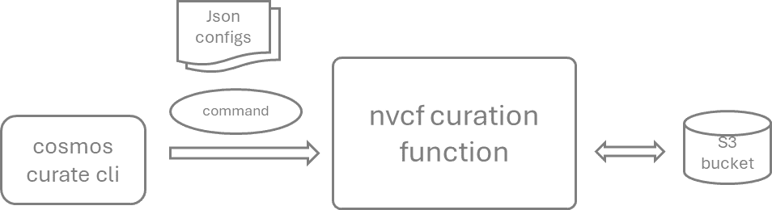

# Core Curation with Cosmos-Curate

> **Prerequisites:** Before proceeding with core curation, ensure you have completed the prerequisite steps outlined in the [Data Curation Overview](overview.md), including data sourcing, sampling, and visualization.

Now that your dataset has been normalized and sampled to better understand its characteristics, the next steps involve splitting the videos into shorter clips, captioning the video clips, applying filtering, and finally sharding the data into webdataset format if needed. These core curation tasks can be handled using [Cosmos-Curate](https://github.com/nvidia-cosmos/cosmos-curate).

The Cosmos Curator tool offers multiple deployment modes to suit different use cases and technical requirements:

## Deployment Options

1. **NVCF (Pre-Deployed Function)** — *Recommended for beginners*

    To streamline the curation process, the Cosmos Engineering team has deployed a pre-configured NVCF function on an 8x H100 GPU infrastructure. This option is ideal when working with relatively clean raw data that does not require extensive filtering or custom classification. It provides quick access with minimal setup.

2. **Local Infrastructure** — *Full control with Docker*

    For complete control over the curation pipeline, you can run Cosmos-Curate locally using Docker containers. This approach allows you to create custom filters, modify source code, and run jobs on your own hardware. This option is ideal for development, testing, and smaller datasets.

    > **Note**: If your local system has only a single GPU, Cosmos-Curate will disable `STREAMING` mode automatically because it cannot maintain multiple GPU stages at the same time; in this case, the Ray worker may encounter an out-of-memory (OOM) condition if the input video size/volume is large.

3. **SLURM Clusters** — *High-performance computing at scale*

    For large-scale processing, you can deploy Cosmos-Curate on SLURM clusters with multiple GPUs. This option provides maximum computational power and is suitable for processing massive datasets in production environments.

## Using the Pre-Deployed NVCF Function

The NVCF approach provides a streamlined, cloud-based solution for data curation without the need for local infrastructure.



### Prerequisites

Install the Cosmos Curator CLI client (detailed setup instructions are provided in the [Local Setup section](#running-cosmos-curator-locally) below):

```shell
# Quick setup (full instructions in Local Setup section)
git clone --recurse-submodules https://github.com/nvidia-cosmos/cosmos-curate.git
cd cosmos-curate
uv venv --python=3.10 && source .venv/bin/activate
uv pip install poetry && poetry install --extras=local
```

### NVCF Configuration

> ⚠️ **Security Warning:** Store API keys in environment variables or secure vaults (e.g., HashiCorp Vault, AWS Secrets Manager). Never commit API keys to source control or share them in plain text.

1. **Set up an NGC API key**: If you don't have a valid API key yet, acquire one as follows: Go to <https://org.ngc.nvidia.com/setup>, select **Cosmos API** from the top-left corner, and choose **no team** as the org profile. Click on **Generate API Key**, then select **Generate Personal Key**. Generate a key and save it for the future usage (the key is only readable once).

    ```shell
    cosmos-curate nvcf config set --org <NVCF Org ID> --key <NGC NVCF API Key>
    # in case you will upload helm chart to you org
    ngc config set
    ```

2. **Register the active function** that has been pre-deployed from the Cosmos Engineering team:

    ```shell
    cosmos-curate nvcf function import-function \
    --funcid 58891eb4-0eef-4a91-8177-5c272275a375 \
    --version b109565a-e15e-492c-997d-3c35ed2c7a9e \
    --name Cosmos-Curate-LHA-1_0_2
    ```

### Video Splitting and Captioning with NVCF

When processing datasets, follow this structure:

```
project_root/
└── dataset_root/
    ├── raw_data/          # Raw data
    ├── processed_data/    # Processed data
        ├── v0/            # Version 0
            ├── clips/     # Processed clips
            ├── meta/      # Metadata
            ├── embeds/    # Calculated embeddings
            └── ...
        └── v1/            # Version 1
            └── ...
    └── webdataset/        # Curated and sharded webdataset
```

You can then invoke the function to perform data curation on your S3 bucket. For subsequent steps--such as splitting, captioning, recaptioning, and sharding--the same command structure is used; you only need to change the JSON configuration file to specify the particular functionality of the cloud function.

```shell
cosmos-curate nvcf function invoke-function --data-file <path_to_your_json_file> --s3-config-file <path_to_file_containing_a_single_aws_cred>
```

The following is an example JSON for the initial processing on an Intelligent Transportation Systems (ITS) dataset. Fine-tune these parameters for your own use case.

```json
{
    "pipeline": "split",
    "args": {
        "input_video_path": "s3://your_bucket/your_dataset/raw_data",
        "output_clip_path": "s3://your_bucket/your_dataset/processed_data/v0",
        "generate_embeddings": true,
        "generate_previews": true,
        "generate_captions": true,
        "splitting_algorithm": "transnetv2",
        "captioning_algorithm": "qwen",
        "captioning_prompt_variant": "default",
        "captioning_prompt_text": "You are a video caption expert. Please describe this video in two paragraphs: 1. Describe the static scene: What objects and people are present? What are their spatial relationships and the overall environment? 2. Describe the actions and motion: How do objects move and interact? Focus on object permanence, collisions, and physical interactions. Be specific and precise in your observations.",
        "limit": 0,
        "limit_clips": 0
   }
}
```

Enabling the `generate_embeddings`, `generate_previews`, and `generate_captions` parameters activates the generation of these corresponding features. The `splitting_algorithm` parameter supports two options: `transnetv2` (default) and `fixed-stride`. The `caption_algorithm` parameter defines the model used for the video captioning (by default, the `Qwen2.5-7b-VLM-instruct` model), and the `captioning_prompt_text` parameter provides the system/user instructions to guide caption generation. In this configuration, the captioner is prompted to describe video clips from traffic surveillance footage by first identifying static scene elements and then describing the dynamic actions or spatial relationships between them.

To enhance the quality and specificity of the generated captions, more sophisticated prompts can be configured in the corresponding JSON file entry. The more contextual information available about a video clip, the more effectively it can be embedded into the prompt—improving the relevance and accuracy of the resulting captions.

### Captioning Best Practices

When designing prompts for the captioner, follow these principles:

- **Inference-Training Consistency**: Structure captions to mirror the inference-time prompting format. For example, describe the initial frame first, followed by the action sequence. This alignment helps the model learn how to respond to similar prompt structures during inference.

- **Camera Perspective Differentiation**: Explicitly include the camera viewpoint (e.g., CCTV, dashcam, bodycam) at the beginning of the caption to help the model differentiate between visual perspectives and generate viewpoint-consistent outputs.

- **Noise Mitigation**: Online video sources often contain visual noise such as logos, watermarks, and text overlays. Prompts should guide the captioner to focus on relevant scene elements and ignore these artifacts to prevent model distraction during training.

- **Motion-Centric Descriptions**: Prioritize dynamic elements and physical interactions in the captions, rather than static descriptions. This helps the model learn motion patterns and physical realism crucial for generative tasks.

- **Domain-Specific Terminology**: Use vocabulary and phrasing that are consistent with the intended use case of the model to promote alignment between training captions and expected inference prompts.

These practices support the creation of high-fidelity, task-aligned captions that improve training effectiveness and model generalization.

### Advanced Captioning Example

```json
    "captioning_prompt_text": "You are a video captioning specialist tasked with creating high-quality English descriptions of traffic videos. Generate a single flowing paragraph that captures both the static scene and dynamic actions without using section headers or numbered points.\n\nBegin by analyzing the first frame to establish the scene, then smoothly transition to describing the full action sequence that follows. Your caption should be specific, precise, and focused on physical interactions.\n\nFirst Frame Analysis Requirements:\n- Camera identification:\n  * Begin caption with \"A traffic CCTV camera\" if video is from a fixed surveillance camera mounted high above ground.\n  * Begin caption with \"A stationary vehicle camera\" if video is from a non-moving camera mounted low to ground (other vehicles may be moving, but camera remains stationary).\n  * Begin caption with \"A moving vehicle camera\" if video is from a camera mounted on a moving vehicle.\n- Include other vehicles, pedestrians, cyclists, traffic lights, lane markings, traffic signs, and any other traffic related objects.\n- Include weather, time of day, road conditions, and any other environmental factors that might affect driving behavior.\n- Do NOT describe logos or watermarks visible in the video.\n- Do NOT describe vehicle number plates, street names, or building names visible in the video.\n- Do NOT describe text overlays visible in the video.\n- Do NOT describe timestamps visible in the video. Do NOT mention any dates or times in the prompt.\n- Always output in English.\n\nAction Sequence Analysis Requirements:\n- Identify and describe any of these traffic scenarios occurring in the video: accidents (collisions, near-misses), violations (wrong-way driving, jaywalking, running red lights), vehicle issues (stalled, broken down), road users (pedestrians crossing, bicyclists, motorcyclists), driving maneuvers (lane changes, U-turns, merging), traffic conditions (congestion, blocked intersions), or road hazards (debris, animals, construction). When describing detected scenarios:\n  * Focus on precise details of how the scenario unfolds, including vehicle trajectories, speeds, and physical interactions\n  * Describe the cause-and-effect relationship if visible (e.g., \"vehicle brakes suddenly due to pedestrian crossing\")\n  * Include relevant environmental factors that contribute to the scenario (wet roads, limited visibility, etc.)\n  * Use simple, direct verbs that precisely convey natural movement and physical interactions (e.g., \"accelerates,\" \"collides,\" \"swerves,\" \"rotates\" rather than \"moves\" or \"goes\")\n  * Maintain focus on physics-based descriptions rather than inferring driver intentions\n  * Ensure all descriptions flow naturally in a single cohesive paragraph without section headers",
```

> **Note**: More captioning details can be found in [this document](https://github.com/nvidia-cosmos/cosmos-curate/blob/main/docs/curator/REFERENCE_PIPELINES_VIDEO.md).

### Video Re-Captioning

There are often situations where caption quality requires progressive improvement. In such cases, you can iterate on the captioning prompt without recomputing embeddings or previews. The following example demonstrates a re-captioning workflow that iterates over previously split video clips and replaces their captions in a new output directory.

```json
{
    "pipeline": "split",
    "args": {
        "input_video_path": "s3://your_bucket/your_dataset/processed_data/v0/clips",
        "output_clip_path": "s3://your_bucket/your_dataset/processed_data/v1",
        "generate_embeddings": false,
        "generate_previews": false,
        "generate_captions": true,
        "splitting_algorithm": "fixed-stride",
        "fixed_stride_split_duration": 100000000,
        "captioning_algorithm": "qwen",
        "captioning_prompt_variant": "default",
        "captioning_prompt_text": "<your modified prompt here>",
        "limit": 0,
        "limit_clips": 0
   }
}
```

If you only intend to generate captions without altering the existing video clips, you can re-run the split pipeline on the same directory. To do this, specify a new `captioning_prompt_text` while setting the `splitting_algorithm` to `fixed_stride` and assigning a large value to `fixed_stride_split_duration`. This ensures that the original clips remain unchanged since they typically do not exceed the maximum duration threshold, while new captions are generated using the updated prompts.

### Sharding

When you're satisfied with the splitting and captioning, the next step is to create a sharded dataset format optimized for model training. This process organizes the processed clips into a webdataset format.

Here's a template for the sharding configuration:

```json
{
    "pipeline": "shard",
    "args": {
        "input_clip_path": "s3://your_bucket/your_dataset/processed_data/v0",
        "output_dataset_path": "s3://your_bucket/your_dataset/webdataset/v0",
        "annotation_version": "v0",
        "verbose": true,
        "perf_profile": false
    }
}
```

#### Output Structure

The sharding pipeline will produce the following artifacts under the `output_dataset_path`:

```
{output_dataset_path}/
├── v0/
│   ├── resolution_720/                     # all clips at 720p resolution
│       ├── aspect_ratio_16_9/              # all clips at 16:9 aspect ratio
│           ├── frames_0_255/               # all captioning windows within frames 0 to 255
│               ├── metas/                  # tar-ed .json files containing metadata for each clip
│                   ├── part_000000/
│                       ├── 000000.tar
│                       ├── 000001.tar
│               ├── t5_xxl/                 # tar-ed .pickle files for text embedding of each caption
│                   ├── part_000000/
│                       ├── 000000.tar
│                       ├── 000001.tar
│               ├── video/                  # tar-ed .mp4 files for each clip
│                   ├── part_000000/
│                       ├── 000000.tar
│                       ├── 000001.tar
│           ├── frames_256_511/             # all captioning window within frames 256 to 511
│               ├── metas/
│                   ├── part_000000/
│                       ├── 000000.tar
│               ├── t5_xxl/
│                   ├── part_000000/
│                       ├── 000000.tar
│               ├── video/
│                   ├── part_000000/
│                       ├── 000000.tar
```

### Running Cosmos Curator locally

For a complete end-to-end example of running Cosmos-Curate locally using Docker, refer to the [Curate data for Cosmos-Predict Fine-Tuning](../../recipes/data_curation/predict2_data/data_curation.md) recipe. This guide walks through the entire workflow using a real dataset from Hugging Face ([nexar_collision_prediction](https://huggingface.co/datasets/nexar-ai/nexar_collision_prediction)).

### SLURM Cluster Deployment

For large-scale processing on SLURM clusters, refer to the [Launch Pipelines on SLURM](https://github.com/nvidia-cosmos/cosmos-curate/blob/main/docs/client/END_USER_GUIDE.md#launch-pipelines-on-slurm) section in the Cosmos-Curate documentation. This deployment mode provides maximum computational power for processing massive datasets in production environments.
