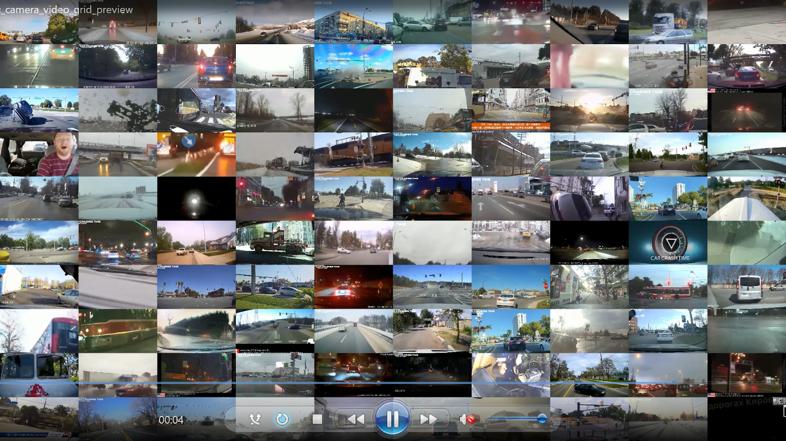

# Data Curation

> **The principle of "garbage in, garbage out" is especially relevant in post-training.** High-quality datasets with sufficient quantity, quality, and domain coverage are essential for enabling models to learn novel generation capabilities.

## Overview

Data curation is the foundation of successful post-training. Models struggle to generate content types that are underrepresented or absent in training data, making it crucial to source datasets that closely match the intended use case in both distribution and structure.

### Key Requirements

- **Domain Alignment**: Data reflects the nuances, variations, and edge cases of the target domain
- **Quality Control**: Active filtering and validation to ensure data relevance
- **Scale and Coverage**: Sufficient quantity and diversity for robust learning
- **Format Consistency**: Data structured in formats compatible with training workflows

### Data Curation Pipeline

Data curation is a complex science. As illustrated in the image below, it can systematically distill large-scale, heterogeneous video sources into refined training sets via phased filtering, annotation, and deduplication. Domain-aligned videos are first segmented, transcoded, and cropped, then evaluated for aesthetics, motion, OCR, and training utility. Vision-language and classifier-based filters enforce semantic coherence. Annotation modules generate metadata and embeddings, powering clustering-based deduplication. The result is a high-fidelity, semantically diverse dataset optimized for vision-language model training.


While the complete pipeline involves many sophisticated techniques, the following sections focus on the foundational tools and practical approaches that enable effective data curation. We'll explore the essential components that transform raw, heterogeneous data sources into high-quality, unified datasets ready for model training.

## Data Sourcing

Data sourcing involves acquiring datasets from multiple sources including cloud storage, public repositories, and web content. The following tools are commonly used for efficient data collection and transfer.

> **Important:** Always verify the license terms and usage rights of datasets before downloading and processing. Ensure compliance with copyright, privacy, and redistribution requirements to avoid legal issues in your projects.

---

### **Cloud Storage Tools**

| Tool | Purpose | Best For |
|------|---------|----------|
| **s5cmd** | High-performance S3-compatible storage | Large-scale data movement with parallel processing |
| **AWS CLI** | Official AWS command-line interface | AWS-native workflows and service integration |
| **rclone** | Universal cloud storage sync (70+ providers) | Multi-cloud environments and complex sync operations |

---

### **Web Content Tools**

| Tool | Purpose | Best For |
|------|---------|----------|
| **HuggingFace CLI** | Dataset and model repository access | Downloading datasets and models from HuggingFace Hub |
| **yt-dlp** | Enhanced YouTube downloader | Multiple video platforms, quality selection, batch processing |
| **wget/curl** | Command-line file downloaders | Simple downloads, recursive crawling, API-based retrieval |

---

### **Data Processing Tools**

| Tool | Purpose | Best For |
|------|---------|----------|
| **ffmpeg** | Video processing and conversion | Format conversion, frame extraction, resizing, quality adjustment |
| **PIL/Pillow** | Python image processing library | Python applications, programmatic image manipulation |

---

### **Quality Control Tools**

| Tool | Purpose | Best For |
|------|---------|----------|
| **OpenCV** | Computer vision library | Video analysis, frame extraction, quality assessment |
| **FFprobe** | Video metadata extraction | Duration, resolution, codec, quality metrics extraction |

---

## Data Sampling and Visualization

Before data curation begins, sampling and visualization are crucial for identifying potential issues and understanding dataset characteristics. This preliminary analysis helps optimize curation tools and pipelines for specific challenges.

### Grid Preview Generation

The `grid_preview_generation.py` tool creates comprehensive dataset overviews by generating grid-style preview videos. It randomly samples videos and arranges them in customizable layouts for quick visual assessment.

```shell
python scripts/curation/tools/sampling_visualization/grid_preview_generation.py \
    --input_dir <input_dir> \
    --output_video <output_dir>
```

**Output Example:**


### Interactive Video Sampling

The `streamlit_sample_video_app.py` provides an interactive web interface for detailed dataset inspection. Features include the following:

- **Paginated browsing** (3x4 grid, 12 videos per page)
- **S3 and local directory support**
- **Configurable sample sizes**

#### Quick Start

```shell
# Install Streamlit
uv tool install -U streamlit

# Run interactive app
streamlit run scripts/curation/tools/sampling_visualization/streamlit_sample_video_app.py \
    -- --input_dir <input_dir_or_s3> --nsamples 36
```

#### Background Execution

```shell
# Run in background with nohup
nohup streamlit run scripts/curation/tools/sampling_visualization/streamlit_sample_video_app.py \
    --input_dir <input_dir_or_s3> > streamlit.log 2>&1 &
```

**Access:** `http://<host_ip>:<port>` (remains accessible after terminal disconnection)

**Sample Output:**


---

## Data Curation Best Practices

### Key Success Factors

- **Start with sampling and visualization** — Understand data characteristics before processing.
- **Apply quality filters early** — Avoid wasting time on irrelevant or low-quality data.
- **Evaluate at small scale and deploy for scale** — Validate your pipeline before full deployment.
- **Use appropriate tools** — Select the right tool for each stage of the pipeline.
- **Track everything** — Maintain version control and experiment logging throughout.

---

## Next Steps: Core Curation

Once you have completed the data sourcing, sampling, and visualization phases outlined above, you're ready to move to the core curation stage. This involves the following:

- **Video splitting** into shorter, scene-coherent clips
- **Automated captioning** with sophisticated prompting strategies
- **Quality filtering** and content validation
- **Dataset sharding** for optimized training workflows

For comprehensive guidance on these core curation tasks, including both cloud-based (NVCF) and local deployment options, refer to the [Core Curation Guide](core_curation.md).

The core curation guide covers:

- **NVCF deployment** for quick cloud-based processing
- **Local Docker setup** for full control and customization
- **SLURM cluster deployment** for large-scale processing
- **Advanced captioning techniques** and best practices
- **Integration with Cosmos Predict 2** workflows
