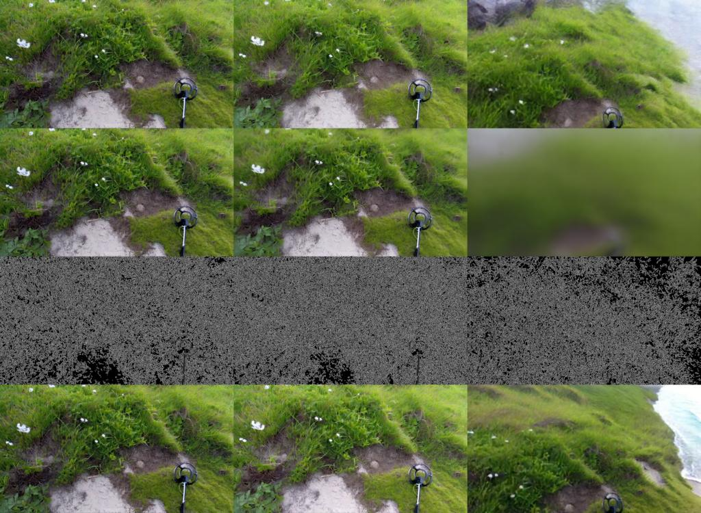
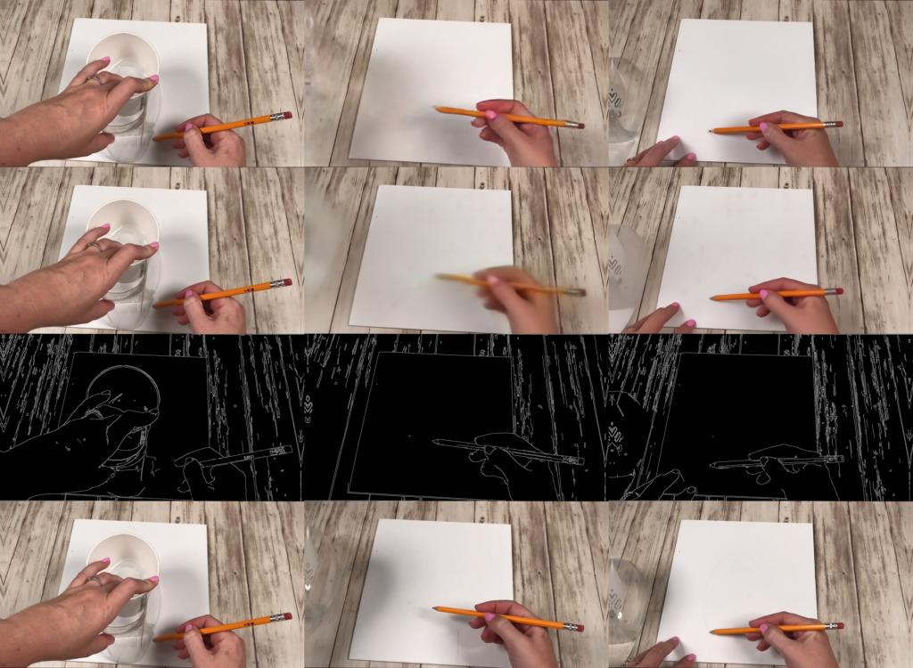
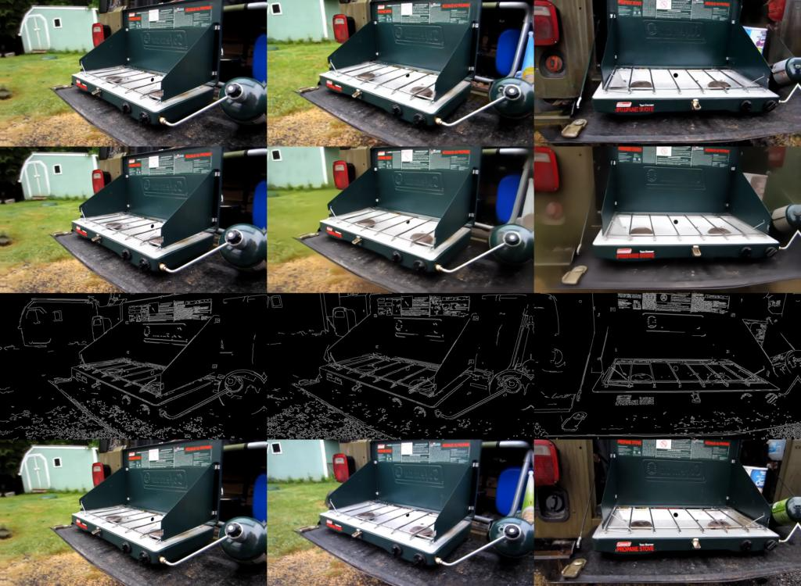

# Distilling Cosmos-Transfer1 Models

> **Authors:** [Grace Lam](https://www.linkedin.com/in/grace-lam/)
> **Organization:** NVIDIA

## Instructions from the Cosmos-Transfer1 Repo

- [Distill Cosmos-Transfer1-7B [Depth | Edge | Keypoint | Segmentation | Vis]](https://github.com/nvidia-cosmos/cosmos-transfer1/blob/main/examples/distillation_cosmos_transfer1_7b.md) **[with multi-GPU support]**

## Case Study: Distilling Cosmos-Transfer1 Edge

This tutorial presents a case study on single-step distillation of the 36-step Cosmos-Transfer1-7B Edge model. While the original model required 72 total inferences (36 steps x 2) due to classifier-free guidance (CFG), the distilled model requires only a single inference without CFG. This achieves a 72x speedup while maintaining output quality.

### Overview

Our recipe is a two-stage distillation pipeline.

#### Stage 1: Knowledge Distillation (KD)

- We generated a synthetic dataset of 10,000 noise-video pairs using the teacher model for Knowledge Distillation.
- Having a strong warmup phase proved critical for subsequent DMD2 success, as this synthetic data approach significantly outperformed an alternative L2 regression warmup using real data.
- We trained the KD phase using a learning rate of 1e-5 and global batch size of 64 for 10,000 iterations.

#### Stage 2: Improved Distribution Matching Distillation (DMD2)

- We applied DMD2, a state-of-the-art distribution-based distillation approach that blends adversarial distillation with variational score distillation.
- The primary challenge was memory constraints from concurrent network copies (student model, teacher model, fake score network, and discriminator). We addressed this through FSDP, CP8, gradient checkpointing, and gradient accumulation to achieve an effective batch size of 64 on 16 nodes.
- We trained the DMD2 phase using a learning rate of 5e-7, guidance scale of 5, GAN loss weight of 1e-3, student update frequency of 5, and global batch size of 64 for 24,000 iterations.

### Knowledge Distillation (KD)

#### Dataset

KD minimizes the regression loss between the Student model's single-step generation and the Teacher model's multi-step generation (36 steps for Cosmos-Transfer1). Consequently, KD requires a preliminary data generation phase to create a synthetic dataset of Teacher model input-output pairs. For Cosmos-Transfer1 Edge, the input comprises random noise, text prompt, and canny edge map, while the output consists of the generated video.

For synthetic data generation, we randomly sampled 10,000 examples from the original training dataset used for Cosmos-Transfer1 Edge. We extracted the text prompts and canny inputs from these samples and processed them through the Teacher model (Cosmos-Transfer1 Edge) to generate corresponding output videos. The resulting KD dataset preserves the original text prompts and canny inputs while additionally storing the random noise tensors and Teacher-generated videos, creating complete input-output pairs for Student model training.

To ensure high-quality synthetic data for distillation training, we generated Teacher outputs using optimal inference hyperparameters, including a guidance scale of 7 with negative prompting.

#### Hyperparameters

Our early distillation experiments revealed that batch size is a critical factor for effective knowledge transfer. Initial small-scale experiments using a batch size of 8 showed limited distillation quality, which improved substantially when scaling to batch sizes of 32 and above. Based on these findings, we adopted a batch size of 64 for all full-scale distillation experiments.

For KD hyperparameter optimization, we conducted systematic learning rate sweeps and determined that a learning rate of 1e-5 yielded optimal performance across our experimental configurations.

#### Visualizations

Throughout the distillation process, we continuously monitored training progress by logging model output samples at regular intervals. This monitoring functionality is implemented as a training callback within the cosmos-transfer1 distillation codebase for systematic evaluation.

The visualization layout displays four key components arranged vertically: Student 1-step sample, Teacher 1-step sample, canny edge input, and ground-truth reference video. Each row presents three temporal samples from the corresponding video clip – specifically the first, middle, and last frames – enabling direct visual comparison of distillation quality and temporal consistency across training iterations.

Representative visualizations from our distillation training runs are shown below.

After ~5k steps:

After ~10k steps:

### Improved Distribution Matching Distillation (DMD2)

#### Dataset

DMD2 optimizes the Student model to match the output distribution of the Teacher model through adversarial training combined with variational score distillation. Unlike Knowledge Distillation, DMD2 requires a diverse dataset of ground-truth real videos rather than synthetic Teacher-generated outputs. We used the original training dataset used for Cosmos-Transfer1 Edge.

#### Hyperparameters

Similar to Knowledge Distillation, batch size and learning rate proved critical, with optimal performance achieved using a batch size of 64 and learning rate of 5e-7. DMD2 introduces additional hyperparameters. We established an update frequency of 4 discriminator and fake score network updates per generator update (`student_update_freq=5`). Guidance scale optimization revealed that a value of 5 provided optimal trade-off between output saturation and detail sharpness. For loss weighting, we applied a GAN loss weight of 0.001, which effectively balanced the adversarial objective against the score distillation loss.

#### Visualizations

Throughout the distillation process, we continuously monitored training progress by logging model output samples at regular intervals. This monitoring functionality is implemented as a training callback within the cosmos-transfer1 distillation codebase for systematic evaluation.

The visualization layout displays four key components arranged vertically: Student 1-step sample, Teacher 1-step sample, canny edge input, and ground-truth reference video. Each row presents three temporal samples from the corresponding video clip – specifically the first, middle, and last frames – enabling direct visual comparison of distillation quality and temporal consistency across training iterations.

Representative visualizations from our distillation training runs are shown below.

After ~10k steps:

After ~20k steps:

