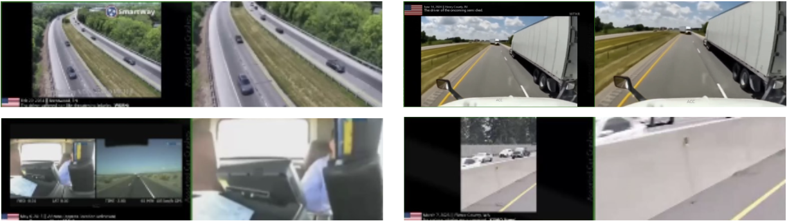

# Advanced Filtering

To ensure high-quality and relevant video data, additional filtering or processing is often required when the dataset is noisy. These filtering steps may include removing low-quality content (as defined below), eliminating pillbox and letterbox artifacts with text banners, or classifying camera perspectives to enable categorization of WebDatasets.

## Camera Type Classification

We use the `camera_type_classifier.py` tool to categorize each video into one of three types:

1. Static CCTV-style camera: Fixed, wide-angle surveillance views.
1. Static dash-camera (parked): Stationary vehicle-mounted views.
1. Moving dash-camera (in-motion): Vehicle-mounted, moving perspectives.

This filter is implemented by prompting a VLM model to analyze and return with a classification label based on the format given in the prompt. Two VLMs are available for experiment (the off-shelf Qwen2.5-7b, or Cosmos-Reason). This is the prompt being used to instruct the VLM:

```
CAMERA_TYPE_PROMPT = """
You are an expert in video analysis and camera classification.
Your task is to analyze the input video in a concise manner and
classify it into one of these three categories:

1) Static CCTV-style camera:
   - Fixed position with no movement
   - Typically mounted high on walls or ceilings
   - Wide-angle view covering a large area
   - Often used for surveillance in buildings, streets, or public spaces
   - No camera motion, only subjects move within the frame

2) Static dash-camera (parked):
   - Mounted on a stationary vehicle
   - Fixed position but at street/road level
   - Typically shows traffic intersection or road view
   - May capture passing vehicles and pedestrians
   - No camera motion, but perspective is from vehicle height

3) Moving dash-camera (in-motion):
   - Mounted on a moving vehicle
   - Shows forward motion and changing scenery
   - Captures road ahead with moving perspective
   - May show vehicle dashboard or hood
   - Continuous camera motion matching vehicle movement

Please analyze the video carefully and:
1. Consider the camera's position, movement, and perspective
2. Note any visible mounting points or vehicle parts
3. Observe the motion characteristics
4. Consider the typical use case and context

Provide your analysis in the following format:
<think>
[Your detailed reasoning about why the video belongs to a specific category]
[Key observations about camera position, movement, and context]
[Comparison with other categories and why they don't fit]
</think>

<answer>
[The category number: 1, 2, or 3]
</answer>
"""
```

Using the pre-existing code as reference, the classifier can be called using the command below:

```shell
python scripts/curation/tools/filters/camera_type_classifier.py --input_dir <input_videos> --output_file camera_classification_results.json --model_name qwen
```

This step helps select videos with the desired camera perspective for downstream tasks.

## Poor Content Filtering

We further filter out videos with low quality, irrelevant content, or editing artifacts using the `poor_content_classifier.py` tool. This classifier labels each video as either GOOD or BAD based on strict criteria (e.g., no split screens, no overlays, clear traffic scenes).

Examples of clips with poor content as they don’t present clear view of traffic nor car accident scenes:

!()[images/poor_content.png]

Prompts used to instruct the VLM for the binary classification of good vs. bad quality videos:

```
CONTENT_QUALITY_PROMPT = """
You are an expert in video content quality analysis.
Your task is to classify the input video as either GOOD or BAD content
based on the following definitions:

GOOD content (ALL conditions must be met):
- Must be a SINGLE, continuous real-life traffic recording from ONE camera angle only
(no split-screens, multi-views, or transitions)
- Must show clear, high-quality footage of actual vehicles and road scenes (no static screens, logos, or solid colors)
- Must be unedited direct camera footage (no overlays, effects, text, or processed content)
- Must be properly exposed and focused, with easily recognizable traffic-related content
- Must show continuous movement (not frozen frames or still images)

BAD content (classify as BAD if ANY of these conditions are met):
- ANY multi-view or view-switching content:
  * Split-screen layouts (even if only for a portion of the video)
  * Multiple camera angles shown simultaneously
  * Camera view transitions or switches during the video
  * Security camera arrays or grid layouts
  * Picture-in-picture displays
  * Any combination of different camera perspectives
- ANY non-camera footage:
  * Static screens, logos, warnings
  * Text overlays, transitions
  * Artificial or computer-generated content
- ANY poor quality footage:
  * Blurry, dark, noisy content
  * Blocked or unrecognizable scenes
- ANY edited content:
  * Effects, transitions, cuts
  * Processed or modified footage
- ANY non-traffic content:
  * Empty frames, solid backgrounds
  * Unrelated scenes or content

CRITICAL INSTRUCTIONS:
1. FIRST describe what you see in the video in detail
2. Then check for split-screens or multiple views - these are ALWAYS BAD
3. Check for any camera transitions during the video - these are ALWAYS BAD
4. Check for non-traffic content (solid colors, logos, static screens)
5. Check video quality and editing
6. ONLY classify as GOOD if it's a single, continuous camera view of actual traffic

Please analyze the video and provide your answer in the following format:
<think>
[FIRST: Detailed description of what you see in the video]
[SECOND: Analysis of camera views - are there multiple views or transitions?]
[THIRD: Analysis of content type - is it real traffic footage?]
[FOURTH: Analysis of quality and editing]
[FINALLY: Your conclusion based on the above analysis]
</think>
<answer>
[good or bad]
</answer>
"""
```

Command Example:

```shell
python scripts/curation/tools/filters/poor_content_classifier.py --input_dir <input_videos> --model_name reason
```

Only videos classified as GOOD are retained for the final dataset.

## Pillarbox/Letterbox Removal

Many online videos have been modified to include pillarbox or letterbox padding to adjust their aspect ratio, or to add text banners that provide additional information to viewers. However, these elements are not suitable for data training purposes. The `remove_pillarbox_letterbox` function below effectively addresses this issue by automatically detecting and cropping out both types of padding. Behind the scenes, it iteratively uses the ffmpeg tool to smartly crop away uniform borders, controlled by a given threshold.

```shell
python scripts/curation/tools/filters/pillarbox_letterbox_removal.py --input_dir <input_dir> --output_dir <output_dir>
```

This ensures all curated videos have a clean, content-focused frame. Examples of videos that were processed using the script to have the pillarbox and letterbox removed. Original video clips are on the left, and the processed videos are on the right.


