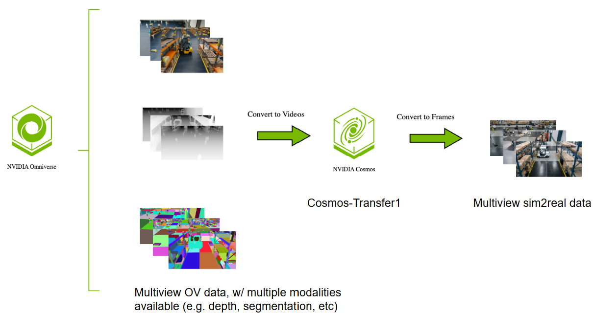

# Cosmos Transfer Sim2Real for Multi-View Warehouse Detection & Tracking

| Model | Workload | Use case |
|------|----------|----------|
| Cosmos Transfer1 | Inference | Sim to Real data augmentation |

This use case study demonstrates how to apply Cosmos Transfer for data augmentation over Omniverse (OV) generated synthetic data to close the Sim-to-Real domain gap, specifically targeting multi-view warehouse detection and tracking scenarios.

- [Setup and System Requirement](setup.md)

## Use Case Description

NVidia Omniverse is a powerful platform for Synthetic Data Generation (SDG) that enables precise control over scene generation and simulation. While digital simulations provide accurate derived information such as depth and segmentation with scene control, generating variations for robust model training can be computationally expensive and time-consuming.

This use case study explores how Cosmos Transfer can serve as an efficient data augmentation solution to bridge this sim-to-real domain gap by transforming Omniverse-generated synthetic warehouse scenes into realistic variations without the computational overhead of re-rendering entire scenes.

## Multi-View Processing Approach

Monitoring of warehouse spaces typically involves multi-camera views to provide comprehensive coverage. Since Cosmos Transfer1 does not natively support multi-view processing, we adopt an approach to ensure visual consistency across all camera viewpoints:

1. **Concatenation**: All video inputs from multiple cameras are concatenated into a single long video sequence
2. **Processing**: The concatenated video is processed through Cosmos Transfer1 as a unified input
3. **Splitting**: The processed video is then split back to retrieve the individual multi-view outputs

This approach guarantees that all camera views receive consistent environmental transformations while maintaining spatial and temporal coherence across the multi-view setup.



## Demonstration Overview

This demonstration shows how **Cosmos Transfer 1** enables Sim2Real domain adaptation through procedural scene randomization including image noise, lighting variations, texture changes, and object placement diversity. The concatenation-based framework ensures consistent transformations across camera views to improve downstream 3D detection and tracking performance in warehouse environments.

## Dataset and Setup

### Sample Input Warehouse Data

A sample of training data for the detection and tracking algorithms is stored locally in the `assets/SURF_Booth_030825/` directory. This multi-camera warehouse data entry provides synchronized rendered RGB and depth information from multiple camera viewpoints for warehouse scene.

The dataset is located at:

```
scripts/examples/transfer1/inference-warehouse-mv/assets/SURF_Booth_030825/
```

### Data Structure

The dataset provides a 6-camera warehouse setup with synchronized data organized as follows:

- **`Camera_00/` through `Camera_05/`**: Individual camera directories, each containing:
    - **`rgb.mp4`**: RGB video data for the camera view
    - **`depth.mp4`**: Corresponding depth video data for the camera view

### Combined Multi-View Input

For processing through Cosmos Transfer1, all camera RGB videos are concatenated into a single video sequence. The combined input preserves the temporal synchronization while creating a unified processing pipeline.

**Combined Multi-View RGB Input:**

<video width="720" controls>
  <source src="assets/combined_grid_rgb.mp4" type="video/mp4">
  Your browser does not support the video tag.
</video>

**Combined Multi-View Depth Control:**

<video width="720" controls>
  <source src="assets/combined_grid_depth.mp4" type="video/mp4">
  Your browser does not support the video tag.
</video>

## Cosmos Transfer Pipeline Components

### Sim2Real Conversion with Ambient Variation

Users can leverage the Cosmos Transfer model to convert synthetic computer graphics appearance to realistic warehouse conditions. By prompting the model appropriately, users can introduce varied ambient conditions such as different lighting scenarios while preserving the structural layout and object relationships.

```json
{
    "prompt": "The camera provides a clear view of the warehouse interior, showing rows of shelves stacked with boxes, baskets and other objects. There are workers and robots walking around, moving boxes or operating machinery. The lighting is bright and even, with overhead fluorescent lights illuminating the space. The floor is clean and well-maintained, with clear pathways between the shelves. The atmosphere is busy but organized, with workers and humanoids moving efficiently around the warehouse.",
    "input_video_path": "/mnt/pvc/gradio/uploads/upload_20250916_152159/rgb.mp4",
    "edge": {
        "control_weight": 0.5
    },
    "depth": {
        "control_weight": 0.5,
        "input_control": "/mnt/pvc/gradio/uploads/upload_20250916_152159/depth.mp4"
    }
}
```

**Combined Multi-View Transfer1 Output:**

<video width="720" controls>
  <source src="assets/combined_grid_output.mp4" type="video/mp4">
  Your browser does not support the video tag.
</video>

### Dense Dust and Low Visibility Variation

To demonstrate data augmentation capabilities, the following prompt transforms the clean warehouse into a dusty, poorly-lit environment with reduced visibility:

```json
{
    "prompt": "The camera captures a hazy view of the warehouse interior, with dust particles suspended in the air and reducing visibility throughout the scene. Rows of shelves are faintly visible through the dusty atmosphere, their outlines softened by the thick layer of particulate matter. The lighting is dim and uneven, with flickering overhead fluorescent lights struggling to penetrate the dusty haze. The floor appears grimy and lightly coated with dust, and visibility between shelves is limited. The environment feels neglected and poorly ventilated, with both workers and robots moving cautiously through the murky space, partially obscured by swirling dust clouds.",
    "input_video_path": "/mnt/pvc/gradio/uploads/upload_20250916_152159/rgb.mp4",
    "edge": {
        "control_weight": 0.5
    },
    "depth": {
        "control_weight": 0.5,
        "input_control": "/mnt/pvc/gradio/uploads/upload_20250916_152159/depth.mp4"
    }
}
```

*[Video Link: Dense Dust and Low Visibility Results - To be added]*

## Control Parameters in Cosmos Transfer1

Similar to the weather augmentation approach, experiments show that controlling only for **segmentation and depth** produces the best results for warehouse Sim2Real conversion. This configuration maintains structural consistency while allowing realistic appearance changes.

### Recommended Control Configuration

```json

{
    "prompt": "The camera provides a clear view of the warehouse interior, showing rows of shelves stacked with boxes, baskets and other objects. There are workers and robots walking around, moving boxes or operating machinery. The lighting is bright and even, with overhead fluorescent lights illuminating the space. The floor is clean and well-maintained, with clear pathways between the shelves. The atmosphere is busy but organized, with workers and humanoids moving efficiently around the warehouse.",
    "input_video_path": "/mnt/pvc/gradio/uploads/upload_20250916_152159/rgb.mp4",
    "edge": {
        "control_weight": 0.5
    },
    "depth": {
        "control_weight": 0.5,
        "input_control": "/mnt/pvc/gradio/uploads/upload_20250916_152159/depth.mp4"
    }
}
```

## 2D Detection Results on Augmented Dataset

To evaluate the effectiveness of Cosmos Transfer for data augmentation, experiments were conducted using carefully selected multiview scenes from the AI City Challenge dataset. **Eleven distinct scenes** were picked from the AI City v0.1 dataset (<https://www.aicitychallenge.org/>), representing diverse warehouse and indoor environments:

Each of these 11 baseline scenes was processed through the Cosmos Transfer augmentation pipeline using the multi-view concatenation approach described earlier. This process generated ambient variations, lighting changes, and environmental conditions (including dust and reduced visibility scenarios) while maintaining structural consistency and multi-view coherence across all camera viewpoints.

The resulting augmented dataset, containing both original and Cosmos Transfer-enhanced versions of each scene, was then used to train RT-DETR and EfficientViT-L2 detectors. The performance comparison demonstrates significant improvements in CV model accuracy and real-world generalization capabilities.

### Detection Performance Results

| Dataset Configuration | Pretrained Checkpoint | Building K Person AP50 | Building K Nova Carter AP50 | Building K mAP50 | Astro2.2 Person AP50 |
|----------------------|----------------------|------------------------|----------------------------|------------------|---------------------|
| **Baseline: 1-min IsaacSim AICity v0.1** | NVImageNetV2 backbone | 0.776 | 0.478 | 0.627 | 0.103 |
| **1-min Cosmos AICity v0.1** | NVImageNetV2 backbone | 0.827 (+6.17%) | 0.545 (+12.35%) | 0.686 (+8.60%) | 0.237 (+55.22%) |
| **1-min IsaacSim + 1-min Cosmos AICity v0.1** | NVImageNetV2 backbone | 0.838 (+7.40%) | 0.645 (+25.94%) | 0.742 (+15.50%) | 0.138 (+25.36%) |

## Conclusion

This use case study demonstrates how users can leverage Cosmos Transfer as an AI model and framework for data augmentation to bridge the sim-to-real domain gap in multi-view warehouse scenarios. The key insights for practitioners are:

1. **Cost-effective Data Augmentation**: Cosmos Transfer provides an efficient alternative to expensive synthetic data re-generation, enabling rapid creation of environmental variations
2. **Multi-View Consistency**: The concatenation-based approach ensures consistent transformations across all camera views while maintaining spatial and temporal coherence
3. **Significant Performance Gains**: Both RT-DETR and EfficientViT-L2 detectors showed substantial improvements (8-11% mAP increase) when trained on Cosmos Transfer augmented datasets
4. **Optimal Control Configuration**: Using only edge and depth controls produces the best results for warehouse Sim2Real conversion

By applying this framework, users can generate realistic warehouse scenes that maintain multi-view consistency, leading to substantial improvements in downstream detection and tracking algorithm accuracy while reducing the need for expensive real-world data collection or costly synthetic data re-rendering.

## Contributors

This content was contributed by **Alice Li ([alicli@nvidia.com](mailto:alicli@nvidia.com)) and team** from the **Metropolis organization**.
