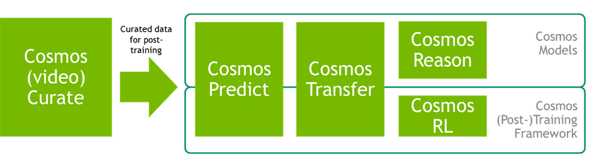

# Cosmos Cookbook

## Overview

The **NVIDIA Cosmos ecosystem** is a suite of World Foundation Models (WFMs) for real-world, domain-specific applications. This cookbook provides step-by-step workflows, technical recipes, and concrete examples across robotics, simulation, autonomous systems, and physical scene understanding. It serves as a technical reference for reproducing successful Cosmos model deployments across different domains.

The Cosmos ecosystem covers the complete AI development lifecycle: from **inference** with pre-trained models to **custom post-training** for domain-specific adaptation. The cookbook includes quick-start inference examples, advanced post-training workflows, and proven recipes for successful model deployment and customization.

## Open Source Community Platform

The Cosmos Cookbook is designed as an **open-source platform**, where NVIDIA shares practical knowledge and proven techniques with the broader AI community. This collaborative approach enables researchers, developers, and practitioners to contribute their own workflows, improvements, and domain-specific adaptations.

**Repository:** [https://github.com/nvidia-cosmos/cosmos-cookbook](https://github.com/nvidia-cosmos/cosmos-cookbook)

We encourage community contributions, including new examples, workflow improvements, bug fixes, and documentation enhancements. The open-source nature of the Cosmos Cookbook ensures that collective knowledge and best practices of Cosmos models continue to evolve and benefit the entire ecosystem.

## Case Study Recipes

The Cosmos Cookbook includes comprehensive case studies demonstrating real-world post-training applications across the Cosmos ecosystem.

### **Cosmos Predict**

#### Future state prediction and generation

| **Workflow** | **Description** | **Link** |
|--------------|-----------------|----------|
| **Training** | Traffic anomaly generation with improved realism and prompt alignment | [Traffic Anomaly Generation](recipes/post_training/predict2/its-accident/post_training.md) |
| **Training** | Synthetic trajectory data generation for humanoid robot learning | [GR00T-Dreams](recipes/post_training/predict2/gr00t-dreams/post-training.md) |

### **Cosmos Transfer**

#### Multi-control video generation and augmentation

| **Workflow** | **Description** | **Link** |
|--------------|-----------------|----------|
| **Inference** | CARLA simulator-to-real augmentation for traffic anomaly scenarios | [CARLA Sim2Real](recipes/inference/transfer2_5/inference-carla-sdg-augmentation/inference.md) |
| **Inference** | Multi-control video editing for background replacement, lighting, and object transformation | [Real-World Video Manipulation](recipes/inference/transfer2_5/inference-real-augmentation/inference.md) |
| **Inference** | Weather augmentation pipeline for simulation data using multi-modal controls | [Weather Augmentation](recipes/inference/transfer1/inference-its-weather-augmentation/inference.md) |
| **Inference** | CG-to-real conversion for multi-view warehouse environments | [Warehouse Simulation](recipes/inference/transfer1/inference-warehouse-mv/inference.md) |
| **Inference** | Sim2Real data augmentation for robotics navigation tasks | [X-Mobility Navigation](recipes/inference/transfer1/inference-x-mobility/inference.md) |
| **Inference** | Synthetic manipulation motion generation for humanoid robots | [GR00T-Mimic](recipes/inference/transfer1/gr00t-mimic/inference.md) |

### **Cosmos Reason**

#### Vision-language reasoning and quality control

| **Workflow** | **Description** | **Link** |
|--------------|-----------------|----------|
| **Training** | Physical plausibility check for video quality assessment | [Video Rewards](recipes/post_training/reason1/physical-plausibility-check/post_training.md) |
| **Training** | Spatial AI understanding for warehouse environments | [Spatial AI Warehouse](recipes/post_training/reason1/spatial-ai-warehouse/post_training.md) |
| **Training** | Intelligent transportation scene understanding and analysis | [Intelligent Transportation](recipes/post_training/reason1/intelligent-transportation/post_training.md) |
| **Training** | AV video captioning and visual question answering for autonomous vehicles | [AV Video Caption VQA](recipes/post_training/reason1/av_video_caption_vqa/post_training.md) |

### **Cosmos Curator**

| **Workflow** | **Description** | **Link** |
|--------------|-----------------|----------|
| **Curation** | Curate video data for Cosmos Predict 2 post-training | [Predict 2 Data Curation](recipes/data_curation/predict2_data/data_curation.md) |

## Cosmos Model Ecosystem

The Cosmos architecture consists of multiple model families, each targeting specific capabilities in the AI development workflow:

### **Cosmos Curator**

**[Cosmos Curator](https://github.com/nvidia-cosmos/cosmos-curate)** - A GPU-accelerated video curation pipeline built on Ray. Supports multi-model analysis, content filtering, annotation, and deduplication for both inference and training data preparation.

### **Cosmos Predict** - Future State Prediction Models

**[Cosmos Predict 2.5](https://github.com/nvidia-cosmos/cosmos-predict2.5)** *(Latest)* - A flow-based model that unifies Text2World, Image2World, and Video2World into a single architecture. Uses Cosmos Reason 1 as the text encoder and significantly improves upon Predict 2 in both quality and prompt alignment. Provides specialized variants for robotics, autonomous vehicles (multiview), and simulation with support for custom post-training for domain-specific prediction tasks.

**[Cosmos Predict 2](https://github.com/nvidia-cosmos/cosmos-predict2)** - A diffusion transformer for future state prediction. Provides text-to-image and video-to-world generation capabilities, with specialized variants for robotics and simulation. Supports custom training for domain-specific prediction tasks.

### **Cosmos Transfer** - Multi-Control Video Generation Models

**[Cosmos Transfer 2.5](https://github.com/nvidia-cosmos/cosmos-transfer2.5)** *(Latest)* - Enhanced multi-control video generation system with improved quality and control precision. Features ControlNet and MultiControlNet conditioning (including depth, segmentation, LiDAR, and HDMap), 4K upscaling capabilities, and supports training for custom control modalities and domain adaptation.

**[Cosmos Transfer 1](https://github.com/nvidia-cosmos/cosmos-transfer1)** - A multi-control video generation system with ControlNet and MultiControlNet conditioning (including depth, segmentation, LiDAR, and HDMap). Includes 4K upscaling capabilities and supports training for custom control modalities and domain adaptation.

### **Cosmos Reason** - Vision-Language Reasoning Models

**[Cosmos Reason 1](https://github.com/nvidia-cosmos/cosmos-reason1)** - A 7B vision-language model for physically grounded reasoning. Handles spatial/temporal understanding and chain-of-thought tasks, with fine-tuning support for embodied AI applications and domain-specific reasoning.

### **Cosmos RL** - Training Framework

**[Cosmos RL](https://github.com/nvidia-cosmos/cosmos-rl)** - A distributed training framework supporting both supervised fine-tuning (SFT) and reinforcement learning approaches. Features elastic policy rollout, FP8/FP4 precision support, and optimization for large-scale VLM and LLM training.

All models include pre-trained checkpoints and support custom training for domain-specific adaptation. The diagram below illustrates component interactions across inference and training workflows.

## ML/Gen AI Concepts

The cookbook is organized around key concepts spanning (controlled) **inference** and **training** use cases:

**1. [Control Modalities](core_concepts/control_modalities/overview.md)** - Master precise control over video generation with Cosmos Transfer 2.5 using Edge, Depth, Segmentation, and Vis modalities. This covers structural preservation, semantic replacement, lighting consistency, and multi-control approaches for achieving high-fidelity, controllable video transformations.

**2. [Data Curation](core_concepts/data_curation/overview.md)** - Use Cosmos Curator to prepare your datasets with modular, scalable processing pipelines. This includes splitting, captioning, filtering, deduplication, task-specific sampling, and cloud-native or local execution.

**3. [Model Post-Training](core_concepts/post_training/overview.md)** - Fine-tune foundation models using your curated data. This covers domain adaptation for Predict (2 and 2.5), Transfer (1 and 2.5), and Reason 1, setup for supervised fine-tuning, LoRA, or reinforcement learning, and use of Cosmos RL for large-scale distributed rollout.

**4. [Evaluation and Quality Control](core_concepts/evaluation/overview.md)** - Ensure your post-trained models are aligned and robust through metrics, visualization, and qualitative inspection. Leverage Cosmos Reason 1 as a quality filter (e.g. for synthetic data rejection sampling).

**5. [Model Distillation](core_concepts/distillation/overview.md)** - Compress large foundation models into smaller, efficient variants while preserving performance. This includes knowledge distillation techniques for Cosmos models, teacher-student training setups, and deployment optimization for edge devices and resource-constrained environments.

## Quick Start Paths

This cookbook provides flexible entry points for both **inference** and **training** workflows. Each section contains runnable scripts, technical recipes, and complete examples.

- **Inference workflows:** [Getting Started](get_started.md) for setup and immediate model deployment
- **Data processing:** [Data Processing & Analysis](core_concepts/data_curation/overview.md) for content analysis workflows
- **Training workflows:** [Model Training & Fine-tuning](core_concepts/post_training/overview.md) for domain adaptation
- **Case study recipes:** [Case Study Recipes](#case-study-recipes) organized by application area
