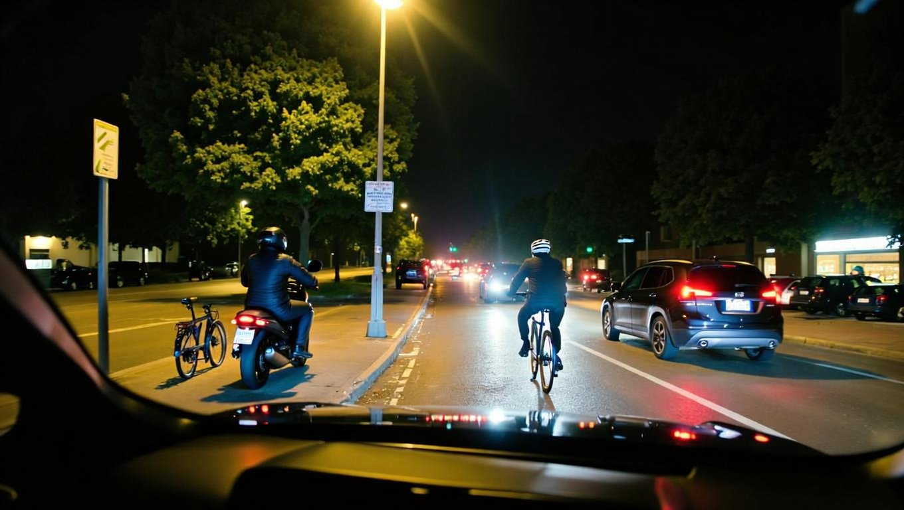

# All recipes

  

    
Discover Cosmos recipes across every domain in one place.

  

  

  <section class="recipe-category" id="robotics">
    

      <h2>Robotics</h2>
      
Manipulation, navigation, and embodied reasoning workflows for robot training.

    

    

      

        <a class="recipe-card" href="./inference/reason2/intbot_showcase/inference.html">
          

            
          

          
Egocentric Social and Physical Reasoning with Cosmos-Reason2-8B

          
Inference

        </a>
        <a class="recipe-card" href="./inference/transfer1/inference-warehouse-mv/inference.html">
          

            <video src="./inference/transfer1/inference-warehouse-mv/assets/combined_grid_rgb.mp4" autoplay muted loop loading="lazy"></video>
          

          
Cosmos Transfer 1 Sim2Real for Multi-View Warehouse Detection and Tracking

          
Inference

        </a>
        <a class="recipe-card" href="./inference/transfer1/gr00t-mimic/inference.html">
          

            
          

          
Isaac GR00T-Mimic for Synthetic Manipulation Motion Generation

          
Inference

        </a>
        <a class="recipe-card" href="./inference/transfer1/inference-x-mobility/inference.html">
          

            
          

          
Cosmos Transfer Sim2Real for Robotics Navigation Tasks

          
Inference

        </a>
        <a class="recipe-card" href="./post_training/predict2/gr00t-dreams/post-training.html">
          

            
          

          
Isaac GR00T-Dreams for Synthetic Trajectory Data Generation

          
Post-Training

        </a>
        <a class="recipe-card" href="./post_training/reason1/spatial-ai-warehouse/post_training.html">
          

            
          

          
Spatial AI for Warehouse Post-Training with Cosmos Reason 1

          
Post-Training

        </a>
        <a class="recipe-card" href="./post_training/reason1/temporal_localization/post_training.html">
          

            
          

          
Cosmos Reason for Mimic Gen temporal localization

          
Post-Training

        </a>
      

    

  </section>

  <section class="recipe-category" id="autonomous-vehicles">
    

      <h2>Autonomous Vehicles</h2>
      
Simulation, traffic scenarios, and autonomous-vehicle-scale data generation and evaluation.

    

    

      

        <a class="recipe-card" href="./post_training/reason2/video_caption_vqa/post_training.html">
          

            
          

          
Post-train Cosmos Reason 2 for AV Video Captioning & VQA

          
Post-Training

        </a>
        <a class="recipe-card" href="./post_training/transfer2_5/av_world_scenario_maps/post_training.html">
          

            <video autoplay loop muted playsinline preload="none" tabindex="-1">
              <source src="./post_training/transfer2_5/av_world_scenario_maps/assets/av_rgb_front_wide.mp4" type="video/mp4">
              Your browser does not support the video tag.
            </video>
          

          
Cosmos Transfer 2.5 Multiview Generation with World Scenario Map Control

          
Post-Training

        </a>
        <a class="recipe-card" href="./inference/predict2/inference-its/inference.html">
          

            
          

          
Cosmos Predict 2 Text2Image for Intelligent Transportation System (ITS) Images

          
Inference

        </a>
        <a class="recipe-card" href="./inference/transfer1/inference-its-weather-augmentation/inference.html">
          

            
          

          
Cosmos Transfer 1 Weather Augmentation for Intelligent Transportation System (ITS) Images

          
Inference

        </a>
        <a class="recipe-card" href="./inference/transfer2_5/inference-carla-sdg-augmentation/inference.html">
          

            
          

          
Cosmos Transfer 2.5 Sim2Real for Simulator Videos

          
Inference

        </a>
        <a class="recipe-card" href="./post_training/predict2/its-accident/post_training.html">
          

            
          

          
Traffic Anomaly Generation with Cosmos Predict2

          
Post-Training

        </a>
        <a class="recipe-card" href="./post_training/reason1/intelligent-transportation/post_training.html">
          

            
          

          
Intelligent Transportation Post-Training with Cosmos Reason 1

          
Post-Training

        </a>
        <a class="recipe-card" href="./post_training/reason1/av_video_caption_vqa/post_training.html">
          

            
          

          
SFT for AV video captioning and VQA

          
Post-Training

        </a>
        <a class="recipe-card" href="./end2end/smart_city_sdg/workflow_e2e.html">
          

            
          

          
Synthetic Data Generation (SDG) for Traffic Scenarios

          
Workflow

        </a>
      

    

  </section>

  <section class="recipe-category" id="vision-ai">
    

      <h2>Vision AI</h2>
      
Visual generation, curation, and domain transfer across image and video modalities.

    

    

      

        <a class="recipe-card" href="./inference/reason2/worker_safety/inference.html">
          

            
          

          
EWorker Safety in a Classical Warehouse with Cosmos Reason 2

          
Inference

        </a>
        <a class="recipe-card" href="./data_curation/embedding_analysis/embedding_analysis.html">
          

            
          

          
Dataset Video Clustering with Time Series K-Means on Embeddings

          
Curation

        </a>
        <a class="recipe-card" href="./inference/transfer2_5/biotrove_augmentation/inference.html">
          

            
          

          
Domain Transfer for BioTrove Moths with Cosmos Transfer 2.5

          
Inference

        </a>
        <a class="recipe-card" href="./inference/transfer2_5/inference-real-augmentation/inference.html">
          

            
          

          
Multi-Control Recipes with Cosmos Transfer 2.5

          
Inference

        </a>
        <a class="recipe-card" href="./inference/transfer2_5/inference-image-prompt/inference.html">
          

            <video autoplay loop muted playsinline preload="none" tabindex="-1">
              <source src="./inference/transfer2_5/inference-image-prompt/assets/example1_generation-from-edge-sunset.mp4" type="video/mp4">
              Your browser does not support the video tag.
            </video>
          

          
Style-Guided Video Generation with Cosmos Transfer 2.5

          
Inference

        </a>
        <a class="recipe-card" href="./post_training/predict2_5/sports/post_training.html">
          

            <video autoplay loop muted playsinline preload="none" tabindex="-1">
              <source src="./post_training/predict2_5/sports/assets/post_trained/12.mp4" type="video/mp4">
              Your browser does not support the video tag.
            </video>
          

          
LoRA Post-training for Sports Video Generation

          
Post-Training

        </a>
        <a class="recipe-card" href="./post_training/reason1/physical-plausibility-check/post_training.html">
          

            <video autoplay loop muted playsinline preload="none" tabindex="-1">
              <source src="https://videophysics2testvideos.s3.us-east-2.amazonaws.com/hunyuan_xdit/A_car_crashes_into_a_stack_of_cardboard_boxes,_sending_the_boxes_flying_in_all_directions.mp4" type="video/mp4">
              Your browser does not support the video tag.
            </video>
          

          
Physical Plausibility Prediction with Cosmos Reason 1

          
Post-Training

        </a>
        <a class="recipe-card" href="./post_training/reason1/wafermap_classification/post_training.html">
          

            
          

          
Wafer Map Anomaly Classification with Cosmos Reason 1

          
Post-Training

        </a>
        <a class="recipe-card" href="./data_curation/predict2_data/data_curation.html">
          

            
          

          
Curate data for Cosmos Predict Fine-Tuning using Cosmos Curator

          
Curation

        </a>
      

    

  </section>

