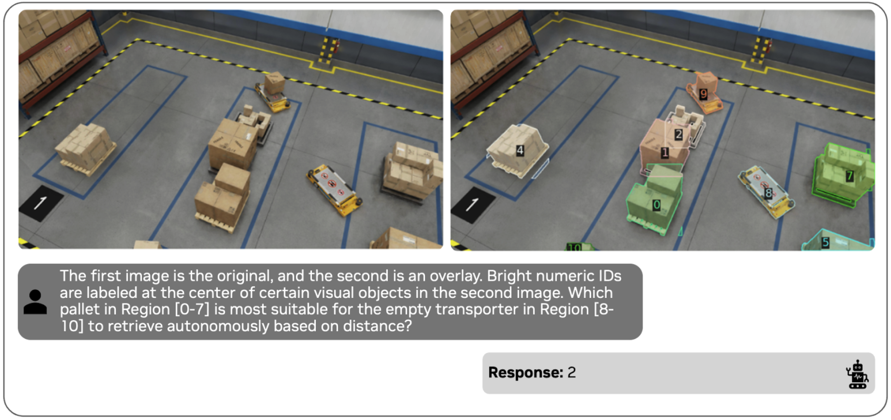
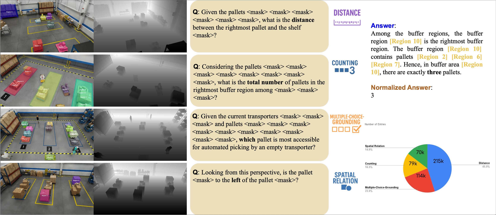
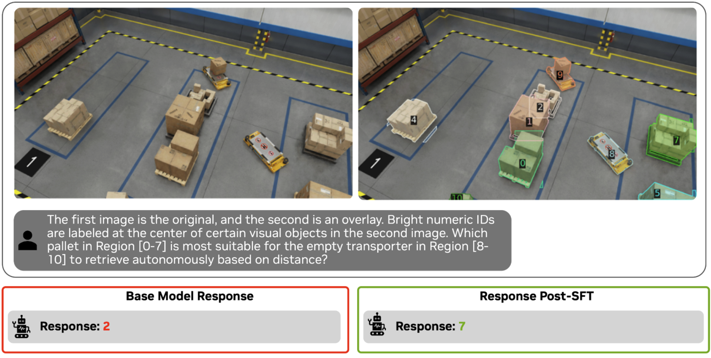
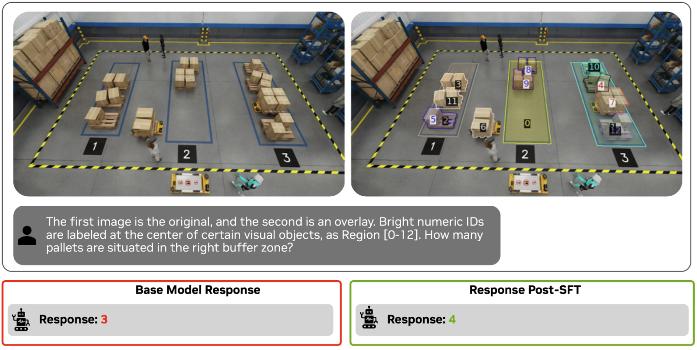
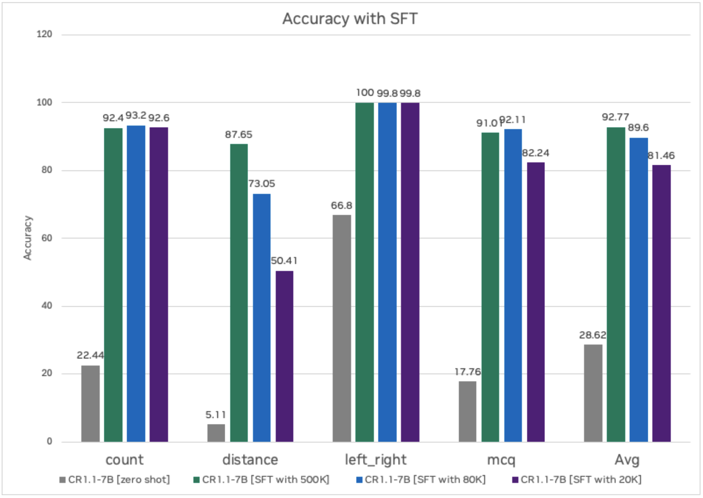
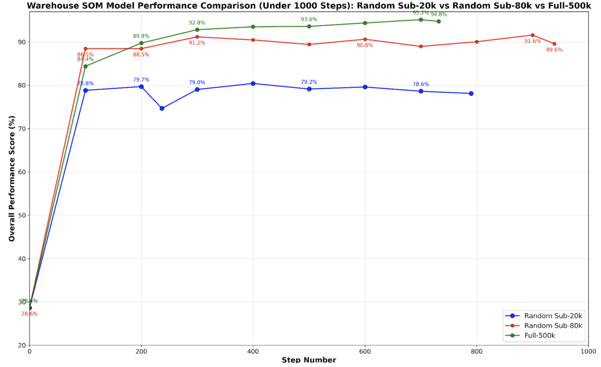

# Spatial AI for Warehouse Post-Training with Cosmos Reason 1
>
> **Authors:** [Xiaolong Li](https://www.linkedin.com/in/xiaolong-li19/) • [Chintan Shah](https://www.linkedin.com/in/chintan-shah-7b7a2811/) • [Tomasz Kornuta](https://www.linkedin.com/in/tkornuta/)
> **Organization:** NVIDIA

## Overview

Supervised Fine-Tuning (SFT) is used to improve the accuracy of a pre-trained model by teaching it to follow specific instructions or understand new tasks using labeled examples. While a base model learns general patterns from large, diverse data, SFT aligns the model to specific tasks with desired outputs by showing clear input–output pairs. In this recipe, we will show how to fine-tune the [Cosmos Reason 1-7B](https://build.nvidia.com/nvidia/cosmos-reason1-7b) model to learn spatial intelligence tasks such as understanding distances between objects and space, relative spatial relationship between objects and count and count.

Before fine-tuning the model, let's look at the zero-shot performance of the model. Based on the question, the model has to identify the pallet closest to the transporter in region 8. Visually, the pallet identified as region 7 appears the closest to the empty transporter in region 8. Although region 2 is close, region 7 is closer. The base model incorrectly predicts region 2. Clearly there is room for the model to improve on spatial understanding task.



<br>
Here’s the end-to-end workflow to fine-tune Cosmos Reason - from data preparation, supervised fine-tuning on the prepared dataset to quantizing and deploying the model for inference.


<br>

## Data Preparation

For this experiment, we will demonstrate on the [Physical AI Spatial Intelligence Warehouse dataset](https://huggingface.co/datasets/nvidia/PhysicalAI-Spatial-Intelligence-Warehouse/tree/main). This is a completely synthetic dataset of a warehouse with 95K images along with around 500k annotations : Q&A pairs with related meta information in LLaVA format for VLM training.  Tasks included distance, counting, multiple-choice grounding, and spatial relation reasoning.

Below example shows the RGB frame, depth map, annotated regions, the corresponding question, and sample answers.
The distribution of question types demonstrated the diversity of reasoning skills required across tasks.



<br>

### Sample JSON Entry

Specifically, the annotation contains several additional attributes compared to general [LLaVa format](https://github.com/haotian-liu/LLaVA/blob/main/docs/Finetune_Custom_Data.md):

- **normalized_answer** field for quantitative evaluation with accuracy and error metrics between ground-truth and predicted answer.
- **freeform_answer** field, which is the original answer from 'gpt'.
- **rle** denotes the corresponding masks per object in pycoco format.
- **category** denotes the question category. The categories are left_right, multi_choice_question(mcq), distance, and count.

Here's an example of the annotation format:

```json
{
    "id": "9d17ba0ab1df403db91877fe220e4658",
    "image": "000190.png",
    "conversations": [
      {
        "from": "human",
        "value": "<image>\nCould you measure the distance between the pallet <mask> and the pallet <mask>?"
      },
      {
        "from": "gpt",
        "value": "The pallet [Region 0] is 6.36 meters from the pallet [Region 1]."
      }
    ],
    "rle": [
      {
      "size": [
          1080,
          1920
      ],
      "counts": "bngl081MYQ19010ON2jMDmROa0ol01_RO2^m0`0PRODkm0o0bQOUO[n0U2N2M3N2N2N3L3N2N1N1WO_L]SO"
      },
      {
      "size": [
          1080,
          1920
      ],
      "counts": "^PmU1j1no000000000000000000001O0000000000001O0000000000001O0000000000001O0000000000"
      }
    ],
    "category": "distance",
    "normalized_answer": "6.36",
    "freeform_answer": "The pallet [Region 0] is 6.36 meters from the pallet [Region 1]."
}
```

<br>

### Data preprocessing

For this experiment, we fine-tune the Cosmos Reason 1 model on the 80k subset of the Physical AI Spatial Intelligence Warehouse dataset. Please refer to [scripts/examples/reason1/spatial-ai-warehouse/](../../../../scripts/examples/reason1/spatial-ai-warehouse/)

**Step 1:** Download Data

Please go to HuggingFace [Physical AI Spatial Intelligence Warehouse dataset](https://huggingface.co/datasets/nvidia/PhysicalAI-Spatial-Intelligence-Warehouse/tree/main) and download the dataset directly.

```shell
cd scripts/examples/reason1/spatial-ai-warehouse/
hf download nvidia/PhysicalAI-Spatial-Intelligence-Warehouse --repo-type=dataset
cd PhysicalAI-Spatial-Intelligence-Warehouse
cd train/images
for file in *.tar.gz; do
    tar -xzf "$file" &
done
```

**Step 2:** Transform the VQA annotations

The complete preprocessing steps include preparing Set of Mark (SoM) image, data random sub_sampling, and convert to final LLaVa format. The final input to the VLM model is the original clean image, SoM image, and corresponding QA text.

Set of Mark (SoM) is a technique where you instruct the model to focus on specific “marks” in an image or text to help VLM or LLM understand the context better and provide better responses. We will mark the object of interest with a segmentation mask and object ID. To overlay the mask and object ID on top of the original image, run the following command.

```shell
cd scripts/examples/reason1/spatial-ai-warehouse/
NUM_CHUNKS=16 NUM_WORKERS=16 python toolbox/overlay_and_save_som.py \
--original_data_root_dir /path/to/PhysicalAI-Spatial-Intelligence-Warehouse/ \
--save_root_dir /path/to/PhysicalAI-Spatial-Intelligence-Warehouse/ \
--annotation_names train

NUM_CHUNKS=16 NUM_WORKERS=16 python toolbox/overlay_and_save_som.py \
--original_data_root_dir /path/to/PhysicalAI-Spatial-Intelligence-Warehouse/ \
--save_root_dir /path/to/PhysicalAI-Spatial-Intelligence-Warehouse/ \
--annotation_names val
```

We will further sub-sample the dataset, and covert everything into the final LLaVa format.

```shell
python toolbox/data_preprocess.py --input_file /path/to/PhysicalAI-Spatial-Intelligence-Warehouse/train.json --output_file /path/to/PhysicalAI-Spatial-Intelligence-Warehouse/train_llava.json

python toolbox/data_preprocess.py --input_file /path/to/PhysicalAI-Spatial-Intelligence-Warehouse/val.json --output_file /path/to/PhysicalAI-Spatial-Intelligence-Warehouse/val_llava.json
```

<br>

## Post-Training with Supervised Fine-Tuning (SFT)

After data preprocessing, we turn our data into standard LlaVa format. To launch training, we follow the default cosmos-rl training command in [Cosmos Reason 1 Post-Training Llava Example](https://github.com/nvidia-cosmos/cosmos-reason1/tree/main/examples/post_training_llava).
Since the Cosmos Reason model uses a vision transformer that processes images in patches. The raw image comes at 1080p resolution, we downsample the image by twice to have 960x540 resolution, since each vision token corresponds to a 28 x 28 = 784 pixel area, we end up with have `960/28 * 540/28 ≈ 646 tokens/frame`

```shell
cosmos-rl --config configs/sft.toml toolbox/custom_sft.py
```

### Hyperparameter optimization

We follow the default setting in [Cosmos Reason 1/sft.yaml](https://github.com/nvidia-cosmos/cosmos-reason1/blob/main/examples/post_training/configs/sft.toml) for this SFT experiment; the default setting works well for our case. We changed a few of the hyperparameters to run more efficiently on 8xA100 GPUs. We noticed that the `train_batch_per_replica=32` with `mini_batch=4` already takes care of gradient accumulation with 8 on each single A100, so the total_batch_size=256 in our case, which largely contributes to the training stability with a larger batch size. Below are the customized changes required to adapt the template config file to our post-training experiment.

### Configuration Example

Here's the TOML configuration file with the key hyperparameter changes:

```toml
[policy.parallelism]
dp_shard_size=8  # for 8 GPUs for FSDP Sharding

[train]
optm_lr=1e-5     # default is 2e-6, this was better since we are adapting the model for image level training, compared to video scenarios
optm_impl = "foreach" # both 'fused' and 'foreach' should be okay,
we have 3 major categories of implementations: for-loop, foreach, and fused. 'foreach' combine parameters into a multi-tensor and run the big chunks of computation all at once, for more check https://docs.pytorch.org/docs/stable/optim.html
resume = true      # in case you want to automatically resume from any previous runs
output_dir = "/path_to_your_own_output_dir" # define your customized output_dir
enable_validation = false # turn off validation steps to save training time
master_dtype = "float32"  # you can choose use higher precision for the master weight data type for optimizers


# add config for your own dataset under [custom] attribute, we can define our own args
[custom.dataset]
annotation_path = "<PATH_TO_DATASET>/train_llava.json"
media_path = "<PATH_TO_DATASET>/"

[logging]
experiment_name = "cr1_warehouse_som_sub80k_tp1_fsdp8_node1_ep1_lr1em5"

[train.train_policy]
dataloader_num_workers = 8 # you can increase your number of data worker to load data from cpu faster
dataloader_prefetch_factor = 8 # you can increase your number of pre-fetch to save potential GPU waiting time
```

<br>

## Ablation and Evaluation

We experimented with different dataset sizes (ranging from 20K to 500K Q&A pairs) and various training step configurations. For detailed analysis of our results, please refer to the [Results](#results) section. Below are the commands for running batch inference and generating evaluation scores.

### Running Model Inference

We provide a reference script (`evaluate.py`) for performing parallel inference over 1K validation samples, please refer to [inference_sample.py](https://github.com/nvidia-cosmos/cosmos-reason1/blob/main/scripts/inference_sample.py) for updated inference code.

```shell
# Run inference with default configuration (simplified version)
python toolbox/evaluate.py \
    --annotation_path <PATH_TO_DATASET>/val_llava.json \
    --media_path <PATH_TO_DATASET> \
    --model_name <PATH_TO_MODEL_CHECKPOINT> \
    --results_dir results/spatial-ai-warehouse
```

### Computing Evaluation Scores

To evaluate the final results and generate scores per QA category, please refer to the [official evaluation script](https://huggingface.co/datasets/nvidia/PhysicalAI-Spatial-Intelligence-Warehouse/blob/main/README.md) to compare the prediction and ground-truth. Below we provide the example command.

```shell
python toolbox/score.py \
    --results_dir results/spatial-ai-warehouse \
    --official_answer_path <PATH_TO_DATASET>/val.json \
    --official_evaluation_script <PATH_TO_DATASET>/utils/compute_scores.py
```

<br>

## Results

### Qualitative Results

First, let's review the qualitative improvements in the response. We will prompt the same question for the base model and post-trained model. Based on the images below, you can see that the output responses have improved significantly. It's able to understand spatial distances and count better.




### Quantitative Results

Next, let's look at the quantitative results - task based accuracy for the base model vs. post-trained model. Clearly by post-training, we are able to improve accuracy significantly versus base model. Additionally, we also swept the number of images and Q&A pairs that are needed and based on the experiment we are starting to see good accuracy once we have about 80K samples. In fact, for ‘counting’ and ‘left right’ orientation tasks we only need 20K Q&A pairs.





<br>

### Training Time

We ran all the experiments on 1 node (8 GPUs) of A100 for 3 epochs. The table below captures the training time with different data sizes. The hyperparameter in the section above is for 8 GPUs; if you are using lesser or more GPUs, please update the hyperparameters accordingly.

| Method | Dataset Size  | Training Time (on 8 A100s) |
|--------|---------------|----------------------------|
| SFT    | 500k          | 36 hours                   |
| SFT    | 80K           | 7 hours                    |
| SFT    | 20K           | 2 hours                    |

<br>

## Model Deployment

The last step is to deploy the trained model for inference. You can deploy it using either NVIDIA optimized NIM or through VSS blueprint or else you can deploy it in your own application. Before deployment, we will first quantize the LLM portion of the VLM to FP8 for faster inference.

### FP8 Quantization

The script to quantize the model to FP8 is provided in the NVIDIA [Cosmos Reason 1 repo](https://github.com/nvidia-cosmos/cosmos-reason1/blob/main/scripts/quantize_fp8.py).

**Step 1:** Clone the Cosmos Reason 1 repo.

**Step 2:** To run post-training quantization (PTQ), you need following dependencies:

```shell
"vllm==0.9.2"
"transformers>=4.53.1"
"qwen-vl-utils[decord]"
"llmcompressor>=0.6.0"
```

**Step 3:** Run the quantization script.

```shell
python ./scripts/quantize_fp8.py --model_id 'nvidia/Cosmos-Reason1-7B' --save_dir 'Cosmos-Reason1-7B-W8A8-FP8'
```

Before deploying the quantized model for inference, please run evaluation on the model for accuracy and ensure quantization doesn’t introduce any accuracy regression.

<br>

### Deploy on NIM

NVIDIA NIM™ provides containers to self-host GPU-accelerated inferencing microservices for pretrained and customized AI models across clouds, data centers, and RTX™ AI PCs and workstations, with industry-standard APIs for simple integration into AI applications.

To deploy a post-trained checkpoint, go to the [fine-tune-model](https://docs.nvidia.com/nim/vision-language-models/latest/fine-tune-model.html) section in NIM documentation. Go to "Cosmos Reason 1-7B" tab. NIM will automatically serve an optimized vLLM engine for this model. The model needs to be in the Huggingface checkpoint or quantized checkpoint.

```shell
export CUSTOM_WEIGHTS=/path/to/customized/reason1
docker run -it --rm --name=cosmos-reason1-7b \
    --gpus all \
    --shm-size=32GB \
    -e NIM_MODEL_NAME=$CUSTOM_WEIGHTS \
    -e NIM_SERVED_MODEL_NAME="cosmos-reason1-7b" \
    -v $CUSTOM_WEIGHTS:$CUSTOM_WEIGHTS \
    -u $(id -u) \
    -p 8000:8000 \
    $NIM_IMAGE
```

<br>

### Deploy with NVIDIA VSS Blueprint

NVIDIA Blueprint for video search and summarization (VSS) leverages both Vision-Language Models (VLM) and Large Language Models (LLM) to generate captions, answer questions, and summarize video content, enabling rapid search and understanding of videos on NVIDIA hardware.

By default, VSS is configured to use base Cosmos Reason 1-7B as the default VLM. Deployment instructions for VSS are available in its [official documentation](https://docs.nvidia.com/vss/latest/content/prereqs_x86.html). VSS supports two primary deployment methods: Docker Compose and Helm charts.

For Docker Compose deployment, navigate to the [Configure the VLM](https://docs.nvidia.com/vss/latest/content/installation-vlms-docker-compose.html#local-models-cosmos-reason1) section under “Plug-and-Play Guide (Docker Compose Deployment)” to integrate a custom fine-tuned Cosmos Reason 1 checkpoint.

```shell
export VLM_MODEL_TO_USE=cosmos-reason1
export MODEL_PATH=</path/to/local/cosmos-reason1-checkpoint>
export MODEL_ROOT_DIR=<MODEL_ROOT_DIR_ON_HOST>
```

Similarly for Helm Chart deployment, navigate to this page - [Configure the VLM](https://docs.nvidia.com/vss/latest/content/installation-vlms.html#local-models-cosmos-reason1) section under “Plug-and-Play Guide (Helm Deployment)”.

```yaml
vss:
  applicationSpecs:
    vss-deployment:
      containers:
        vss:
          env:
          - name: VLM_MODEL_TO_USE
            value: cosmos-reason1
          - name: MODEL_PATH
            value: "/tmp/cosmos-reason1"
  extraPodVolumes:
  - name: local-cosmos-reason1-checkpoint
    hostPath:
      path: </path/to/local/cosmos-reason1-checkpoint>
  extraPodVolumeMounts:
  - name: local-cosmos-reason1-checkpoint
    mountPath: /tmp/cosmos-reason1

```

<br>

## Conclusion

Supervised Fine-Tuning Cosmos Reason 1 on warehouse-specific data boosts accuracy from zero-shot levels to over 90% on spatial intelligence VQA tasks. Key insights:

- **Dataset scale drives causal perception**: Large-scale datasets (>80K samples) provide sufficient complexity and diversity for the model to learn robust causal relationships and spatial reasoning patterns.
- **Rapid convergence**: Training completes within 7 hr on 80K-scale data, and it converges within the 1st 100 steps, demonstrating the efficiency of the fine-tuning approach.
- **Seamless deployment**: Workflow supports quantization and deployment via NIM or VSS for production environments.

This methodology can be applied to any physical AI domain by substituting relevant datasets, with dataset scale being a critical factor for achieving strong causal perception capabilities.
