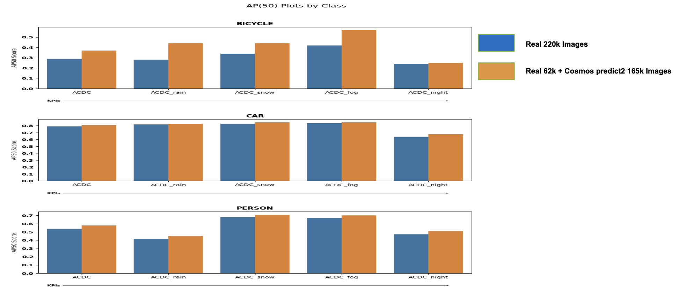

# Cosmos Predict 2 Text2Image for Intelligent Transportation System (ITS) Images

> **Authors:** [Charul Verma](https://www.linkedin.com/in/charul-verma-6bb778172/)  • [Reihaneh Entezari](https://www.linkedin.com/in/reihanehentezari/) • [Arihant Jain](https://www.linkedin.com/in/arihant-jain-5955046b/) • [Dharshi Devendran](https://www.linkedin.com/in/dharshidevendran/) • [Ratnesh Kumar](https://www.linkedin.com/in/rkumar1729/)
> **Organization:** NVIDIA

| **Model** | **Workload** | **Use Case** |
|-----------|--------------|--------------|
| [Cosmos Predict 2](https://github.com/nvidia-cosmos/cosmos-predict2) | Inference | Synthetic Data Generation |

This tutorial demonstrates how to use the [Cosmos Predict 2](https://github.com/nvidia-cosmos/cosmos-predict2) Text2Image model for Synthetic Data Generation (SDG) to improve the accuracy of Computer Vision (CV) or Vision-Language Model (VLM) algorithms downstream.

- [Setup and System Requirement](setup.md)

## Why ITS Synthetic Data Generation Matters

Collecting high-quality ITS data at scale is expensive, slow, and often incomplete:

- Diverse scenes are hard to capture on demand (urban vs. highway, intersections).
- The long-tail is underrepresented: road signs, cyclists, pedestrians and motorcycles appear infrequently, creating class imbalance.
- Variations across time of day, weather and camera angles introduce domain shifts that are difficult to cover comprehensively.

Cosmos Predict 2 enables targeted synthetic data generation to strategically fill these gaps. With text-to-image control, we can:

- Generate balanced sets that upsample low-frequency classes (e.g., specific road signs, bicycles) while preserving scene realism.
- Systematically sweep camera viewpoints (top-down, dashboard), illumination (dawn/day/dusk/night), weather, and scene layouts to improve generalization.

The result is a curated mixture of scenes that complements real data, improves coverage of rare cases, and reduces domain gaps—ultimately improving downstream CV/VLM performance and robustness in production.

## Demonstration Overview

This is a demonstration of **Cosmos Predict 2** being used for ITS image generation. To showcase the impact, this tutorial walks through a step-by-step Cosmos Predict 2 ITS image generation process to improve a downstream ITS object detector RT-DETR model.

## Cosmos Predict 2 Pipeline Components

## Architecture

### Component explanations

- VLM Captioner: Produces faithful, detailed captions from example ITS images to seed generation.
- LLM Prompt Augmenter: Injects target entities and variations (viewpoint, weather) under strict realism rules.
- Cosmos Predict 2 Text‑to‑Image: Generates high‑quality ITS images aligned with prompts.
- Train RT‑DETR: Fine‑tune the detector .
- Evaluate on KPIs: Measure improvements across ACDC, SUTD, DAWN (e.g., AP50 per class and weather).

### Sample Input ITS Images

Start with an ITS image to take inspiration of caption.

### Image Captioning Using a VLM

First, generate detailed captions of the input images using a VLM as captioner:

> "A nighttime street view from inside a vehicle shows a motorcyclist navigating through traffic, with cars and streetlights illuminating the wet road."

NOTE: We used Qwen 2.5 VL for captioning with the following input prompt:

> Given this image, please generate a caption that describes only the aspects of the image that satisfy all four of the following criteria:
>
> 1. obeys the laws of physics.
> 2. has objects that are scaled and positioned realistically relative to each other and the setting.
> 3. has visual coherence (i.e. all the objects belong to the setting and all the objects naturally occur with each other).
> 4. has objects of the correct texture/geometry.
> 5. Make sure the caption is similar to a real-life photograph caption. Avoid the words 'scene', 'depicts', or 'imagines'.

### LLM‑guided caption augmentation to introduce target objects (e.g., bicycles)

Next, use a LLM to augment the caption for target object inclusion(bicycle):

> "A nighttime street view from inside a vehicle shows a motorcyclist navigating through traffic, with cars and streetlights illuminating the wet road. A bicycle leans against a lamppost near the sidewalk, its owner nowhere to be seen. In the distance, a cyclist on a bicycle rides in the opposite direction, their reflective gear catching the light of an oncoming car. Meanwhile, a bicycle messenger weaves through the traffic, dodging a car that's turning into a parking lot, where another bicycle is locked to a rack near the entrance."

NOTE: We used Llama 3.1 with the following input prompt for object-centric augmentation:

> """You are given a base image caption describing a scene. Enhance the caption by adding realistic and contextually varied instances of person, bicycle, and car (including synonyms such as bike, motorbike, truck, or bus) only when the scene can logically accommodate them. The modified caption will be used for generating an image.
>
> Strict Rules:
>
> 1. Preserve the original environment and setting exactly except the weather. Do not transform the scene into a road or traffic scene if it is not already one.
> 2. If the scene is indoors, inside a campus area without visible roads, on a footpath, or otherwise unsuitable for vehicles, DO NOT add any vehicles or road elements.
> 3. Start the enhanced caption with the given camera angle and viewpoint (e.g., "A static roadside camera captures...", "A fixed overhead camera records...") only if this matches the original scene type.
> 4. Include the provided weather and surrounding context naturally without altering the original environment.
> 5. If adding objects, place multiple instances in distinct, realistic locations or contexts.
> 6. Only place vehicles on the road; never on footpaths.
> 7. Do not place bicycles in racks.
> 8. Ensure all object positions respect real-world physical laws and lighting conditions.
> 9. Remove all greenery, trees and bushes from the caption.
> 10. Lighting must be natural daylight consistent with the given weather.
> 11. Avoid unrealistic or overly dramatic lighting descriptions such as "sun reflection", "glaring sunlight", "blinding light", or unnatural lens effects. Describe light and shadows only as they would appear in real life.
> 12. Avoid using descriptions like serene, mystical ambience etc.
> 13. Avoid giving unnecessary weather or surrounding description.
> 14. Do not add abandoned, broken-down, or damaged vehicles on the road.
> 15. Do not add vehicles on the road without a driver or visible occupant.
>
> Context-Specific Enhancement Rules:
>
> 1. When surroundings indicate a specific cultural or regional context (e.g., "Indian traffic scene", "European city", "Southeast Asian street"), incorporate appropriate contextual elements:
>     - For Indian contexts: Include auto-rickshaws, diverse vehicle types (cars, motorcycles, scooters, buses), mixed traffic patterns, street vendors if appropriate, varied clothing styles
>     - For European contexts: Include typical European vehicles, organized traffic patterns, appropriate architecture references
>     - For Asian contexts: Include region-specific vehicles (scooters, small cars, delivery bikes), appropriate urban density
> 2. If surroundings are not specified, empty, or "none", use generic/universal traffic elements without specific cultural markers.
> 3. Adapt vehicle types and traffic patterns to match the specified surrounding context while maintaining realism.
> 4. Include culturally appropriate human elements (clothing, behavior, demographics) that match the surrounding context, or generic elements if no context is specified.
> 5. When adding people, ensure their appearance, attire, and activities are contextually appropriate for the specified surroundings, or use neutral descriptions if surroundings are unspecified.
> 6. For traffic scenes, reflect the typical traffic composition and behavior patterns of the specified region or culture, or use standard mixed traffic if no specific context is given.
>
> Output Format:
>
> - Return the enhanced caption as a single paragraph enclosed in <...>.
> - Do not include any extra text or explanations.
>
> Inputs:
>
> - Camera angle: {camera_angle}
> - Weather: {weather}
> - Surroundings: {surroundings}
> - Original Caption: {caption}"""

For this example, we used different camera angles (topdown, front dashboard), different weathers (snow, fog, night) and surroundings = none.

### Cosmos Predict 2 Output Image

The sample below is a grid composed of multiple generations across different camera angles and weather conditions.

## Training Downstream ITS Detector

To illustrate the impact of Cosmos Predict 2 image generation on a downstream ITS detector, we have trained an RT-DETR detector with Cosmos Predict 2 generated images using different camera angels , weathers and objects and evaluated the trained models on three public KPIs.

## Results

Experiments were conducted with a set of ~62k real ITS images and ~165K Cosmos Predict 2 generated synthetic images (without any filtering) using the pipeline described in this tutorial.

For context, we compare against a baseline ITS detector with the exact same architecture trained on ~220k real images (no synthetic data). Both models use the same backbone: ResNet‑50 pretrained on OpenImages.

Below are the results on the three KPIs:

## ACDC Dataset

The ACDC dataset is an Intelligent Transportation System (ITS)-related dataset with different weather conditions such as snow, fog, rain, and night. The dataset contains approximately ~2k images and can be found here: <https://acdc.vision.ee.ethz.ch/>

Below are the AP50 results of the most common objects (car, person, bicycle) in the dataset along all weather conditions:

As seen above, the blue curves (which are from the trained detector with Cosmos Predict 2 generated images) have consistently higher AP50 compared to the red curves, across all weather/lightings and objects.

## SUTD Dataset

The SUTD dataset is also an ITS-related dataset with more diverse weather conditions such as snow, fog, rain, night, cloudy, and sunny. The dataset contains approximately ~10k images and can be found here: <https://sutdcv.github.io/SUTD-TrafficQA/#/download>

Below are the AP50 results of the most common objects (car, person, bicycle) in the dataset along all weather conditions:

As seen above, the blue curves (which are from the trained detector with Cosmos Predict 2 generated images) have consistently higher AP50 compared to the red curves, across all weather/lightings and objects.

## DAWN Dataset

The DAWN dataset is also another ITS-related dataset with different weather conditions such as snow, fog, rain, and sandy. The dataset contains approximately ~1k images and can be found here: <https://www.kaggle.com/datasets/shuvoalok/dawn-dataset>

Below are the AP50 results of the most common objects (car, person) in the dataset along all weather conditions:

As seen above, the blue curves (which are from the trained detector with Cosmos Predict 2 generated images) have consistently higher AP50 compared to the red curves, across all weather/lightings and objects.

## Conclusion

This tutorial demonstrates how Cosmos Predict 2 can strategically generate ITS images to address long‑tail sparsity, viewpoint/weather diversity, and domain gaps—leading to measurable gains on downstream detectors.

In our experiments, the baseline used ~220k real images, while the Cosmos variant used ~62k real and ~165k synthetic images. The Cosmos variant shows notable gains for the bicycle class, with AP50 improvements averaged across weather conditions per KPI.

Measured bicycle AP50 improvements (baseline → +Cosmos Predict 2):

- ACDC: 0.287 → 0.374 (+0.087)
- SUTD: 0.515 → 0.610 (+0.095)
- DAWN: 0.514 → 0.801 (+0.286)

Key takeaways:

1. Targeted text-to-image synthesis boosts accuracy for low-frequency classes (e.g., bicycles) while maintaining visual realism.
2. Viewpoint, lighting, and weather sweeps improve generalization across real deployment conditions.
3. Strong prompt design (captioning + constrained augmentation) is critical for controllable, high-quality outputs.

For more details on implementation and training configurations, please refer to the accompanying setup and configuration files in this repository.
