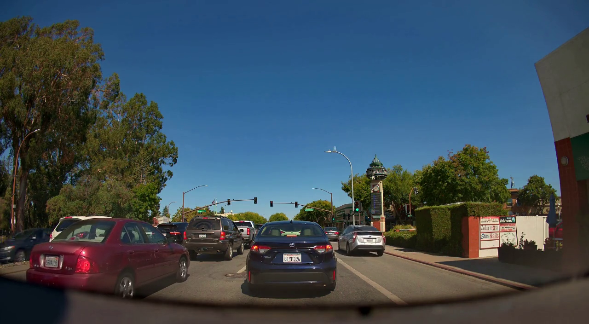
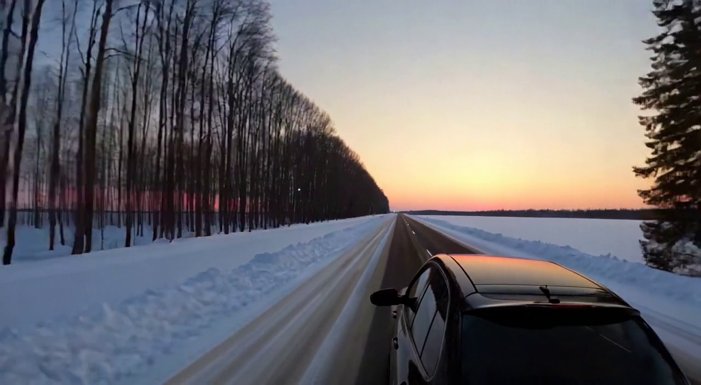
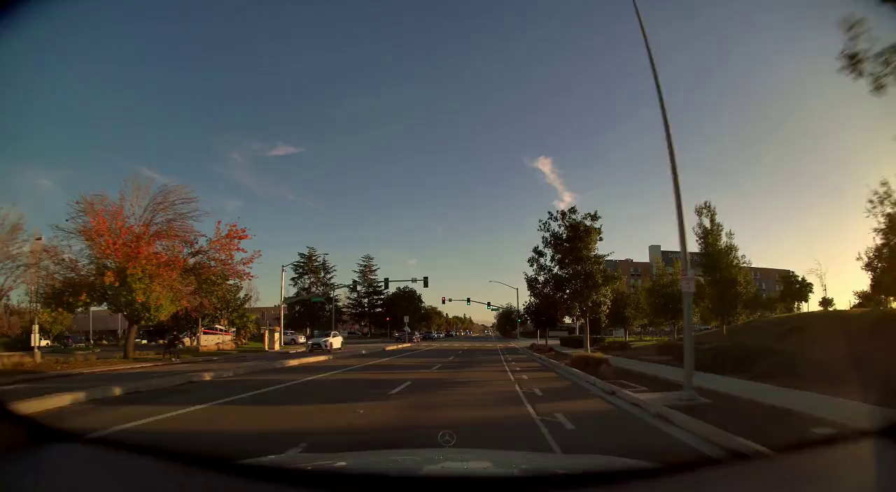
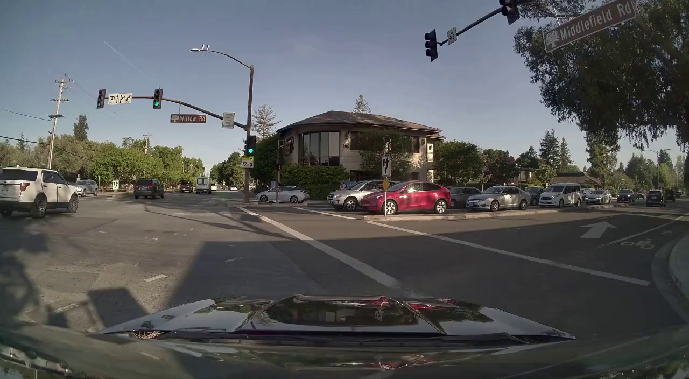
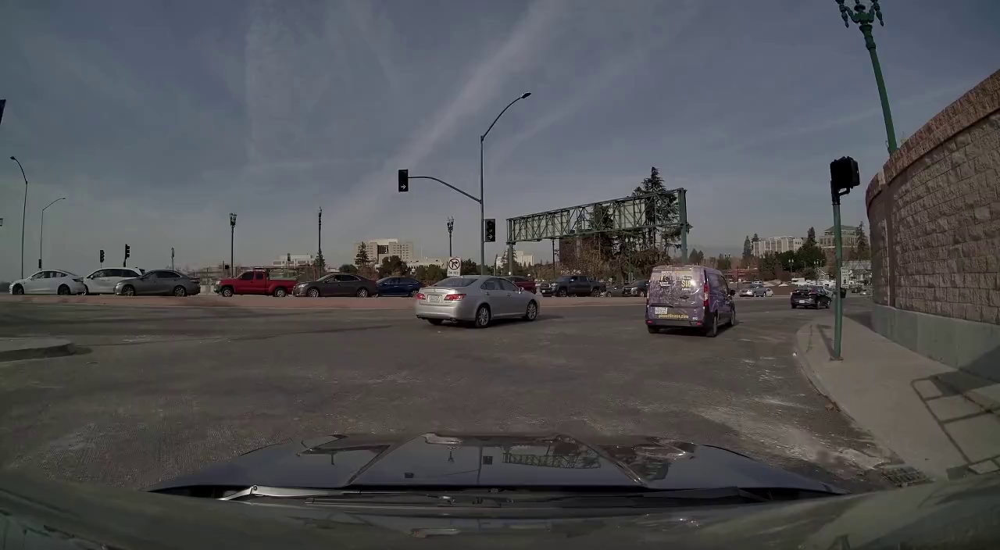

# Cosmos Predict2.5 Gallery

> **Authors:** [Mahesh Patekar](https://www.linkedin.com/in/mahesh-patekar-a3609467/)
>
> **Organization:** NVIDIA

## Overview

This page showcases a collection of results generated using Cosmos Predict2.5 World Foundation Models (WFMs). Cosmos-Predict2.5 is the latest branch of Cosmos WFMs specialized for future state prediction built for physical AI, often referred to as world models. The examples demonstrate three powerful inference capabilities:

- **Text2World**: Generate videos directly from text prompts
- **Image2World**: Create videos from a combination of text prompts and input images
- **Video2World**: Generate videos from text prompts and input videos with controllable parameters

These examples serve as inspiration for users exploring how to leverage the models for video generation and prediction tasks across various scenarios.

---

## Text2World Model

The Text2World model generates videos directly from written prompts without requiring any visual input. This capability enables creation of diverse driving scenarios, weather conditions, and traffic patterns purely from textual descriptions.

### Base Parameters

```json
{
    "inference_type":"text2world",
    "name":"DescribingOutcome",
    "prompt": "Your text prompt here describing the scene, environment, weather, and actions"
}
```

<style>
table td {
  vertical-align: top;
}
table {
  border: none;
}
table td, table th {
  border: none;
}
</style>

### Examples

<table>
<colgroup>
<col style="width: 20%;">
<col style="width: 80%;">
</colgroup>
<tbody>
<tr>
<td><strong>Output Video</strong></td>
<td><video width="600" controls><source src="samples/assets/T1_output.mp4" type="video/mp4">Your browser does not support the video tag.</video></td>
</tr>
<tr>
<td><strong>Input Prompt</strong></td>
<td>The video is shot from a pedestrian's perspective, showing two departing black trucks quickly turn left at an intersection. It is afternoon, with fog reducing visibility. Nearby, another vehicle is attempting to make a right turn while a pedestrian waits to cross.</td>
</tr>
<tr>
<td><strong>Parameters</strong></td>
<td>Text prompt only with default parameters (no additional input)</td>
</tr>
<tr>
<td><strong>Output Video</strong></td>
<td><video width="600" controls><source src="samples/assets/T2_output.mp4" type="video/mp4">Your browser does not support the video tag.</video></td>
</tr>
<tr>
<td><strong>Input Prompt</strong></td>
<td>The video is shot from the driver's view, showing one yellow sedan steadily driving straight along a highway. It is afternoon, with thick fog reducing visibility. Another vehicle in the next lane is attempting to change lanes, while a truck approaches from behind.</td>
</tr>
<tr>
<td><strong>Parameters</strong></td>
<td>Text prompt only with default parameters(no additional input)</td>
</tr>
<tr>
<td><strong>Output Video</strong></td>
<td><video width="600" controls><source src="samples/assets/T3_output.mp4" type="video/mp4">Your browser does not support the video tag.</video></td>
</tr>
<tr>
<td><strong>Input Prompt</strong></td>
<td>The video is shot from a pedestrian's perspective, showing a matte black van swiftly turning right at a stop sign. It is dusk, windy, and there is a cyclist approaching the intersection, waiting for the van to complete its turn.</td>
</tr>
<tr>
<td><strong>Parameters</strong></td>
<td>Text prompt only with default parameters(no additional input)</td>
</tr>
<tr>
<td><strong>Output Video</strong></td>
<td><video width="600" controls><source src="samples/assets/T4_output.mp4" type="video/mp4">Your browser does not support the video tag.</video></td>
</tr>
<tr>
<td><strong>Input Prompt</strong></td>
<td>The video is shot from the driver's view, showing several black SUVs steadily proceeding onto the highway. It is morning, bright and clear. A motorcycle merges into the lane ahead, and another vehicle signals to enter from an adjacent on-ramp.</td>
</tr>
<tr>
<td><strong>Parameters</strong></td>
<td>Text prompt only with default parameters(no additional input)</td>
</tr>
<tr>
<td><strong>Output Video</strong></td>
<td><video width="600" controls><source src="samples/assets/T5_output.mp4" type="video/mp4">Your browser does not support the video tag.</video></td>
</tr>
<tr>
<td><strong>Input Prompt</strong></td>
<td>The video is shot from the driver's view, showing many red trucks steadily driving down a steep slope. It is evening, cloudy and windy. There is a car approaching from behind, and fallen leaves cover parts of the road, reducing traction and requiring careful control.</td>
</tr>
<tr>
<td><strong>Parameters</strong></td>
<td>Text prompt only with default parameters(no additional input)</td>
</tr>
</tbody>
</table>

---

## Image2World Model

The Image2World model allows you to create dynamic videos by combining a text prompt with an input image. This enables users to animate static scenes and predict future states based on visual context.

### Base Parameters

```json
{
    "inference_type":"image2world",
    "name":"DescribingOutcome",
    "prompt": "Your text prompt here describing the scene and desired motion",
    "image_path": "path/to/input/image.jpg"
}
```

### Example 1

<table>
<colgroup>
<col style="width: 20%;">
<col style="width: 80%;">
</colgroup>
<tbody>
<tr>
<td><strong>Input Image</strong></td>
<td></td>
</tr>
<tr>
<td><strong>Output Video</strong></td>
<td><video width="600" controls><source src="samples/assets/IO1_output.mp4" type="video/mp4">Your browser does not support the video tag.</video></td>
</tr>
<tr>
<td><strong>Input Prompt</strong></td>
<td>The video is taken from the perspective of a vehicle's dashboard camera, showing the view of the road ahead. The sky is clear and blue, indicating good weather conditions. The road is lined with green trees and bushes, adding a touch of nature to the urban setting. There are multiple vehicles on the road, including cars and trucks, all moving in the same direction. The vehicles vary in color, with shades of red, blue, and white being prominent. The traffic lights are visible, showing a green light, indicating that it is safe to proceed. The video does not show any accidents or unusual events, just a typical day on the road.</td>
</tr>
<tr>
<td><strong>Parameters</strong></td>
<td>Text prompt + Input image</td>
</tr>
</tbody>
</table>

### Example 2

<table>
<colgroup>
<col style="width: 20%;">
<col style="width: 80%;">
</colgroup>
<tbody>
<tr>
<td><strong>Input Image</strong></td>
<td></td>
</tr>
<tr>
<td><strong>Output Video</strong></td>
<td><video width="600" controls><source src="samples/assets/IO2_output.mp4" type="video/mp4">Your browser does not support the video tag.</video></td>
</tr>
<tr>
<td><strong>Input Prompt</strong></td>
<td>The video opens with a view of a snow-covered road flanked by trees on both sides. The sky is a gradient of colors, suggesting either sunrise or sunset. The camera angle is from the perspective of a car driver, with the hood of the car visible in the foreground. As the video progresses, the car moves forward, and the surrounding landscape remains consistent, with the trees and snow-covered ground visible throughout. The lighting conditions change subtly, indicating the passage of time.</td>
</tr>
<tr>
<td><strong>Parameters</strong></td>
<td>Text prompt + Input image</td>
</tr>
</tbody>
</table>

### Example 3

<table>
<colgroup>
<col style="width: 20%;">
<col style="width: 80%;">
</colgroup>
<tbody>
<tr>
<td><strong>Input Image</strong></td>
<td></td>
</tr>
<tr>
<td><strong>Output Video</strong></td>
<td><video width="600" controls><source src="samples/assets/IO3_output.mp4" type="video/mp4">Your browser does not support the video tag.</video></td>
</tr>
<tr>
<td><strong>Input Prompt</strong></td>
<td>The video is taken from the perspective of a driver inside a vehicle, with the dashboard visible in the lower part of the frame. The vehicle is moving along a road with multiple lanes, and the surroundings include trees, buildings, and other vehicles. The sky is clear with a few clouds, and the lighting suggests it is either morning or late afternoon. The road signs and traffic lights are visible, indicating a well-regulated traffic system.</td>
</tr>
<tr>
<td><strong>Parameters</strong></td>
<td>Text prompt + Input image</td>
</tr>
</tbody>
</table>

### Example 4

<table>
<colgroup>
<col style="width: 20%;">
<col style="width: 80%;">
</colgroup>
<tbody>
<tr>
<td><strong>Input Image</strong></td>
<td></td>
</tr>
<tr>
<td><strong>Output Video</strong></td>
<td><video width="600" controls><source src="samples/assets/IO4_output.mp4" type="video/mp4">Your browser does not support the video tag.</video></td>
</tr>
<tr>
<td><strong>Input Prompt</strong></td>
<td>The video is taken from the perspective of a driver inside a car, with the dashboard visible in the foreground. The car is stationary at an intersection, waiting for the traffic light to change. The traffic light is visible in the upper left corner of the frame, showing a red signal. The surrounding environment includes other vehicles, trees, and buildings. The sky is clear and blue, indicating good weather conditions.</td>
</tr>
<tr>
<td><strong>Parameters</strong></td>
<td>Text prompt + Input image</td>
</tr>
</tbody>
</table>

### Example 5

<table>
<colgroup>
<col style="width: 20%;">
<col style="width: 80%;">
</colgroup>
<tbody>
<tr>
<td><strong>Input Image</strong></td>
<td></td>
</tr>
<tr>
<td><strong>Output Video</strong></td>
<td><video width="600" controls><source src="samples/assets/IO5_output.mp4" type="video/mp4">Your browser does not support the video tag.</video></td>
</tr>
<tr>
<td><strong>Input Prompt</strong></td>
<td>The video is taken from the perspective of a driver inside a vehicle. The vehicle is stationary at a traffic light, and the view outside the windshield shows a clear sky and a road with multiple lanes. There are other vehicles visible, including cars and a truck. The traffic light is red, and there are no visible pedestrians. The surroundings include a bridge in the distance and a building with a red roof. The video does not show any significant action or movement.</td>
</tr>
<tr>
<td><strong>Parameters</strong></td>
<td>Text prompt + Input image</td>
</tr>
</tbody>
</table>

---

## Video2World Model

The Video2World model generates videos from a combination of text prompts and input videos. This model supports controllable parameters such as `seed` and `guidance` that allow fine-tuning of the output generation. These parameters can be adjusted from their default values to their minimum and maximum ranges to achieve different visual results.

### Base Parameters

```json
{
    "inference_type":"video2world",
    "name":"DescribingOutcome",
    "seed": 5000,
    "guidance": 3,
    "prompt": "Your text prompt here describing the scene and desired continuation",
    "video_path": "path/to/input/video.mp4"
}
```

### Examples

### Example 1

<table>
<colgroup>
<col style="width: 20%;">
<col style="width: 80%;">
</colgroup>
<tbody>
<tr>
<td><strong>Input Video</strong></td>
<td><video width="600" controls><source src="samples/assets/V1_input.mp4" type="video/mp4">Your browser does not support the video tag.</video></td>
</tr>
<tr>
<td><strong>Output Video</strong></td>
<td><video width="600" controls><source src="samples/assets/VO1_output.mp4" type="video/mp4">Your browser does not support the video tag.</video></td>
</tr>
<tr>
<td><strong>Input Prompt</strong></td>
<td>The video shows the perspective of a driver inside a car, with the dashboard visible at the bottom of the frame. The car is driving down a wet street, reflecting the overcast sky above. On either side of the street, there are rows of houses with well-manicured lawns and neatly trimmed hedges. The houses have a similar architectural style, with brick facades and white trim. The street is lined with tall, green trees that provide a canopy over the road. The sky is cloudy, suggesting recent or impending rain.</td>
</tr>
<tr>
<td><strong>Parameters</strong></td>
<td>seed: default, guidance: default</td>
</tr>
</tbody>
</table>

### Example 2

<table>
<colgroup>
<col style="width: 20%;">
<col style="width: 80%;">
</colgroup>
<tbody>
<tr>
<td><strong>Input Video</strong></td>
<td><video width="600" controls><source src="samples/assets/V2_input.mp4" type="video/mp4">Your browser does not support the video tag.</video></td>
</tr>
<tr>
<td><strong>Output Video</strong></td>
<td><video width="600" controls><source src="samples/assets/VO2_output.mp4" type="video/mp4">Your browser does not support the video tag.</video></td>
</tr>
<tr>
<td><strong>Input Prompt</strong></td>
<td>The video begins with a wide view of a large, empty warehouse characterized by a light grey colored floor and a solid wall in the background. The warehouse is filled with numerous stacks of boxes arranged in rows on wooden pallets. A pink ladder is positioned in the center of the frame. The camera slowly moves forward, providing a closer view of the stacks of boxes. The camera continues to move forward, offering a detailed view of the neatly arranged boxes and the ladder. The video wraps up with the camera still moving forward, maintaining the focus on the stacks of boxes and the ladder.</td>
</tr>
<tr>
<td><strong>Parameters</strong></td>
<td>seed: default, guidance: default</td>
</tr>
</tbody>
</table>

### Example 3

<table>
<colgroup>
<col style="width: 20%;">
<col style="width: 80%;">
</colgroup>
<tbody>
<tr>
<td><strong>Input Video</strong></td>
<td><video width="600" controls><source src="samples/assets/V3_input.mp4" type="video/mp4">Your browser does not support the video tag.</video></td>
</tr>
<tr>
<td><strong>Output Video</strong></td>
<td><video width="600" controls><source src="samples/assets/VO3_output.mp4" type="video/mp4">Your browser does not support the video tag.</video></td>
</tr>
<tr>
<td><strong>Input Prompt</strong></td>
<td>An empty wooden pallet lies on the ground in an unloading area of a vast industrial warehouse. There are many filled pallets on the ground nearby, full of goods and shipping supplies. The floor is an old wooden floor that is dusty and dirty.</td>
</tr>
<tr>
<td><strong>Parameters</strong></td>
<td>seed: default, guidance: default</td>
</tr>
</tbody>
</table>

### Example 4

<table>
<colgroup>
<col style="width: 20%;">
<col style="width: 80%;">
</colgroup>
<tbody>
<tr>
<td><strong>Input Video</strong></td>
<td><video width="600" controls><source src="samples/assets/V4_input.mp4" type="video/mp4">Your browser does not support the video tag.</video></td>
</tr>
<tr>
<td><strong>Output Video</strong></td>
<td><video width="600" controls><source src="samples/assets/VO4_output.mp4" type="video/mp4">Your browser does not support the video tag.</video></td>
</tr>
<tr>
<td><strong>Input Prompt</strong></td>
<td>The static shot captures a yellow hard hat on the floor of an industrial warehouse. The concrete floor is clean with texture.</td>
</tr>
<tr>
<td><strong>Parameters</strong></td>
<td>seed: default, guidance: default</td>
</tr>
</tbody>
</table>

### Example 5

<table>
<colgroup>
<col style="width: 20%;">
<col style="width: 80%;">
</colgroup>
<tbody>
<tr>
<td><strong>Input Video</strong></td>
<td><video width="600" controls><source src="samples/assets/V5_input.mp4" type="video/mp4">Your browser does not support the video tag.</video></td>
</tr>
<tr>
<td><strong>Output Video</strong></td>
<td><video width="600" controls><source src="samples/assets/VO5_output.mp4" type="video/mp4">Your browser does not support the video tag.</video></td>
</tr>
<tr>
<td><strong>Input Prompt</strong></td>
<td>The mounted camera on the robot's head captures its steady progress past shelves of materials toward large cylindrical structures in the distance.</td>
</tr>
<tr>
<td><strong>Parameters</strong></td>
<td>seed: default, guidance: default</td>
</tr>
</tbody>
</table>
