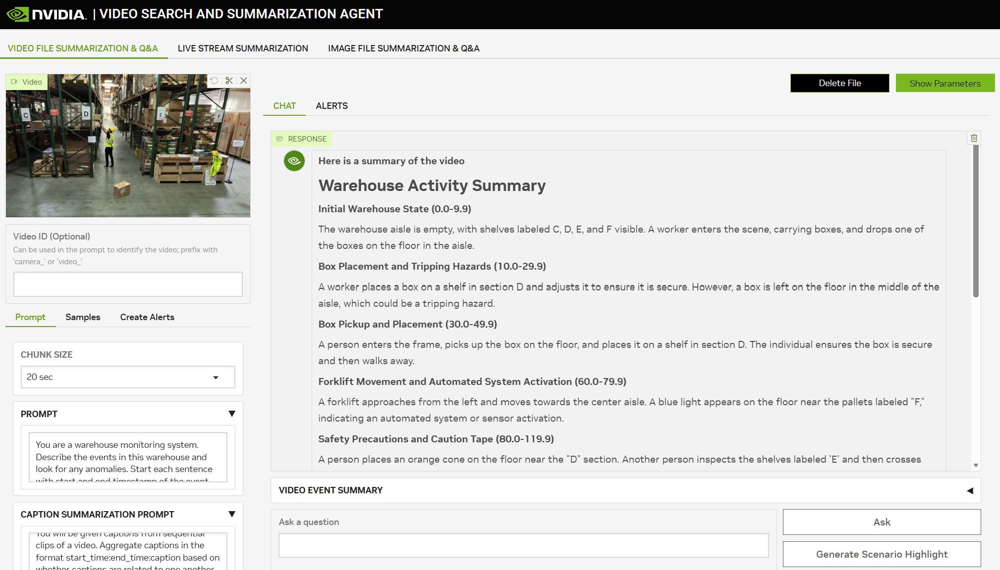

# Video Search and Summarization with Cosmos Reason

> **Authors:** [Sammy Ochoa](https://www.linkedin.com/in/sammy-ochoa/)
> **Organization:** NVIDIA

## Overview

| **Model** | **Workload** | **Use Case** |
|-----------|--------------|--------------|
| Cosmos Reason| Inference | Large scale video search and summarization. |

Large volumes of video data contain critical information for understanding and optimizing operations in warehouses, factories, retail stores, cities and more. Both archived video files and live streaming camera feeds require time consuming manual review to extract valuable insights from the videos.

The Video Search and Summarization Blueprint (VSS) from NVIDIA is a reference architecture for combining vision language models, computer vision models and large language models to analyze and understand large volumes of video data. VSS is easily configured through various prompts to tune the model responses based on the target use case.



VSS allows the user to upload video files or connect live streaming camera feeds to generate summaries, answer questions or send alerts when events of interest occur.

Cosmos Reason is used as the default vision language model in VSS to produce high quality captions across the input videos. VSS first breaks the input video into small chunks (10s-30s) then provides them to Cosmos Reason as a part of a GPU optimized inference pipeline to rapidly caption the video chunks in parallel.

In addition to the captions from Cosmos Reason, extra data sources such as detection data and audio transcription are combined with the video captions. All this data is stored in a graph database and retrieved by a large language model to generate summaries, answer questions and trigger alerts based on user prompts.


The NVIDIA Brev Launchable is a quick way to launch a pre-configured environment for VSS testing.
- [VSS Brev Launchable](https://docs.nvidia.com/vss/latest/content/cloud_brev.html)

For Nebius deployment, an 8xH100 GPU instance is recommended using the local deployment profile. Alternatively, a single 1xH100 instance can be used with smaller models by following the single GPU deployment profile.
- [Multi-GPU local deployment profile](https://docs.nvidia.com/vss/latest/content/vss_dep_docker_compose_x86.html#local-deployment)
- [Single-GPU local deployment profile](https://docs.nvidia.com/vss/latest/content/vss_dep_docker_compose_x86.html#fully-local-deployment-single-gpu)

For custom deployments on local systems or other cloud instances, the VSS documentation provides several deployment profiles for various hardware configurations.
- [Setup and System Requirements](https://docs.nvidia.com/vss/latest/content/prereqs_x86.html#)

## Key Features

- **Video Summarization**: Generate custom video summaries based on user prompts.
- **Video Q&A**: Answer questions using advanced Graph-RAG techniques on video files and streams.
- **Livestream Alerts**: Receive alerts on live streaming video when events of interest occur.

## VSS Blueprint Architecture


VSS is composed of two main parts:

- **Ingestion Pipeline**: Extract visual insights from the input video in the
  form of captions and scene descriptions.
- **Retrieval Pipeline**: Visual insights from the ingestion pipeline are further
  processed, indexed, and used in retrieval tasks like summarization, Q&A and alerts.


### Ingestion Pipeline

The ingestion pipeline supports offline and batch processing of video and image files as well
as online processing of live streams from cameras.

- Video files are divided into smaller segments—typically 10 to 30 seconds, depending on the model and application. Processing of individual chunks is distributed across the GPUs in parallel for better performance.

- For each video chunk, a set number of frames are sampled. For example 10 frames from a 10 second video chunk will be provided to Cosmos Reason to produce a caption. These values are configurable based on the use case and model context length.

- Audio transcription using Riva ASR can optionally be enabled to generate audio transcripts of each video chunk.

- A Grounding Dino based detection and tracking pipeline can be enabled to gain extra insight into specific objects in the video. The detection and tracking data is overlaid onto the video then provided to Cosmos Reason to produce more detailed captions.

- The VLM captions, audio transcripts, CV metadata and timestamp information for each chunk are sent to the retrieval pipeline for further processing and indexing.

### Retrieval Pipeline

The retrieval pipeline, implemented in the [CA-RAG library](https://github.com/NVIDIA/context-aware-rag), is responsible for processing the output of the ingestion pipeline and using it for various retrieval tasks like summarization of long video files, live streams, and Q&A on the indexed data.

- VLM captions, audio transcripts and associated metadata are processed and indexed and stored in vector and graph databases.

- The accelerated NeMo Retriever Embedding NIM is used for high throughput text embedding of the VLM captions. These text embeddings, along with associated metadata, are inserted in the vector database.

- LLMs like Llama 3.1 70B are used for tool calling, parsing the VLM captions, and generating the insertion API calls for the graph database to build a knowledge graph of the video.

- For summarization, the VLM captions and audio transcripts are summarized together to get a final aggregated summary using an LLM.

- For Q&A, with the help of LLM tool calling, information relevant to your query is extracted from the knowledge graph and the vector database. The retrieved information is passed to the NeMo reranking service and the output is used as context by the LLM for generating the answer to your question.

## Getting Started

To use VSS with Cosmos Reason, you must first deploy it either to a cloud instance or to your local GPUs. After deployment, VSS offers a reference front-end interface for quick video summarization and a REST API backend for seamless integration with your custom applications.

Cloud Deployment
- [VSS Brev Launchable](https://docs.nvidia.com/vss/latest/content/cloud_brev.html)

Local Deployment
- [Setup and System Requirements](https://docs.nvidia.com/vss/latest/content/prereqs_x86.html#)

Once deployed, you can follow the [UI documentation page](https://docs.nvidia.com/vss/latest/content/ui_app.html) to learn how to use the reference UI for quickly testing your own videos and live streams.


### Example Code Walkthrough

Once you are ready build a custom application around VSS, you can directly access the back end REST APIs instead of using the UI.

1) Once deployed, VSS will provide a backend port by default at port 8100. This is where the REST APIs are available.

2) Import the requests library and setup the REST API paths. The full REST API documentation can be found [here](https://docs.nvidia.com/vss/latest/content/API_doc.html).

```
import requests

vss_host = "http://localhost:8100"
files_endpoint = vss_host + "/files" #upload and manage files
summarize_endpoint = vss_host + "/summarize" #summarize uploaded content
qna_endpoint = vss_host + "/chat/completions" #ask questions for ingested video
```

3) Upload a video file to VSS and receive a video ID

```
video_file_path = /path/to/your/video.mp4

with open(video_file_path, "rb") as file:
    files = {"file": ("video_file", file)} #provide the file content along with a file name
    data = {"purpose":"vision", "media_type":"video"}
    response = requests.post(files_endpoint, data=data, files=files) #post file upload request
    response = response.json()

video_id = response["id"] #save file ID for summarization request
```

4) With the video id, a summarization request can be sent along with prompts to control the VLM captioning and output summary.

```
body = {
    "id": video_id, #id of file returned after upload
    "prompt": "Write a detailed caption based on the video clip.",
    "caption_summarization_prompt": "Combine sequential captions to create more concise descriptions.",
    "summary_aggregation_prompt": "Write a detailed and well formatted summary of the video captions.",
    "model": "cosmos-reason",
    "max_tokens": 1024,
    "temperature": 0.3,
    "top_p": 0.3,
    "chunk_duration": 20,
}

response = requests.post(summarize_endpoint, json=body)
response = check_response(response)
summary = response["choices"][0]["message"]["content"]
print(summary)
```

5) Once the video has been ingested, additional Q&A requests can be sent to ask questions about the video.

```
question = "What did you see in the video?"

payload = {
        "id": video_id,
        "messages": [{"content": question, "role": "user"}],
        "model": "cosmos-reason"
    }

response = requests.post(qna_endpoint, json=payload)
response_data = response.json()
answer = response_data["choices"][0]["message"]["content"]
print(answer)
```


## Conclusion

Cosmos Reason is used in VSS to generate high quality video captions through an optimized GPU accelerated inference pipeline. The captions are analyze and indexed using a combination of embedding and large language models to store key information in vector and graph databases to power long video summarization, Q&A and live stream alerts.

VSS can easily be deployed through the Brev Launchable or by following the local deployment guide. Once deployed, the reference web UI can be used to quickly test custom videos and prompts. To integrate with your own application, the VSS REST APIs can be used programmatically to access all VSS features.


## Resources

- **[VSS Documentation](https://docs.nvidia.com/vss/latest/index.html)** - Primary documentation for VSS
- **[VSS Github Repository](https://github.com/NVIDIA-AI-Blueprints/video-search-and-summarization)** - Open Source GitHub Repository for VSS
