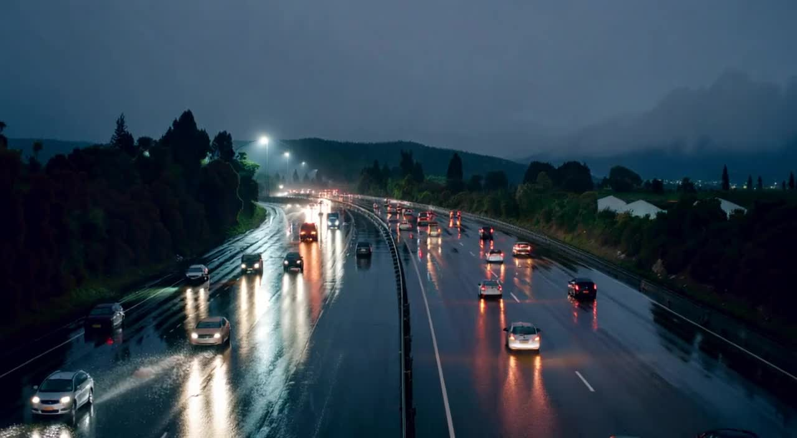
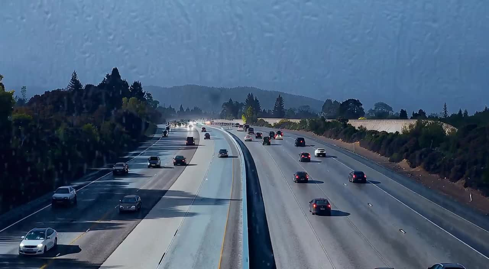
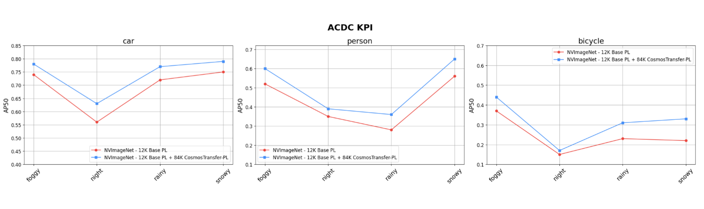
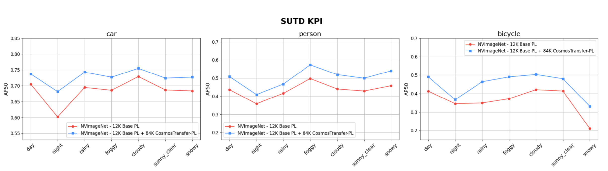

# Cosmos Transfer Weather Augmentation for Intelligent Transportation System (ITS) Images

> **Authors:** [Reihaneh Entezari](https://www.linkedin.com/in/reihanehentezari/) • [Charul Verma](https://www.linkedin.com/in/charul-verma-6bb778172/) • [Arihant Jain](https://www.linkedin.com/in/arihant-jain-5955046b/) • [Dharshi Devendran](https://www.linkedin.com/in/dharshidevendran/) • [Ratnesh Kumar](https://www.linkedin.com/in/rkumar1729/)
> **Organization:** NVIDIA

| Model | Workload | Use case |
|------|----------|----------|
| Cosmos Transfer 1 | Inference | Data augmentation |

This tutorial demonstrates how to use the Cosmos Transfer model for Synthetic Data Generation (SDG) to augment data and improve the accuracy of Computer Vision (CV) or Vision-Language Model (VLM) algorithms downstream.

- [Setup and System Requirement](setup.md)

## Why Weather Augmentation Matters

Acquiring Intelligent Transportation System (ITS) data in adverse weather conditions is time consuming and challenging, and adding weather-based diversity to pre-recorded datasets is prohibitive and impossible. This data scarcity leads to poor performance of computer vision models in real-world adverse weather scenarios. Weather augmentation using Cosmos Transfer addresses this critical gap by generating synthetic weather-diverse training data from existing clear-weather datasets, significantly improving the robustness and accuracy of downstream ITS object detection models across various weather conditions.

## Demonstration Overview

This is a demonstration of **Cosmos Transfer 1** being used for weather augmentation of ITS images. To showcase the impact, this tutorial walks through a step-by-step Cosmos Transfer weather augmentation process for ITS images to improve a downstream ITS object detector RT-DETR model.

## Cosmos Transfer Pipeline Components

### Sample Input ITS Images/Videos

Start with clear daylight highway scenes as the base input for augmentation.


NOTE: If you are dealing with images only, you need to create a video with repeating image frame before proceeding with the next steps and Cosmos Transfer 1.

### Video Captioning Using a VLM

First, generate detailed captions of the input images using a VLM as captioner:

> "The video depicts a busy highway scene during what appears to be late afternoon, as indicated by the long shadows cast by the trees and vehicles. The sky is clear and blue, suggesting fair weather with no visible clouds. The highway is multi-lane, with traffic flowing in both directions. There are several cars on the road, varying in color and model, indicating a mix of personal vehicles. The surrounding landscape includes dense greenery on both sides of the highway, with trees lining the edges. In the background, there are hills or low mountains, adding depth to the scene. The overall atmosphere is calm yet active, typical of a weekday commute"

NOTE: We used Qwen 2.5 VL for captioning with the following input prompt:

> *Describe this video in detail and please include weather or time of the day detail at the start.*

### Prompt Augmentation for Rainy Night Condition Using a LLM

Next, use a LLM to augment the caption for the desired weather condition (rainy night):

> "The video depicts a busy highway scene during a rainy night, shrouded in deep darkness. The sky is obscured, and the only visible light comes from scattered headlights and dim streetlights, casting faint reflections on the rain-soaked road. The highway is multi-lane, with traffic flowing in both directions, and the surrounding landscape is barely visible, with dense greenery on both sides of the highway and hills or low mountains in the background, but these features are only faintly discernible due to the darkness. There are several cars on the road, varying in color and model, their headlights illuminating the rain-soaked road, where puddles and thin streams of water shimmer faintly. The overall atmosphere is calm yet active, typical of a nighttime commute."

NOTE: We used Llama 3.1 with the following input prompt for weather augmentation:

> *I have the following caption describing a video captured by a CCTV camera. I want to adapt this caption so that it accurately reflects the following environmental condition. The updated caption will be used as a prompt for a video generation model.*
>
>*Please update the original caption minimally and realistically — do not add any details that are not already implied or explicitly stated. Avoid hallucinations, assumptions, or dramatic interpretations. Do not add events, objects, or actions that do not exist in the original caption. Simply modify the scene description to reflect the given weather or lighting condition while preserving the factual content and structure.*
>
>*If the environmental condition indicates **daytime**, remove any mention of headlights, artificial lighting, or shadows caused by artificial sources.*
> *If the condition implies **nighttime or low visibility** (e.g., fog, heavy rain, snow at night), you may include realistic visual effects such as headlights, reflections, or dim street lighting — but only if consistent with the original caption.*
>
> *Format the output as a single paragraph enclosed within angle brackets `<...>`. Do not include any other text.*
>
> *Original Caption:*
> *{video_caption}*
>
> *Environmental Condition to Reflect:*
> *{condition}*

And the weather condition description for rainy night is as follows:

> *Rainy night shrouded in deep darkness, with only scattered headlights and dim streetlights casting faint reflections on the rain-soaked road, where puddles and thin streams of water shimmer faintly.*

### Cosmos Transfer Output Image for Rainy Night

Using the augmented prompt, Cosmos Transfer generates realistic rainy night scenes while preserving the structural elements of the original scene.



Note: We have chosen the middle frame of the output video from Cosmos Transfer 1.

## Control Parameters in Cosmos Transfer 1

In general, it is possible to control for vis, edge, segmentation, and depth when running Cosmos Transfer 1. However, experiments have found that when controlling only for **segmentation and depth**, the generated images are well suited for daylight/weather augmentations, especially when generating night scenes.

### Recommended Control Configuration

The recommended control config file is as follows:

```json
{
    "input_video_path": "assets/example1_input_video.mp4",
    "negative_prompt": "The video shows an unrealistic traffic scene with floating or jittery cars that ignore physics, sliding without friction, turning sharply without steering, or vanishing mid-motion. Vehicles overlap unnaturally, lack weight or inertia, and don't align with the road. Road markings are inconsistent or missing, and lanes appear distorted. Lighting is flickering and fake, while backgrounds look melted or warped. Pedestrians and traffic signals are misshapen, duplicated, or misplaced. Overall, the scene feels chaotic, lacks depth, structure, and visual coherence.",
    "guidance": 8.0,
    "sigma_max": 90.0,
    "depth": {
        "control_weight": 0.9
    },
    "seg": {
        "control_weight": 0.9
    }
}
```

**Note:** Control weights with magnitude of 0.9 are used so that the output image is more adhered to the input image.

### Why We Removed Vis and Edge Controls

To illustrate why vis and edge controls are removed when using Cosmos Transfer 1, two rainy night images were generated from the same input image:

1. **With all controls** (vis, edge, seg, depth): Night scenes are not generated as expected
2. **With only seg and depth controls**: The generated image achieves the desired darkness level

#### Cosmos Transfer Generated Image - All Controls (vis, edge, depth, seg control weights of 0.9)



#### Cosmos Transfer Generated Image - Depth and Seg Only (control weights of 0.9)


As demonstrated, using all controls (vis, edge, depth, seg) fails to generate proper night scenes, while using only depth and seg controls produces the expected dark imagery.

## Training Downstream ITS Detector

To illustrate the impact of Cosmos Transfer weather augmentation on a downstream ITS detector, we have trained an RT-DETR detector with and without the Cosmos Transfer augmented images using all possible weather/lighting conditions and  evaluated the trained models on three public KPIs.

## Results

Experiments were conducted with a set of ~12k real ITS images and ~84K weather augmented Cosmos Transfer 1 images using the pipeline described in this tutorial. Below are the results on the three KPIs:

## ACDC Dataset

The ACDC dataset is an Intelligent Transportation System (ITS)-related dataset with different weather conditions such as snow, fog, rain, and night. The dataset contains approximately ~2k images and can be found here: <https://acdc.vision.ee.ethz.ch/>

Below are the AP50 results of the most common objects (car, person, bicycle) in the dataset along all weather conditions:

As seen above, the blue curves (which are from the trained detector WITH Cosmos Transfer 1 augmented images) have consistently higher AP50 compared to the red curves, across all weather/lightings and objects.

## SUTD Dataset

The SUTD dataset is also an ITS-related dataset with more diverse weather conditions such as snow, fog, rain, night, cloudy, and sunny. The dataset contains approximately ~10k images and can be found here: <https://sutdcv.github.io/SUTD-TrafficQA/#/download>

Below are the AP50 results of the most common objects (car, person, bicycle) in the dataset along all weather conditions:

As seen above, the blue curves (which are from the trained detector WITH Cosmos Transfer 1 augmented images) have consistently higher AP50 compared to the red curves, across all weather/lightings and objects.

## DAWN Dataset

The DAWN dataset is also another ITS-related dataset with different weather conditions such as snow, fog, rain, and sandy. The dataset contains approximately ~1k images and can be found here: <https://www.kaggle.com/datasets/shuvoalok/dawn-dataset>

Below are the AP50 results of the most common objects (car, person) in the dataset along all weather conditions:

As seen above, the blue curves (which are from the trained detector WITH Cosmos Transfer 1 augmented images) have consistently higher AP50 compared to the red curves, across all weather/lightings and objects.

## Conclusion

This tutorial demonstrates how Cosmos Transfer can effectively augment ITS datasets with challenging weather conditions, leading to improved performance of downstream object detection models. The key insights are:

1. Use only segmentation and depth controls for optimal weather augmentation
2. Proper prompt engineering is crucial for realistic weather condition generation
3. Synthetic augmentation significantly improves model performance on rare weather conditions

For more details on implementation and training configurations, please refer to the accompanying setup and configuration files in this repository.
