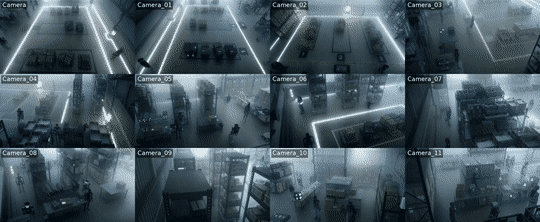
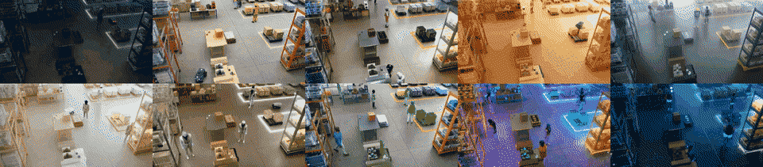
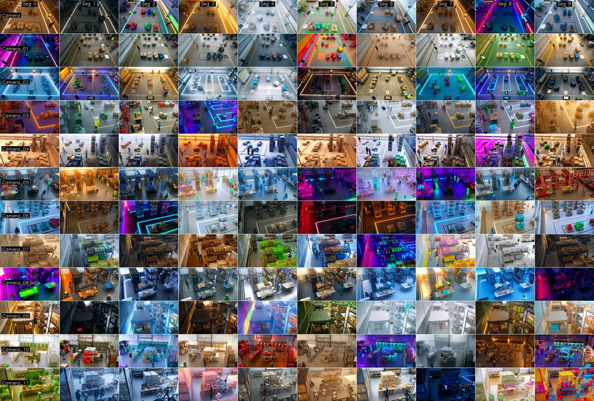

# Cosmos Transfer 1 Sim2Real for Multi-View Warehouse Detection and Tracking

> **Authors:** [Alice Li](https://www.linkedin.com/in/alice-li-17439713b/) • [Thomas Tang](https://www.linkedin.com/in/zhengthomastang/) • [Yuxing Wang](https://www.linkedin.com/in/yuxing-wang-55394620b/) • [Jingyi Jin](https://www.linkedin.com/in/jingyi-jin) > **Organization:** NVIDIA

| **Model** | **Workload** | **Use Case** |
|-----------|--------------|--------------|
| [Cosmos Transfer 1](https://github.com/nvidia-cosmos/cosmos-transfer1) | Inference | Sim to Real data augmentation |

This use case demonstrates how to apply Cosmos Transfer 1 for data augmentation over Omniverse (OV) generated synthetic data to close the sim-to-real domain gap, specifically targeting multi-view warehouse detection and tracking scenarios.

- [Setup and System Requirement](setup.md)

## Use Case Description

NVIDIA Omniverse is a powerful platform for Synthetic Data Generation (SDG) that enables precise control over scene generation and simulation. While digital simulations provide accurate derived information such as depth and segmentation with scene control, generating variations for robust model training can be computationally expensive and time-consuming.

This use case explores how first time outside-in multi-view world simulation can be achieved by Cosmos Transfer 1. Transforming Omniverse-generated synthetic warehouse scenes into realistic variations reduces the sim-to-real domain gap without the computational cost of re-rendering entire scenes.

## Outside-In Multi-View Processing Approach

Monitoring of warehouse spaces typically involves multi-camera views to provide comprehensive coverage. Since Cosmos Transfer 1 does not natively support multi-view processing, we adopt an approach to ensure visual consistency across all camera viewpoints:

1. **Multi-view Outside-In Data Generation**: Multi-view synthetic videos and corresponding multi-modal
   ground truth data (e.g., depth, segmentation masks) are prepared by [IsaacSim.Replicator.Agent](https://docs.isaacsim.omniverse.nvidia.com/latest/index.html).
2. **Processing**: For each video, identical text prompts and parameter settings are provided to the Cosmos Transfer 1 model, ensuring uniformity across different camera views. Modalities are carefully chosen and analyzed to enhance object feature consistency across different camera views. Detailed, data-driven text prompts are employed to minimize divergence in object features between views. In the following case, only depth and edge maps (0.5 depth + 0.5 edge) are used as input controls to the Cosmos Transfer 1 model.

This approach guarantees that all camera views receive consistent environmental transformations while maintaining spatial and temporal coherence across the multi-view setup.


## Demonstration Overview

This demonstration shows how **Cosmos Transfer 1** enables sim-to-real domain adaptation through procedural scene randomization including image noise, lighting variations, texture changes, and object placement diversity. The parameter-consistent framework ensures consistent transformations across camera views to improve downstream 3D detection and tracking performance in warehouse environments.

## Dataset and Setup

### Sample Input Warehouse Data

A sample of training data for the detection and tracking algorithms is stored locally in the `assets/SURF_Booth_030825/` directory. This multi-camera warehouse data entry provides synchronized rendered RGB and depth information from multiple camera viewpoints for warehouse scene.

The dataset is located in the following directory:

```
scripts/examples/transfer1/inference-warehouse-mv/assets/SURF_Booth_030825/
```

### Data Structure

The dataset provides a 6-camera warehouse setup with synchronized data organized as follows:

- **`Camera_00/` through `Camera_05/`**: Individual camera directories, each containing the following:
  - **`rgb.mp4`**: RGB video data for the camera view
  - **`depth.mp4`**: Corresponding depth video data for the camera view

### Additional Physical AI Smart Spaces Datasets

For additional multi-camera warehouse datasets, see the [NVIDIA PhysicalAI-SmartSpaces dataset](https://huggingface.co/datasets/nvidia/PhysicalAI-SmartSpaces) on Hugging Face, which includes over 250 hours of synchronized multi-camera video with 2D/3D annotations, depth maps, and calibration data.

### Warehouse Outside-In Multi-View Input

The RGB video for each camera is processed sequentially through multiple Cosmos Transfer 1 inference runs. We present the concatenated multi-view videos below to demonstrate the combined perspectives.

**Multi-View RGB Input:**

<video width="720" controls>
  <source src="assets/combined_grid_rgb.mp4" type="video/mp4">
  Your browser does not support the video tag.
</video>

**Combined Multi-View Depth Control:**

<video width="720" controls>
  <source src="assets/combined_grid_depth.mp4" type="video/mp4">
  Your browser does not support the video tag.
</video>

## Cosmos Transfer 1 Pipeline Components

### Sim2Real Conversion with Ambient Variation

We can leverage the Cosmos Transfer 1 model to convert the appearance of synthetic computer graphics to realistic warehouse conditions. By prompting the model appropriately, we can introduce varied ambient conditions such as different lighting scenarios, while preserving the structural layout and object relationships.

```json
{
  "prompt": "The camera provides a clear view of the warehouse interior, showing rows of shelves stacked with boxes, baskets and other objects. There are workers and robots walking around, moving boxes or operating machinery. The lighting is bright and even, with overhead fluorescent lights illuminating the space. The floor is clean and well-maintained, with clear pathways between the shelves. The atmosphere is busy but organized, with workers and humanoids moving efficiently around the warehouse.",
  "input_video_path": "/your_video_path/rgb_video.mp4",
  "edge": {
    "control_weight": 0.5
  },
  "depth": {
    "control_weight": 0.5,
    "input_control": "/your_video_path/depth_video.mp4"
  }
}
```

**Combined Multi-View Transfer 1 Output:**

<video width="720" controls>
  <source src="assets/combined_grid_output.mp4" type="video/mp4">
  Your browser does not support the video tag.
</video>

## Control Parameters in Cosmos Transfer 1

By updating text prompts with varied environmental descriptions, Cosmos Transfer 1 increases data diversity in addition to reducing the sim-to-reality gap. For example, providing descriptions of the warehouse scene under foggy or low-light conditions enables the generation of data with more challenging scenarios.

### Foggy and Dark Conditions

Example control and text prompts:

```json
{
  "prompt": "The camera provides a photorealistic view of a dimly lit warehouse shrouded in thick fog, where shelves emerge like silhouettes through the mist, holding crates covered in dew. Workers wear diversed layered clothing in muted tones, including utility jackets, waterproof pants, and sturdy boots, some paired with scarves and beanies to counter the chill. Humanoid robots with matte black finishes and faintly glowing outlines navigate through the haze, their movements slow and deliberate. Forklifts, painted in industrial gray with fog lights attached, glide silently across the damp concrete floor. The lighting is eerie and diffused, with beams from overhead fixtures piercing the mist to create dramatic light shafts. The atmosphere is mysterious and quiet, with the muffled sound of machinery barely audible through the thick air.",
  "prompt_title": "The camera provides a photorealistic",
  "input_video_path": "/your_video_path/rgb_video.mp4",
  "edge": {
    "control_weight": 1.0
  }
}
```



### Further Scaling Up

With a diverse set of text prompts for world simulation, we can significantly scale up the variety of generated scenes.

Below is a demonstration showing how Cosmos Transfer 1 augments a single view using multiple text prompts, demonstrating the impact of prompt diversity.



Diversity can be further enhanced by dividing each camera view video into 10 segments and assigning a unique text prompt to each segment.



### Recommended Control Configuration

Similar to the weather augmentation approach, experiments show that controlling only for _edge and depth_ produces the best results for warehouse sim-to-real conversion. This configuration maintains structural consistency while allowing realistic appearance changes.

```json
{
  "prompt": "The camera provides a clear view of the warehouse interior, showing rows of shelves stacked with boxes, baskets and other objects. There are workers and robots walking around, moving boxes or operating machinery. The lighting is bright and even, with overhead fluorescent lights illuminating the space. The floor is clean and well-maintained, with clear pathways between the shelves. The atmosphere is busy but organized, with workers and humanoids moving efficiently around the warehouse.",
  "input_video_path": "/mnt/pvc/gradio/uploads/upload_20250916_152159/rgb.mp4",
  "edge": {
    "control_weight": 0.5
  },
  "depth": {
    "control_weight": 0.5,
    "input_control": "/mnt/pvc/gradio/uploads/upload_20250916_152159/depth.mp4"
  }
}
```

## 2D Detection Results on Augmented Dataset

To evaluate the effectiveness of Cosmos Transfer 1 for data augmentation, experiments were conducted using carefully selected multi-view scenes from the AI City Challenge dataset. _Eleven distinct scenes_ were picked from the [AI City v0.1](https://www.aicitychallenge.org/) dataset, representing diverse warehouse and indoor environments.

Each of these 11 baseline scenes was processed through the Cosmos Transfer 1 augmentation pipeline using the multi-view parameter-consistent approach described earlier. This process generated ambient variations, lighting changes, and environmental conditions (including dust and reduced visibility scenarios), while maintaining structural consistency and multi-view coherence across all camera viewpoints.

The resulting augmented dataset, containing both original and Cosmos Transfer-enhanced versions of each scene, was then used to train RT-DETR and EfficientViT-L2 detectors. The performance comparison demonstrates significant improvements in computer vision (CV) model accuracy and real-world generalization capabilities.

### Detection Performance Results

| Dataset Configuration                         | Pretrained Checkpoint | Building K Person AP50 | Building K Nova Carter AP50 | Building K mAP50 |
| --------------------------------------------- | --------------------- | ---------------------- | --------------------------- | ---------------- |
| **Baseline: 1-min IsaacSim AICity v0.1**      | NVImageNetV2 backbone | 0.776                  | 0.478                       | 0.627            |
| **1-min Cosmos AICity v0.1**                  | NVImageNetV2 backbone | 0.827 (+6.17%)         | 0.545 (+12.35%)             | 0.686 (+8.60%)   |
| **1-min IsaacSim + 1-min Cosmos AICity v0.1** | NVImageNetV2 backbone | 0.838 (+7.40%)         | 0.645 (+25.94%)             | 0.742 (+15.50%)  |

## Conclusion

This use case demonstrates how users can leverage Cosmos Transfer 1 as an AI model and framework for data augmentation to bridge the sim-to-real domain gap in multi-view warehouse scenarios. These are the key insights:

1. **Cost-effective Data Augmentation**: Cosmos Transfer 1 provides an efficient alternative to expensive synthetic data re-generation, enabling rapid creation of environmental variations.
2. **Multi-View Consistency**: The parameter-consistent approach ensures consistent transformations across all camera views while maintaining spatial and temporal coherence.
3. **Significant Performance Gains**: Both RT-DETR and EfficientViT-L2 detectors show substantial improvements (8-11% mAP increase) when trained on Cosmos Transfer 1 augmented datasets.
4. **Optimal Control Configuration**: Using only edge and depth controls produce the best results for warehouse sim-to-real conversion.

By applying this framework, we can generate realistic warehouse scenes that maintain multi-view consistency, leading to substantial improvements in downstream detection and tracking algorithm accuracy, while reducing the need for expensive real-world data collection or costly synthetic data re-rendering.

---

## Document Information

**Publication Date:** October 09, 2025

### Citation

If you use this recipe or reference this work, please cite it as:

```bibtex
@misc{cosmos_cookbook_cosmos_transfer_1_2025,
  title={Cosmos Transfer 1 Sim2Real for Multi-View Warehouse Detection and Tracking},
  author={Li, Alice and Tang, Thomas and Wang, Yuxing and Jin, Jingyi},
  year={2025},
  month={October},
  howpublished={\url{https://nvidia-cosmos.github.io/cosmos-cookbook/recipes/inference/transfer1/inference-warehouse-mv/inference.html}},
  note={NVIDIA Cosmos Cookbook}
}
```

**Suggested text citation:**

> Alice Li, Thomas Tang, Yuxing Wang, & Jingyi Jin (2025). Cosmos Transfer 1 Sim2Real for Multi-View Warehouse Detection and Tracking. In *NVIDIA Cosmos Cookbook*. Retrieved from https://nvidia-cosmos.github.io/cosmos-cookbook/recipes/inference/transfer1/inference-warehouse-mv/inference.html
