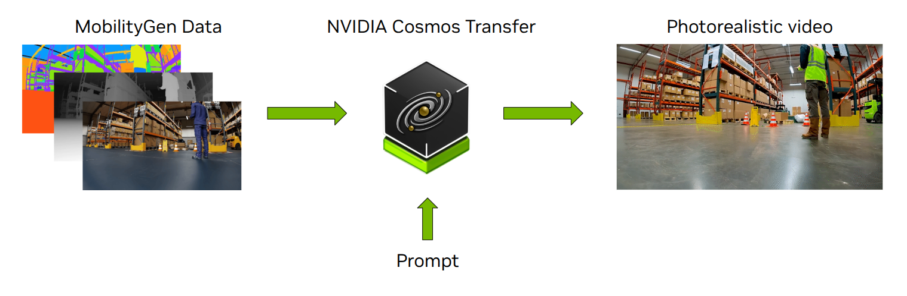
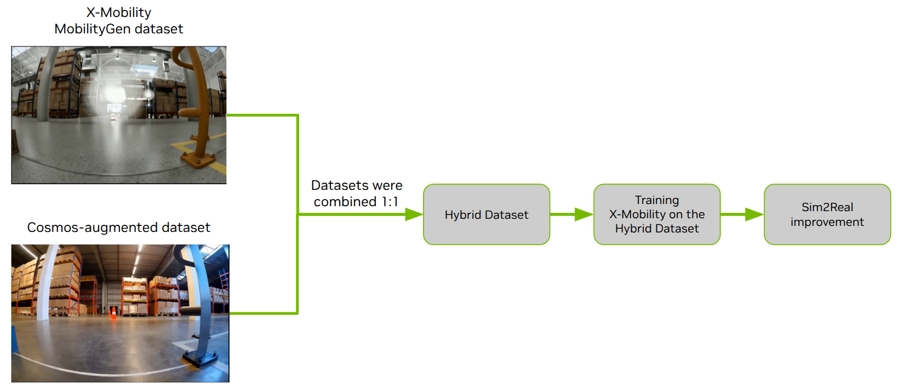

# Cosmos Transfer Sim2Real for Robotics Navigation Tasks

> **Authors:** [Aigul Dzhumamuratova](https://www.linkedin.com/in/aigul-dzhumamuratova-78232b234/) • [Hesam Rabeti](https://www.linkedin.com/in/hesamrabeti/) • [Yan Chang](https://www.linkedin.com/in/yanchang1/) • [Jingyi Jin](https://www.linkedin.com/in/jingyi-jin)
> **Organization:** NVIDIA

| Model | Workload | Use case |
|------|----------|----------|
| Cosmos Transfer 1 | Inference | Sim to Real data augmentation |

This tutorial demonstrates how to apply Cosmos Transfer to robotics navigation tasks to improve Sim2Real performance.

- [Setup and System Requirement](../inference-warehouse-mv/setup.md)

## Use Case Description

For this evaluation, we used several NVIDIA tools - the [X-Mobility](https://nvlabs.github.io/X-MOBILITY/) navigation model and the [Mobility Gen](https://github.com/NVlabs/MobilityGen) data-generation workflow.

1. **X-Mobility** is an end-to-end navigation model capable of generalizing across a wide variety of environments. It learns navigation policies using both on-policy and off-policy data. The original X-Mobility dataset was created entirely using Mobility Gen, within simulated warehouse and indoor environments.
2. **Mobility Gen** is a workflow built on NVIDIA Isaac Sim for generating high-fidelity synthetic motion and perception data for mobile robots - including wheeled, quadruped, and humanoid platforms. It produces detailed ground-truth annotations such as occupancy maps, robot pose and velocity, RGB and depth images, and semantic segmentation masks, enabling scalable dataset creation for navigation and control policies.

We used the RGB and segmentation data from the original X-Mobility dataset as inputs to Cosmos Transfer. Cosmos Transfer augmented the dataset by varying lighting conditions, obstacle appearances, and material properties - without altering the original geometry or robot motion. This preserved the ground-truth information (such as trajectories and semantic segmentation) while producing a more realistic and diverse dataset for training robust navigation models.



## Demonstration Overview

This demonstration showcases how **Cosmos Transfer 1** enables Sim2Real domain adaptation. It provides a step-by-step workflow for transforming a Mobility Gen dataset into a photorealistic and diverse version, training models on the augmented data, and then evaluating their performance in real-world conditions.

## Dataset and Setup

### **X-Mobility Dataset**

The X-Mobility Dataset is available for download on Hugging Face: [https://huggingface.co/datasets/nvidia/X-Mobility](https://huggingface.co/datasets/nvidia/X-Mobility). This photorealistic synthetic dataset provides two types of action policy inputs: random actions and a teacher policy based on Nav2:

- **Random Action Dataset** (`x_mobility_isaac_sim_random_160k.zip`): 160K frames for world model pre-training without action network
- **Teacher Policy Dataset** (`x_mobility_isaac_sim_nav2_100k.zip`): 100K frames for joint world model and action policy training

Each frame includes key fields: image, speed, semantic label, route, path, and action command. The image field contains the RGB input from the front-view camera, while the semantic label field identifies each pixel according to the predefined semantic classes: [Navigable, Forklift, Cone, Sign, Pallet, Fence, and Background]

> **Note:** All scripts used in this experiment are available under `$COOKBOOK_ROOT/scripts/examples/transfer1/inference-x-mobility/` for readers' reference.

## Cosmos Transfer Data Augmentation Pipeline

### **X-Mobility Dataset Conversion to Videos for Cosmos Transfer Inputs**

We used the RGB and segmentation data from the X-Mobility dataset as inputs to Cosmos Transfer. Run the following commands to prepare video inputs for Cosmos Transfer:

```shell
uv run scripts/examples/transfer1/inference-x-mobility/xmob_dataset_to_videos.py data/x_mobility_isaac_sim_nav2_100k data/x_mobility_isaac_sim_nav2_100k_input_videos

uv run scripts/examples/transfer1/inference-x-mobility/xmob_dataset_to_videos.py data/x_mobility_isaac_sim_random_160k data/x_mobility_isaac_sim_random_160k_input_videos
```

This process creates two directories of videos that mirror the original dataset’s directory structure. Each sample includes an RGB `<video_file>.mp4` and a corresponding segmentation video named `<video_file>_segmentation.mp4`.

### **Cosmos Transfer Multimodal Control**

Next, Cosmos Transfer 1 generates photorealistic videos from the input videos using the following command:

```shell
export CUDA_VISIBLE_DEVICES="${CUDA_VISIBLE_DEVICES:=0}"
export CHECKPOINT_DIR="${CHECKPOINT_DIR:=./checkpoints}"
export NUM_GPU="${NUM_GPU:=1}"

PYTHONPATH=$(pwd) torchrun --nproc_per_node=$NUM_GPU --nnodes=1 --node_rank=0 cosmos_transfer1/diffusion/inference/transfer.py --checkpoint_dir $CHECKPOINT_DIR  --video_save_folder outputs/example --controlnet_specs assets/inference_cosmos_transfer1_custom.json --offload_text_encoder_model --offload_guardrail_models --num_gpus $NUM_GPU
```

Example control and text prompts `inference_cosmos_transfer1_custom.json`:

```json
{
    "prompt": "A realistic warehouse environment with consistent lighting, perspective, and camera motion. Preserve the original structure, object positions, and layout from the input video. Ensure the output exactly matches the segmentation video frame-by-frame in timing and content. Camera movement must follow the original path precisely.",
    "input_video_path" : "data/output_0360.mp4",
    "edge": {
        "control_weight": 0.3,
    },
    "seg": {
        "input_control": "data/output_0360_segmentation.mp4",
        "control_weight": 1.0
    }
}
```

The segmentation control weight was set to 1.0 to preserve the original geometry and motion, allowing reuse of the ground-truth labels from the original X-Mobility dataset. The picture below demonstrates this process: the top row shows the input RGB video and its corresponding segmentation mask used as control, while the bottom row displays the photorealistic output generated by Cosmos Transfer 1 using the JSON specification provided above.


## Training X-Mobility Using Cosmos-Augmented Data

### **Converting Cosmos Transfer Outputs Back to X-Mobility Format**

After generating photorealistic videos with Cosmos Transfer, we need to convert them back into the X-Mobility dataset format to use them for training. The `cosmos_dataset_to_xmob.py` script reconstructs the original X-Mobility data structure by:

1. Extracting individual frames from the Cosmos-generated videos
2. Copying ground-truth annotations (semantic labels, routes, paths, actions) from the original dataset
3. Organizing the data into the X-Mobility format with all required fields

Run the following commands to perform the conversion for both datasets:

```shell
# Convert the random action dataset (for world model pre-training)
python cosmos_dataset_to_xmob.py \
  --input_dir_cosmos data/x_mobility_isaac_sim_random_160k_cosmos_output \
  --input_dir_xmob data/x_mobility_isaac_sim_random_160k \
  --output_dir data/x_mobility_isaac_sim_random_160k_cosmos_to_xmob \
  --mode simple

# Convert the teacher policy dataset (for joint world model and action policy training)
python cosmos_dataset_to_xmob.py \
  --input_dir_cosmos data/x_mobility_isaac_sim_nav2_100k_cosmos_output \
  --input_dir_xmob data/x_mobility_isaac_sim_nav2_100k \
  --output_dir data/x_mobility_isaac_sim_nav2_100k_cosmos_to_xmob \
  --mode segmented
```

**Parameter Explanation:**

- `--input_dir_cosmos`: Directory containing Cosmos Transfer output videos
- `--input_dir_xmob`: Directory containing original X-Mobility dataset (source for ground-truth annotations)
- `--output_dir`: Output directory for the converted dataset in X-Mobility format
- `--mode`: Conversion mode (`simple` for basic conversion, `segmented` for processing video segments, as in the Teacher Policy Dataset `x_mobility_isaac_sim_nav2_100k_cosmos_to_xmob`)

Since the segmentation control weight was set to 1.0 during generation, the geometry and motion are preserved exactly, allowing direct reuse of all ground-truth labels from the original dataset.

### **Training Configuration**

We combined the original and Cosmos-augmented data in **equal proportions (1:1)** to create a hybrid dataset. The model was trained following the X-Mobility training methodology with a two-stage approach:

| **Training Stage** | **Dataset** | **Epochs** | **Batch Size** | **Hardware** | **Additional Notes** |
|-------------------|-------------|------------|----------------|--------------|---------------------|
| **Stage 1: World Model Pre-training** | Random action dataset (160K frames) | 100 | 32 | 8× H100 GPUs | Pre-train world model without action network |
| **Stage 2: Action Policy Training** | Teacher policy dataset (100K frames) | 100 | 32 | 8× H100 GPUs | Joint training with world model; RGB diffuser disabled for speed |

**Key Dataset Composition:**

- **Hybrid Dataset** = 50% Original X-Mobility + 50% Cosmos-augmented data
- **Total Training Data** = 520K frames (260K original + 260K augmented)

The diagram below illustrates the complete training pipeline: the hybrid dataset (combining original and Cosmos-augmented data in equal proportions) is used to train the X-Mobility model through both world model pre-training and action policy training stages, resulting in improved success rate.



## Testing in Isaac Sim and the Real World

To evaluate the effectiveness of Cosmos Transfer for data augmentation, we tested the trained models both in Isaac Sim simulated environments and on a real-world NVIDIA Carter robot.
Testing in Isaac Sim showed comparable performance between the original and augmented models. In real-world closed-loop evaluation, the X-Mobility policy trained on the hybrid dataset (Mobility Gen + Cosmos) significantly outperformed the baseline model trained only on Mobility Gen data.

The improved policy successfully handled challenging scenarios such as:

- Navigating around transparent obstacles
- Avoiding low-contrast obstacles (e.g., gray pole on a gray floor)
- Traveling closer to obstacles, reducing total distance to the goal
- Navigating in dimly lit environments
- Passing through narrow spaces

**Transparent Box Navigation:** This animation sequence shows a side-by-side comparison where the baseline model (trained only on X-Mobility data) fails to detect and avoid a transparent box obstacle, resulting in collision. In contrast, the model trained with Cosmos-augmented data successfully identifies the transparent obstacle and navigates around it, demonstrating enhanced perception capabilities for challenging transparent objects.


**Pole Avoidance:** This sequence illustrates similar improvements with a tall, thin pole obstacle. The baseline model struggles to detect the narrow pole and collides with it, while the Cosmos-augmented model successfully perceives the obstacle and executes a smooth avoidance maneuver, showcasing improved detection of low-contrast and geometrically challenging objects.


We collected the following key metrics for all these real-world tests:

1. Mission success rate - percentage of trials where robot reached the goal.
2. Weighted trip time, which measures navigation efficiency by dividing trip time by success rate.
3. Average absolute angular acceleration (Average AAA) as an indicator of motion smoothness.

### Real-World Navigation Results

| Dataset Configuration | Success Rate (%) | Weighted Trip Time (s) | Average AAA (rad/s²) |
|----------------------|------------------|------------------------|----------------------|
| **X-Mobility (Baseline)** | 54 | 58.1 | 0.453 |
| **X-Mobility + Cosmos** | 91 | 25.5 | 0.606 |
| **Improvement** | +68.5% | -56.1% | +33.8% |

## Conclusion

This demonstration shows that Cosmos Transfer significantly enhances Sim2Real navigation performance. The hybrid training approach (combining original and Cosmos-augmented data in equal proportions) achieved:

- **+68.5% improvement** in mission success rate (54% → 91%)
- **56% reduction** in trip time (58.1s → 25.5s)
- **Enhanced robustness** for transparent, low-contrast, and poorly-lit obstacles

These results highlight Cosmos Transfer as a powerful tool for improving the robustness and real-world adaptability of robotics navigation systems through photorealistic data augmentation.
