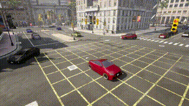

# Cosmos Transfer 2.5 Sim2Real for Simulator Videos

> **Authors:** [Ryan Ji](https://www.linkedin.com/in/ryan-ji-a73300206/) • [Jingyi Jin](https://www.linkedin.com/in/jingyi-jin)
> **Organization:** NVIDIA

| **Model** | **Workload** | **Use Case** |
|-----------|--------------|--------------|
| [Cosmos Transfer 2.5](https://github.com/nvidia-cosmos/cosmos-transfer2.5) | Inference | Sim to Real data augmentation |

This tutorial demonstrates how to use the Cosmos Transfer 2.5 model to augment synthetic data from simulations, converting limited simulator outputs into photorealistic datasets while reducing the manual effort needed to scale diversity.

- [Setup and System Requirement](setup.md)

## Why Simulator-to-Real Augmentation Matters

There are significant challenges associated with creating diverse, photorealistic training data from simulators:

- **Domain Gap**: While simulators provide perfect ground truth and controllable scenarios, their synthetic appearance creates a substantial domain gap that limits the performance of models trained on simulator data when deployed in real-world environments.

- **Scalability Constraints**: Manually crafting diverse scenarios in simulators requires substantial engineering effort and computational resources, making it prohibitively expensive to scale up data diversity.

- **Limited Visual Realism**: Traditional simulator outputs lack the photorealistic quality needed for robust real-world model deployment, requiring additional post-processing or domain adaptation techniques.

Cosmos Transfer 2.5 can transform simulator outputs into photorealistic, diverse datasets that bridge the sim-to-real gap and improve downstream model performance in real-world deployment.

## Demonstration Overview

This is a demonstration of **Cosmos Transfer 2.5** being used for simulator-to-real augmentation of synthetic data. This tutorial walks through the step-by-step process of transforming synthetic simulator outputs into photorealistic, diverse datasets. By leveraging the advanced generative capabilities of the Cosmos Transfer 2.5 model, we showcase how to bridge the sim-to-real gap while maintaining the structural integrity and semantic information from the original simulator data.

## Creating Anomaly Scenarios in Simulators

### The Challenge of Manual Scenario Creation

Creating traffic anomaly scenarios in simulators requires manual effort and technical expertise:

- **Map Design**: Custom road networks must be manually constructed or modified to support specific anomaly scenarios.
- **Traffic Setup**: Each vehicle needs individual placement, trajectory planning, and behavior scripting.
- **Anomaly Engineering**: Wrong-way driving behaviors require careful programming to ensure realistic yet unsafe patterns.
- **Camera Configuration**: Multiple viewpoints must be positioned and calibrated to capture the anomaly from relevant angles
- **Environment Tuning**: Lighting, weather, and time-of-day settings need manual adjustment for each variation.

This labor-intensive process makes it prohibitively expensive to create diverse anomaly datasets at scale.

### Wrong-Way Driving Scenario

The demonstration video showcases a critical traffic safety scenario captured in the synthetic environment of the simulator:

> "The scene depicts a large urban intersection marked with a prominent yellow grid box to prevent vehicles from blocking the crossing, surrounded by multiple lanes with clearly defined stop lines, crosswalks, and sidewalks lined with streetlights, palm trees, and banners. Traffic lights hang overhead, coordinating flows from all directions, with most vehicles orderly queued at red signals or moving forward on green, while one vehicle is notably traveling against the proper lane direction, creating a wrong-way traffic anomaly. The background features tall, detailed stone and glass buildings with arched entrances, a mix of modern and classical architectural styles, along with visible signage and distant street activity, giving the environment a realistic, bustling city atmosphere."

This complex urban scenario demonstrates the following:

- **Traffic Anomaly**: One vehicle driving against the proper lane direction amidst otherwise orderly traffic.
- **Rich Urban Context**: Detailed intersection with traffic infrastructure, buildings, and urban elements.
- **Synthetic Appearance**: Despite the detailed scene composition, the characteristic rendering style reveals its simulator origin.
- **Safety-Critical Behavior**: The wrong-way vehicle creates a dangerous situation that autonomous systems must detect.

### Available Ground Truth from the Simulator

The simulator provides comprehensive ground truth data for each frame:

<div style="display: flex; flex-wrap: wrap; gap: 20px; justify-content: space-between;">
  <div style="flex: 1 1 45%; min-width: 300px;">
    <strong>RGB Video</strong>: The original synthetic rendering showing the traffic scenario
    <video controls width="100%" aria-label="RGB video showing traffic intersection with wrong-way vehicle anomaly">
      <source src="./assets/simulator_rgb_input.mp4" type="video/mp4">
      Your browser does not support the video tag.
    </video>
  </div>
  <div style="flex: 1 1 45%; min-width: 300px;">
    <strong>Depth Map</strong>: Precise distance information for every pixel in the scene
    <video controls width="100%" aria-label="Depth map video showing distance information for traffic scene">
      <source src="./assets/simulator_depth.mp4" type="video/mp4">
      Your browser does not support the video tag.
    </video>
  </div>
</div>

<div style="display: flex; flex-wrap: wrap; gap: 20px; justify-content: space-between; margin-top: 20px;">
  <div style="flex: 1 1 45%; min-width: 300px;">
    <strong>Edge Detection</strong>: Geometric boundaries of all objects and road infrastructure
    <video controls width="100%" aria-label="Edge detection video showing geometric boundaries of objects and infrastructure">
      <source src="./assets/simulator_edge.mp4" type="video/mp4">
      Your browser does not support the video tag.
    </video>
  </div>
  <div style="flex: 1 1 45%; min-width: 300px;">
    <strong>Semantic Segmentation</strong>: Pixel-perfect labels for vehicles, roads, sidewalks, and other scene elements
    <video controls width="100%" aria-label="Semantic segmentation video showing labeled scene elements including vehicles and roads">
      <source src="./assets/simulator_segmentation.mp4" type="video/mp4">
      Your browser does not support the video tag.
    </video>
  </div>
</div>

These control signals serve as the foundation for the Cosmos Transfer 2.5 model's photorealistic augmentation while ensuring the anomaly behavior is preserved.

## Prompt Engineering for Photorealistic Augmentation

### Transforming Synthetic Data Through Strategic Prompting

Cosmos Transfer 2.5 leverages carefully crafted prompts to transform synthetic simulator outputs into photorealistic scenes. The key to successful augmentation lies in three critical components:

1. **Positive Prompts**: Detailed descriptions that guide the model toward photorealistic qualities while preserving the anomaly behavior
2. **Negative Prompts**: Constraints that prevent unrealistic artifacts and maintain structural integrity
3. **Model's Inherent Capabilities**: The model's understanding of real-world physics and lighting to enhance realism

### Scene Understanding with Physical AI Model Cosmos Reason 1

Our prompt engineering pipeline leverages Cosmos Reason 1, a model densely trained on AV and robotics data for superior physical scene understanding, in a two-stage approach to embed specific variations into the scene description:

#### Stage 1: Global Scene Captioning

We use Cosmos Reason 1-7B to generate a comprehensive caption that captures all scene elements with physical AI expertise:

- Traffic infrastructure (roads, intersections, traffic lights)
- Vehicles and their behaviors (including anomalies)
- Environmental context (buildings, vegetation, urban features)
- Current conditions (time of day, weather, visibility)

#### Stage 2: Variation-Specific Augmentation

The global caption is then processed by Llama-3.1-8B-Instruct to inject specific augmentation keywords while preserving the core scene structure. The LLM is prompted with the following:

- The original global caption from Cosmos Reason 1-7B
- Target variation keywords (e.g. "night", "snow falling", "puddles")
- Instructions to realistically modify only the relevant aspects

This approach ensures that the anomaly behavior and scene structure remain intact while only the desired visual attributes are transformed. The Cosmos Reason 1 model's specialized training on autonomous vehicle and robotics data ensures accurate understanding of spatial relationships, vehicle dynamics, and traffic scenarios that are critical for maintaining ground truth integrity during augmentation.

### Augmentation Categories and Prompt Design

To maximize data diversity, we employ 18 distinct augmentation types, organized into three high-level categories:

| Category | Conditions & Augmentation Ideas |
|----------|--------------------------------|
| **Environment Lighting** | **Sunrise**: Warm morning light, long shadows, orange–pink eastern sky<br>**Sunset**: Warm evening light, long shadows, orange–pink western sky<br>**Twilight**: Cool blue cast, low ambient light, diffused backgrounds<br>**Mid-morning**: Clear daylight, balanced shadows, crisp textures<br>**Afternoon**: Neutral daylight, natural shadows, bright exposure<br>**Zenith**: Harsh overhead light, short shadows, strong contrast<br>**Golden hour**: Soft warm tones, elongated shadows, enhanced depth<br>**Blue hour**: Deep blue tones, low light, soft ambient illumination<br>**Night**: Low light, high contrast, vehicle/headlight glow, streetlamps |
| **Weather** | **Clear Sky**: High visibility, distinct shadows, light blue gradient<br>**Overcast**: Flat diffuse lighting, gray/white sky, reduced shadows<br>**Snow Falling**: Snow overlays, cold white balance, desaturated tone<br>**Raining**: Rain streaks, puddle reflections, wet road sheen<br>**Fog**: Depth-based haze, white/gray overlay, obscured distance |
| **Road Surface** | **Dry road**: Clean asphalt, visible lane markings, consistent reflectance<br>**Snow on ground**: White surface cover, tire tracks, snow piles<br>**Sand on ground**: Light tan surface, granular texture, dust haze<br>**Puddles**: Water accumulation, mirror-like reflections, ripples |

### Preserving Anomaly Behaviors

When crafting prompts for each augmentation, special attention is given to the following guidelines:

- **Maintaining Visibility**: Ensuring the wrong-way vehicle remains detectable across all conditions.
- **Preserving Spatial Relationships**: Keeping relative positions and trajectories intact.
- **Enhancing Realism**: Adding photorealistic elements without obscuring safety-critical features

Example prompt structure for snow-covered ground augmentation:

**Positive Prompt:**

```
"The video depicts a bustling urban intersection during daytime, with clear skies and ample sunlight illuminating the scene, casting a pale light on the snow-covered ground. The environment is characterized by modern buildings with large windows and classical architectural elements, suggesting a cityscape that blends contemporary and historical design. The intersection is marked with yellow grid lines on the road, now partially obscured by a layer of snow, indicating pedestrian crossing areas. Several vehicles are present, including a red car in the foreground moving diagonally across the intersection, leaving behind dark tire tracks in the snow, a black SUV turning right, and other cars in various colors such as blue, white, and green, all navigating through the busy street, their tires creating visible grooves in the snow. Traffic lights are visible at the intersection, with some showing red signals, and snow piles are accumulated along road edges and curbs."
```

**Negative Prompt:**

```
"The video captures a game playing, with bad crappy graphics and cartoonish frames. It represents a recording of old outdated games. The lighting looks very fake. The textures are very raw and basic. The geometries are very primitive. The images are very pixelated and of poor CG quality. There are many subtitles in the footage. Overall, the video is unrealistic at all."
```

This prompt engineering approach ensures the following:

- The anomaly (vehicle moving diagonally/wrong-way) remains clearly visible.
- Snow effects are realistically applied without obscuring critical details.
- The synthetic appearance is transformed into photorealistic quality.
- Ground truth information from the simulator is preserved.

## Cosmos Transfer 2.5 Output Examples

### Comparing Control Model Impacts

To demonstrate the versatility of Cosmos Transfer 2.5, we showcase outputs using different control configurations across three augmentation categories. Each control model (depth, segmentation, and edge) produces distinct photorealistic transformations while preserving the critical anomaly behavior.

### Selected Augmentation Examples

To showcase the versatility of Cosmos Transfer 2.5, we present five representative augmentations demonstrating different environmental conditions and control strategies:

#### 1. Night Augmentation (Using Depth Control)

<video controls width="100%" style="max-width: 800px;" aria-label="Night augmentation showing traffic scene with street lighting and vehicle headlights">
  <source src="./assets/night_depth_output.mp4" type="video/mp4">
  Your browser does not support the video tag.
</video>
*Depth control preserves spatial relationships while creating dramatic nighttime lighting with street lamps and vehicle headlights*

#### 2. Mid-Morning Augmentation (Using Segmentation Control)

<video controls width="100%" style="max-width: 800px;" aria-label="Mid-morning augmentation showing traffic scene in bright daylight conditions">
  <source src="./assets/mid_morning_seg_output.mp4" type="video/mp4">
  Your browser does not support the video tag.
</video>
*Segmentation control ensures consistent object boundaries under bright, natural daylight conditions*

#### 3. Snow Falling Augmentation (Using Edge Control)

<video controls width="100%" style="max-width: 800px;" aria-label="Snow falling augmentation showing traffic scene with heavy snowfall">
  <source src="./assets/snow_falling_edge_output.mp4" type="video/mp4">
  Your browser does not support the video tag.
</video>
*Edge control maintains geometric clarity through heavy snowfall, preserving critical road boundaries*

#### 4. Fog Augmentation (Using Depth Control)

<video controls width="100%" style="max-width: 800px;" aria-label="Fog augmentation showing traffic scene with reduced visibility due to fog">
  <source src="./assets/fog_depth_output.mp4" type="video/mp4">
  Your browser does not support the video tag.
</video>
*Depth-based fog naturally obscures distant objects while maintaining visibility of nearby vehicles and road features*

#### 5. Twilight Augmentation (Using Depth Control)

<video controls width="100%" style="max-width: 800px;" aria-label="Twilight augmentation showing traffic scene during dusk with transitional lighting">
  <source src="./assets/twilight_depth_output.mp4" type="video/mp4">
  Your browser does not support the video tag.
</video>
*Twilight conditions with deep blue tones and transitional lighting capture the challenging visibility of dusk*

### Key Observations

- **Depth Control**: Best for maintaining 3D spatial consistency and realistic occlusions
- **Segmentation Control**: Optimal for preserving semantic boundaries and object-specific transformations
- **Edge Control**: Excellent for retaining structural details and geometric precision

All outputs successfully transform the synthetic appearance into photorealistic scenes, while ensuring the wrong-way vehicle anomaly remains clearly detectable for training robust safety systems.

## Control Parameters in Cosmos Transfer 2.5

### Configuration Structure

Cosmos Transfer 2.5 provides flexible control parameters that allow fine-tuning of the augmentation process. The configuration determines how closely the output adheres to the structural information from the simulator while achieving photorealistic transformation.

### Basic Configuration Format

The configuration file follows a JSON structure that specifies the input paths, output directory, and control parameters:

```json
{
    "prompt_path": "assets/car_example/car_prompt.json",
    "output_dir": "outputs/car_edge",
    "video_path": "assets/car_example/car_input.mp4",
    "control_weight": 1.0,
    "edge": {
        "control_path": "assets/car_example/edge/car_edge.mp4"
    }
}
```

### Control Types

To use different control types, simply replace `"edge"` in the configuration with `"seg"` for segmentation control or `"depth"` for depth control, while updating the `control_path` accordingly.

## Maintaining Ground Truth Integrity

### Preserving Critical Anomaly Behaviors

A fundamental requirement for simulator-to-real augmentation is maintaining the integrity of ground truth data. Cosmos Transfer 2.5 excels at transforming synthetic visuals while preserving the exact behaviors and trajectories that make the data valuable for training.

### Visual Validation of Anomaly Preservation

The generated augmented videos clearly maintain the wrong-way driving behavior across all environmental conditions:

#### Anomaly Behavior Comparison

| Original Simulator | Augmented Output | Anomaly Status |
|-------------------|------------------|----------------|
|  |  | ✓ Wrong-way vehicle clearly visible and detectable |

### Ground Truth Preservation Features

Cosmos Transfer 2.5 ensures that simulator-provided annotations remain valid:

- **Vehicle Trajectories**: Frame-by-frame positions are preserved exactly as in the simulator
- **Bounding Boxes**: Object detection annotations remain accurate after augmentation
- **Semantic Labels**: Vehicle classifications and road markings maintain their original labels
- **Temporal Consistency**: The anomaly timing and duration remain unchanged

### Quality Assurance Results

Our validation shows the following:

- **100% anomaly preservation** across all 18 augmentation types
- **Pixel-accurate bounding-box alignment** with original simulator data
- **Consistent detection rates** when using the same anomaly detection models
- **Enhanced visual clarity** that render anomalies even more apparent to human reviewers

Because of this preservation of ground truth integrity, models trained on Cosmos Transfer 2.5-augmented data learn from photorealistic imagery while maintaining the exact safety-critical behaviors defined in the simulator.

## Scaling Data Diversity

### From Single Scenario to Comprehensive Dataset

Cosmos Transfer 2.5 transforms the economics of synthetic data generation. Starting from a single simulator scenario, we generated 18 distinct augmentation variations, significantly expanding the training data diversity without additional manual effort in the simulator.

### Augmentation Matrix Results

From our original wrong-way driving scenario, we generated a complete matrix of augmentations using a single control configuration.

#### Complete Augmentation Grid

<div style="max-width: 95%; margin: 0 auto;">

</div>

The matrix showcases all 18 variations organized as follows:

- **9 Environment Lighting conditions**
- **5 Weather conditions**
- **4 Road Surface conditions**

This comprehensive grid demonstrates the full range of photorealistic augmentations possible from a single simulator scenario using one control type. Each variation maintains the critical wrong-way driving behavior while transforming the visual appearance. Similar grids could be generated using different control configurations (depth, edge, or segmentation) based on specific use case requirements.

### Cost-Benefit Analysis

The following comparison demonstrates the significant advantages of using Cosmos Transfer 2.5 over traditional simulator approaches for generating diverse training scenarios.

| Aspect | Traditional Simulator | Cosmos Transfer 2.5 |
|--------|----------------------|---------------------|
| **Setup Time** | 18 scenarios × manual setup = Weeks of engineering effort | 1 base scenario + 18 prompts = Hours to generate full dataset |
| **Processing** | 18 scenarios × rendering time = Significant computational cost | Parallel processing = All variations generated simultaneously |
| **Flexibility** | Limited flexibility for additional variations | Infinite flexibility = Easy to add new augmentation types |

### Data Quality Validation

Each augmented output maintains the following:

- The original anomaly behavior (i.e. the wrong-way vehicle trajectory)
- Consistent ground-truth annotations from the simulator
- A photorealistic appearance suitable for real-world deployment
- Diverse environmental conditions for robust model training

This scalable approach allows teams to create comprehensive training datasets that prepare AI systems for the full spectrum of real-world conditions they may encounter.

## Conclusion

This tutorial demonstrates how Cosmos Transfer 2.5 revolutionizes synthetic data generation for Physical AI applications. By transforming basic simulator outputs into photorealistic, diverse datasets, it enables the development of robust world models for autonomous vehicles and robotics.

The wrong-way driving scenario has demonstrated the following:

- **18x Data Multiplication**: From a single simulator scenario to 18 photorealistic variations, spanning different lighting, weather, and road conditions
- **Preserved Ground Truth**: 100% retention of anomaly behaviors and simulator annotations across all augmentations
- **Production-Ready Quality**: Photorealistic outputs suitable for training safety-critical AI systems
- **Flexible Control Options**: Depth, segmentation, and edge controls for different use cases

### Impact on Physical AI Development

Cosmos Transfer 2.5 addresses critical challenges in Physical AI:

1. **Cost Efficiency**: Eliminates weeks of manual simulator engineering per scenario
2. **Safety**: Enables training on dangerous scenarios without real-world risks
3. **Scalability**: Democratizes access to diverse, high-quality training data
4. **Reliability**: Maintains ground truth integrity for safety-critical applications

By leveraging advanced generative AI with physical scene understanding from Cosmos Reason 1, this pipeline empowers businesses and researchers to build more robust Physical AI systems. The combination of photorealistic quality and preserved ground truth makes it particularly valuable for autonomous vehicle development, where both visual fidelity and behavioral accuracy are paramount.

For implementation details and additional use cases, please refer to the [setup guide](setup.md) and explore more examples in the Cosmos ecosystem.

---

## Document Information

**Publication Date:** October 09, 2025

### Citation

If you use this recipe or reference this work, please cite it as:

```bibtex
@misc{cosmos_cookbook_cosmos_transfer_25_2025,
  title={Cosmos Transfer 2.5 Sim2Real for Simulator Videos},
  author={Ji, Ryan and Jin, Jingyi},
  year={2025},
  month={October},
  howpublished={\url{https://nvidia-cosmos.github.io/cosmos-cookbook/recipes/inference/transfer2_5/inference-carla-sdg-augmentation/inference.html}},
  note={NVIDIA Cosmos Cookbook}
}
```

**Suggested text citation:**

> Ryan Ji, & Jingyi Jin (2025). Cosmos Transfer 2.5 Sim2Real for Simulator Videos. In *NVIDIA Cosmos Cookbook*. Retrieved from https://nvidia-cosmos.github.io/cosmos-cookbook/recipes/inference/transfer2_5/inference-carla-sdg-augmentation/inference.html
