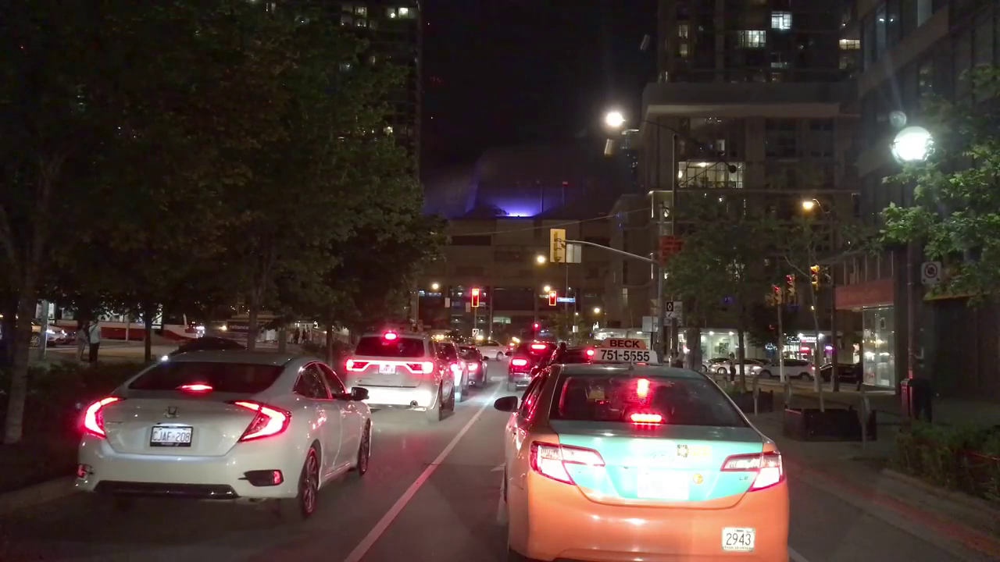
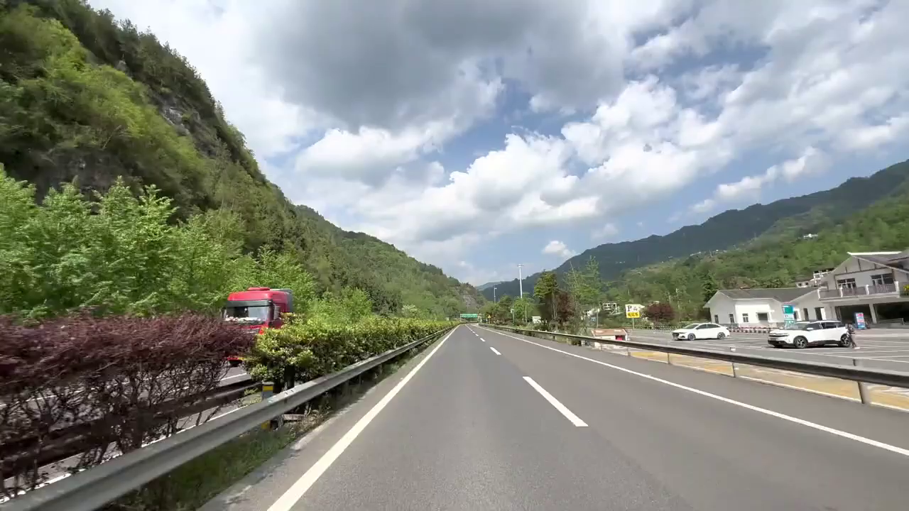

# Style-Guided Video Generation with Cosmos Transfer 2.5

> **Authors:** [Fangyin Wei](https://weify627.github.io/)
> **Organization:** NVIDIA

## Overview

| **Model** | **Workload** | **Use Case** |
|-----------|--------------|--------------|
| Cosmos Transfer 2.5 | Inference | Style-guided video generation using image references |

Cosmos Transfer 2.5 introduces a powerful new capability: generating videos that combine structural control (edge/blur/depth/segmentation) with style guidance from reference images. This enables users to create videos that maintain specific visual aesthetics while following precise motion and structure patterns.

- [Setup and System Requirements](../inference-carla-sdg-augmentation/setup.md)

## Key Features

- **Image-Guided Style Transfer**: Use any image as a style reference for video generation
- **Multi-Modal Control**: Combine edge/blur/depth/segmentation control with image prompts
- **Flexible Style Application**: Control how strongly the reference image influences the output
- **Temporal Consistency**: Maintains coherent style across all video frames

## How It Works

1. **Input Control Video**: Provide structural guidance through edge, blur, depth, or segmentation
2. **Style Reference Image**: Supply an image that defines the desired visual style, but will not change the structure guided by input control video
3. **Text Prompt**: Describe the scene and desired output
4. **Model Processing**: Transfer 2.5 combines all inputs to generate stylized video

## Dataset and Setup

### Input Data Requirements

For style-guided video generation, you need:

- A control video (edge, blur, depth, or segmentation)
- A style reference image (JPEG/PNG)
- A text prompt describing the desired output

### Data Structure

The pipeline expects inputs in the following format:

```
input_directory/
├── control_video.mp4    # Edge/blur/depth/segmentation video
├── style_image.jpg      # Reference image for style
└── prompt.txt          # Text description
```

## Results

The following two examples demonstrate how different environmental styles can be applied to the same edge-controlled motion:

### Example 1

**Text Prompt:**
> "The camera moves steadily forward, simulating the perspective of a vehicle driving down the street. This forward motion is smooth, without any noticeable shaking or abrupt changes in direction, providing a continuous view of the urban landscape. The video maintains a consistent focus on the road ahead, with the buildings gradually receding into the distance as the camera progresses. The overall atmosphere is calm and quiet, with no pedestrians or vehicles in sight, emphasizing the emptiness of the street."

<table>
  <tr>
    <td colspan="3" align="center"><strong>Input</strong></td>
  </tr>
  <tr>
    <td align="center">Edge Control<br><video controls width="300"><source src="./assets/example1_input_edge.mp4" type="video/mp4"></video></td>
    <td align="center">Sunny Style<br></td>
    <td align="center">Sunset Style<br></td>
  </tr>
  <tr>
    <td colspan="3" align="center"><strong>Output</strong></td>
  </tr>
  <tr>
    <td align="center">Base Generation<br><video controls width="300"><source src="./assets/example1_generation-from-edge.mp4" type="video/mp4"></video></td>
    <td align="center">Sunny Style Applied<br><video controls width="300"><source src="./assets/example1_generation-from-edge-sunny.mp4" type="video/mp4"></video></td>
    <td align="center">Sunset Style Applied<br><video controls width="300"><source src="./assets/example1_generation-from-edge-sunset.mp4" type="video/mp4"></video></td>
  </tr>
</table>

### Example 2

**Text Prompt:**
> "A scenic drive unfolds along a coastal highway. The video captures a smooth, continuous journey along a multi-lane road, with the camera positioned as if from the perspective of a vehicle traveling in the right lane. The road is bordered by a tall, green mountain on the right, which casts a shadow over part of the highway, while the left side opens up to a view of the ocean, visible in the distance beyond a row of low-lying vegetation and a sidewalk. Several vehicles, including two red vehicles, travel ahead, maintaining a steady pace. The road is well-maintained, with clear white lane markings and a concrete barrier separating the lanes from the mountain covered by trees on the right. Utility poles and power lines run parallel to the road on the left, adding to the infrastructure of the scene. The camera remains static, providing a consistent view of the road and surroundings, emphasizing the serene and uninterrupted nature of the drive."

<table>
  <tr>
    <td colspan="3" align="center"><strong>Input</strong></td>
  </tr>
  <tr>
    <td align="center">Edge Control<br><video controls width="300"><source src="./assets/example2_input_edge.mp4" type="video/mp4"></video></td>
    <td align="center">Darker Style<br></td>
    <td align="center">Greener Style<br></td>
  </tr>
  <tr>
    <td colspan="3" align="center"><strong>Output</strong></td>
  </tr>
  <tr>
    <td align="center">Base Generation<br><video controls width="300"><source src="./assets/example2_generation-from-edge.mp4" type="video/mp4"></video></td>
    <td align="center">Darker Mood Applied<br><video controls width="300"><source src="./assets/example2_generation-from-edge-darker.mp4" type="video/mp4"></video></td>
    <td align="center">Greener Tone Applied<br><video controls width="300"><source src="./assets/example2_generation-from-edge-greener.mp4" type="video/mp4"></video></td>
  </tr>
</table>

### Key Observations

- **Style Preservation**: The reference image's color palette, lighting, and mood are successfully transferred to the generated video
- **Structure Maintenance**: Edge control ensures consistent motion and object boundaries across all style variations
- **Temporal Coherence**: Style remains consistent throughout the video sequence
- **Flexible Application**: Different styles can dramatically change the video's atmosphere while preserving the underlying motion

## Configuration Examples

### Basic Style-Guided Generation

```json
{
  "video_path": "input_video.mp4",
  "image_context_path": "style_reference.jpg",
  "output_dir": "output/styled_video",
  "prompt": "A person walking in a park with sunny atmosphere",
  "edge": {
    "control_weight": 1.0,
    "control_path": "edge_control.mp4"
  },
  "guidance": 3.0
}
```

## Best Practices

### Style Image Selection

1. **Lighting Consistency**: Choose reference images with lighting that matches your intended scene
2. **Color Harmony**: Select images with color palettes that complement your content
3. **Quality Matters**: High-resolution reference images produce better style transfer
4. **Contextual Relevance**: Images with similar environments work best

### Parameter Tuning

- **Control Weight**: Balance between structure preservation and style flexibility
  - Higher for precise motion tracking
  - Lower for more artistic interpretation

- **Guidance Scale**: Affects adherence to both the text prompt and reference image
  - Higher values: Increased influence from both text prompt and reference image

## Applications

- **Film and Animation**: Apply consistent visual styles across scenes
- **Content Creation**: Transform videos to match brand aesthetics
- **Artistic Expression**: Create unique visual interpretations
- **Environmental Simulation**: Generate videos in different lighting/weather conditions
- **Style Consistency**: Maintain visual coherence across video series

## Troubleshooting

### Common Issues and Solutions

1. **Style Not Applying Strongly Enough**
   - Increase guidance parameter
   - Use more distinctive reference images
   - Adjust prompt to emphasize style elements

2. **Loss of Motion Coherence**
   - Increase control_weight for edge/blur/depth/segmentation
   - Reduce guidance if it's too dominant
   - Ensure control video quality is high

3. **Color Bleeding or Artifacts**
   - Check reference image quality
   - Reduce guidance scale
   - Adjust guidance and control weight balance

## Resources

- **[Cosmos Transfer 2.5 Model](https://github.com/nvidia-cosmos/cosmos-transfer2.5)** - Model weights and documentation
- **[Control Modalities Guide](../../../../core_concepts/control_modalities/overview.md)** - Understanding different control types
