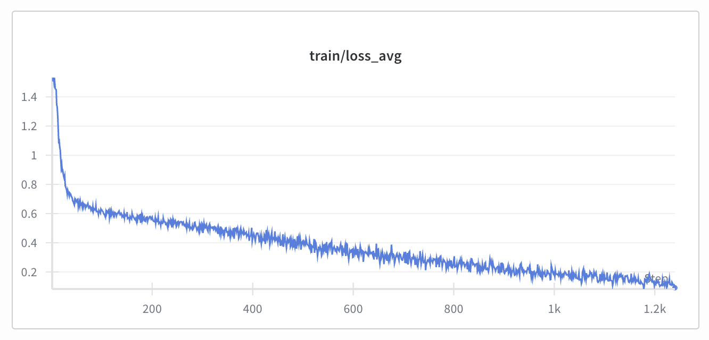

# SFT for AV video captioning and VQA

> **Authors:**
[DeLesley Hutchins](https://www.linkedin.com/in/delesley-hutchins-ba48532b) • [Jingyi Jin](https://www.linkedin.com/in/jingyi-jin/) • [Amol Fasale](https://www.linkedin.com/in/amolfasale/) (**NVIDIA**) •
[Joseph Wang](https://www.linkedin.com/in/josephwangphd/) (**Uber**)

| **Model** | **Workload** | **Use Case** |
|-----------|--------------|--------------|
| [Cosmos Reason 1](https://github.com/nvidia-cosmos/cosmos-reason1) | Post-training | AV video captioning and visual question answering |

## Overview

Autonomous vehicles must operate under a variety of different conditions. These conditions include include different kinds of weather, times of day, types of roads, road conditions, driving environments, and traffic situations. Autonomous vehicles must also be able to recognize and respond to traffic signals, posted traffic signs, and road markings. Furthermore, they must be able to identify situations where the safety of human lives are at risk, such as the presence of cyclists and pedestrians.

It is relatively easy to collect large quantities of video driving data from dashcams, but such data is initially unlabeled. In order to make use of video data, it is often necessary to have high-quality labels or captions; such labels allow video clips to be organized into a searchable database, so that it is possible to locate interesting  driving situations for training or testing purposes. Human annotations are high quality, but expensive. Video-language models, such as Cosmos Reason, can be used as an auto-labeler or auto-captioner instead.

This recipe describes how to fine-tune Cosmos Reason to produce high-quality domain-specific captions and labels for video data. The baseline Reason model can produce captions as-is, but we show that the quality of the captions can be improved by fine-tuning on a dataset of human annotations.

Finetuning on human annotations is also a good way to improve visual question answering (VQA) skills on domain-specific tasks. Many of the specific annotations used in this recipe can also be interpreted as questions to the model, e.g. "What are the weather conditions?"

The basic steps in this recipe are as follows:

- **Data**: Collect an initial dataset of video clips with human annotations.
- **SFT**: Perform supervised fine-tuning of the model on the dataset.
- **Evaluation**: Evaluate the quality of the results, using another LLM as judge.

## Data

For this recipe, we use an internal NVIDIA dataset, which consists of short video clips, each of which is between 5 and 10 seconds long. These clips were passed to a team of human annotators, who answer a series of questions about the clip.

Here's an example video clip:

<video controls width="1280">
  <source src="assets/01a6de83-ac02-4689-a901-f0d1dfc0672d.small.mp4" type="video/mp4">
</video>

And here are the human annotations for the clip in json format:

```json
--8<-- "docs/recipes/post_training/reason1/av_video_caption_vqa/assets/01a6de83-ac02-4689-a901-f0d1dfc0672d.label.json"
```

### Dataset Statistics

#### Split Distribution

- **Total samples**: 10,273
- **Training set**: 9,273 samples (90.3%)
- **Evaluation set**: 1,000 samples (9.7%)

#### Data Size

- **Total dataset size**: 174 GB
- **Training split**: 157 GB
- **Evaluation split**: 17 GB
- **Average video size**: ~17 MB per sample
- **Video size range**: 3.2 MB - 54.5 MB
- **Average annotation file size**: ~1.5 KB per sample

## Prompting the model

In order to get Cosmos Reason to produce annotations similar to the above, we provide the model with a detailed prompt. The prompt should provide clear instructions on how to answer each question, and have enough detail that it can be followed by either humans or LLMs.

### System prompt (annotations)

???+ code "system_prompt.txt"

    ```
    --8<-- "scripts/examples/reason1/av_video_caption_vqa/prompts/system_prompt.txt"
    ```

### User prompt (annotations)

???+ code "user_prompt.txt"

    ```
    --8<-- "scripts/examples/reason1/av_video_caption_vqa/prompts/user_prompt.txt"
    ```

### Running Cosmos Reason in inference mode

Using the above prompt, the base Cosmos Reason model can produce video annotations that match the required format. To generate annotations for a set of videos, run the following script:

```bash
# from the Cosmos cookbook directory
cd scripts/examples/reason1/av_video_caption_vqa
mkdir eval
ln -s /path/to/videos eval/videos
./avha_caption.py --output-dir ./output/baseline
```

## Supervised fine tuning

[Cosmos-rl](https://github.com/nvidia-cosmos/cosmos-rl) provides infrastructure for post-training of Cosmos models, including both supervised fine-tuning and reinforcement learning. In this case, we will do supervised fine-tuning, and post-train the model to predict the human annotations, given the video and the prompt described above.

### Setup

To start, please follow the [example SFT setup instructions in the Cosmos Reason 1 respository](https://github.com/nvidia-cosmos/cosmos-reason1/tree/main/examples/post_training). In particular, be sure to install redis-server, and log into [wandb](https://wandb.ai).

### Copying the SFT code to cosmos-reason

The fine-tuning code requires four files:

- The system and user prompts described above.
- The `avha_sft.py` script creates a custom dataset, which combines each video clip with the appropriate prompt and the human annotations.
- The `avha_sft.toml` config file sets the SFT hyperparameters.

Check out the [cosmos-reason github repository](https://github.com/nvidia-cosmos/cosmos-reason1), and then run the following shell script, which copies the necessary files from cosmos-cookbook over to cosmos-reason:

```bash
# In the cosmos_cookbook/scripts/examples/reason1/av_video_caption_vqa/ directory
./setup_sft.sh /path/to/cosmos-reason
```

### Training Configuration

Most of the training configuration is copied from the existing SFT examples. The important differences are shown below:

???+ code "Training Configuration: avha_sft.toml"

    ```toml
    [train]
    epoch = 20                             # Train for 20 epochs
    output_dir = "./outputs/avha_sft"      # Output directory
    ...
    train_batch_per_replica = 16           # Reduced batch size for memory efficiency

    [logging]
    project_name = "cosmos_reason1_avha"   # Custom project name
    experiment_name = "avha_sft"           # Custom experiment name

    [train.train_policy.dataset]
    name = "/path/to/dataset/train"        # Path to local dataset
    ```

### Using cosmos-rl for fine-tuning

Run the following commands to fine-tune the model with cosmos-rl:

```bash
# In the cosmos-reason1/examples/post_training_hf directory
just install
source .venv/bin/activate
cosmos-rl --config configs/avha_sft.toml scripts/avha_sft.py
```

You should see a training loss curve that looks something like the following:



### Running the fine-tuned model in inference mode

Once supervised fine-tuning is done, use the SFTed model to generate a new set of annotations, with the same prompt as before. Instead of loading the default model weights from HuggingFace, point the inference script at the directory where the fine-tuned weights are stored:

```bash
# In the cosmos_cookbook/scripts/examples/reason1/av_video_caption_vqa/ directory
./avha_caption.py --model-path /path/to/safetensor/weights/ --output-dir ./output/sft
```

## Evaluation using an LLM as judge

A few of the annotations shown above are multiple-choice, namely: "weather", "lighting", "driving difficulty", "rule_violation", and "interesting_scenario". However, the answers to the most interesting questions are all free-form text, in which the human annotator can write whatever description they want.

Since the answers are not multiple choice, there is no way to compute an exact accuracy. Instead, we used another LLM to judge the responses. For each question, the LLM auto-judge compares the LLM response against the human annotation, and scores it on a sliding scale from 1 to 5. The auto-judge does not require access to the original video, so any text LLM can be used as judge. We chose to use [ChatGPT 5](https://openai.com/index/introducing-gpt-5/) for our experiment, as it seemed to produce accurate comparisons.

Note that the score of the auto-judge is not an objective measure of "correctness" or "accuracy". The longer and more complicated the answer, the less likely it is that two answers will have a close match. For example, on "safety_analysis", it is entirely possible for the human annotator and the LLM captioner to notice different things. For example, the LLM may point out that an intersection has a crosswalk, while the human doesn't feel that it's important to point that out, because *all* intersections with traffic lights have crosswalks. In that case, the LLM response is technically correct, but it will only receive a partial match -- i.e. a score of 3/5. Even if two different humans were to answer that question, their answers would be unlikely to match exactly.

However, the auto-judge scores do serve as a rough measure of how similar the LLM responses are to the human responses, so higher numbers are better.

Here are the prompts for the auto-judge:

### System prompt (for LLM judge)

???+ code "System prompt for LLM judge"

    ```
    You are a helpful assistant who has been tasked with evaluating the reponses produced by
    another LLM. A series of questions were given to both humans and LLMs, and we want to
    evaluate how closely the LLM response matches the human response.

    The match should be scored on a scale between 1 and 5, according to the following rubric:

    1: The responses don't match at all; the LLM gave a completely different answer to the
    human.

    2: There is some overlap between the two responses, but overall the LLM response is
    substantially different from the human response, and thus should be considered to be
    "wrong" overall.

    3: The LLM got some things right, and some things wrong.

    4: The responses are clearly similar, but there are still a few details where the
    LLM response does not match the human response.

    5: The responses match very closely. Note that the phrasing may be different, but the
    match should still be given a grade of 5 if they have the same meaning. For example,
    when asked about weather, the human may respond "clear blue skies", while the LLM may
    respond "the sky is sunny and cloudless", but these mean the same thing.

    Give your answer in the following format. First, write a short description of why you
    think the responses match or don't match. If the responses don't match, be sure to
    explain why you think they are different. Then provide your score.
    ```

### User prompt

???+ code "User prompt for LLM judge"

    ```
    Given the question ``%s'', here are the two responses to compare:

    *** Human response ***:
    %s

    *** LLM response ***:
    %s

    Provide your answer in the following format:

    [Reason for giving the score.]

    <answer>[Single digit between 1 and 5]</answer>
    ```

### Scoring the model

To score the LLM responses, run the following script:

```bash
cd scripts/examples/reason1/av_video_caption_vqa
export OPENAI_API_KEY="your_openai_api_key"
avha_judge.py --output-dir ./output/baseline --score-dir ./scores/baseline
avha_judge.py --output-dir ./output/sft --score-dir ./scores/sft
avha_compare_scores.py
```

### Results

The results of the fine-tuning experiment were as follows:


Fine-tuning the model on human annotations improved annotation scores across the board. The first four questions -- "weather," "lighting," "road_conditions," and "traffic_light" -- were easy. They show only modest improvement, because the baseline scores were already high.

The hardest question by far was "safety_analysis."  It shows very little improvement, but that is at least partly due to the fact that it is very hard for the auto-judge to compare paragraph-level responses. Most answers, even if the answers are valid, will only be a partial match -- i.e. a score of 3.

The mid-difficulty questions are "additional_traffic_rules," "road_type," "junction_type," and "lane_type". Most of these show substantial improvement. These are questions that the baseline model did poorly on, but the auto-judge is able to score effectively.

The only case where the fine-tuned model does worse is "rule_violation". For this question, the baseline model gets a near-perfect score simply by answering "False" every time.

## Conclusion

This recipe demonstrates that the Cosmos Reason model can be used out-of-the box for video captioning and VQA, and  the baseline model is able to answer simple questions about weather and road conditions with high accuracy.  However, for more complex domain-specific questions, performance of the model can be improved substantially by supervised fine-tuning on human annotations.
