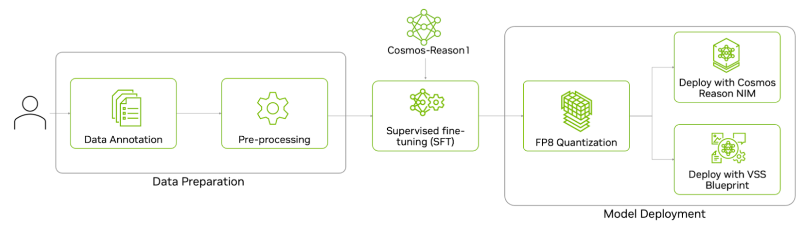

# Intelligent Transportation Post-Training with Cosmos Reason 1

> **Authors:** [Paris Zhang](https://www.linkedin.com/in/pariszhang11/) • [Chintan Shah](https://www.linkedin.com/in/chintan-shah-7b7a2811/) • [Tomasz Kornuta](https://www.linkedin.com/in/tkornuta/)
> **Organization:** NVIDIA

## Overview

Supervised Fine-Tuning (SFT) is used to improve the accuracy of a pre-trained model by teaching it to follow specific instructions or understand new tasks using labeled examples. While a base model learns general patterns from large, diverse data, SFT aligns the model to specific tasks with desired outputs by showing clear input–output pairs. Using domain-specific data is essential—it embeds the specialized vocabulary, visual patterns, and reasoning needed for real-world scenarios. In this recipe, we show how to fine-tune the [Cosmos Reason 1-7B](https://build.nvidia.com/nvidia/cosmos-reason1-7b) model to understand the world from a traffic point of view - scene understanding, road attributes, and pedestrian situation.

Before fine-tuning the model, let's review the zero-shot performance of the model. The model spots some of the content correctly while identifying one of the pedestrians crossing the road incorrectly.

<video controls width="960">
  <source src="assets/example_video.mp4" type="video/mp4">
</video>


<br>

Here’s the end-to-end workflow to fine-tune Cosmos Reason 1—from data preparation and supervised fine-tuning on the prepared dataset to quantizing and deploying the model for inference.


<br>

## Data Preparation

For this experiment, we used the [WovenTraffic Safety](https://woven-visionai.github.io/wts-dataset-homepage/) (WTS) Dataset from [Woven by Toyota, Inc.](https://woven.toyota/en/). This is a real-world pedestrian-centric traffic video dataset featuring 255 traffic scenarios, including staged pedestrian-related accidents across 1.2k video segments. It provides detailed textual descriptions of pedestrian and vehicle behavior, bounding box annotations, and traffic Visual Question Answering (VQA) with multiple-choice questions (MCQ).

> **Note**: The goal of this example is to demonstrate post-training on Cosmos-Reason 1. The dataset used in this experiment is governed by the terms specified in the [WTS DATASET Terms of Use](https://woven-visionai.github.io/wts-dataset-homepage/#downloads).

Here are examples of the video clips and textual descriptions of the pedestrian from the dataset. The images and text are courtesy of Woven by Toyota, Inc.


<br>

For this experiment, we fine-tune the Cosmos Reason 1 model on the Environment VQA subset of the WTS dataset. The subset contains 341 videos with 5k MCQ question-answer pairs. The average video length is about 75 seconds.

### Data Pre-processing

We performed the following steps to pre-process the dataset:

1. Download the dataset from the WTS Dataset [homepage](https://woven-visionai.github.io/wts-dataset-homepage/). This dataset is owned and managed by “Woven by Toyota”. To use this dataset for your own applications, you must request access directly from the “Woven by Toyota” organization.

2. Pre-process the VQA annotations into Llava format.

   ```shell
   # From scripts/examples/reason1/intelligent-transportation directory
   python data_preprocess.py --data_path /path/to/WTS/folder
   ```

<br>

## Post-Training with Supervised Fine-Tuning (SFT)

After preprocessing, the WTS dataset is in Llava format and ready for training. To launch training, we follow the default cosmos-rl training command in [Cosmos Reason 1 Post-Training Llava Example](https://github.com/nvidia-cosmos/cosmos-reason1/tree/main/examples/post_training_llava):

```shell
# From scripts/examples/reason1/intelligent-transportation directory
cosmos-rl --config sft_config.toml custom_sft.py
```

### Hyperparameter optimization

For this SFT experiment, we updated the default configuration in the post-training Llava example for Cosmos Reason 1. Here are the key updates that optimize this experiment on 8 A100.

???+ code "Training Configuration"

   ```toml
   --8<-- "scripts/examples/reason1/intelligent-transportation/sft_config.toml"
   ```

### Ablation Study

We ablated the training with two common configurations for different frame resolutions:

1. **Max pixels 81,920 per frame**: This translates to roughly **4k total vision tokens**, according to the average WTS video length. The calculation is provided below.
2. **Total pixels 6,422,528**: This translates to a total of **8k vision tokens**. The calculation is provided below.

---

**Calculation for max_pixels 81,920 to 4k total vision tokens**

1. **Frame Calculation:**
   On average, our training video is about 75 seconds long. With 1 fps, it is:
   `75 seconds * 1 fps = 75 frames per video`
2. **Frame Grouping:**
   According to the Qwen2.5-VL [paper](https://arxiv.org/pdf/2502.13923) (the backbone model of Cosmos-Reason 1), the model groups every two consecutive frames as a single unit input to the language model:
   `75 frames / 2 = 38 frame pairs per video`
3. **Tokens per Frame:**
   The Qwen2.5-VL model uses a vision transformer that processes images in patches. Each token corresponds to a `28 x 28 = 784` pixel area, so we set max pixels per frame as 81,920 pixels:
   `81,920 pixels/frame / 784 pixels/token ≈ 104 tokens/frame`
4. **Total Vision Tokens:**
   Multiply the number of frame groups by the tokens per frame:
   `38 frame groups × 104 tokens/group = 3,952 tokens`

---

**Calculation for total_pixels 6,422,528 to 8k total vision tokens:**

As noted above, based on the Qwen2.5-VL model architecture, each vision token represents a `28 x 28 = 784` pixel area, so we set total_pixels as 6,422,528:
  `6,422,528 pixels / 784 pixels/token = 8,192 tokens`

### Model Evaluation

After training, we evaluate the model on the validation set of the Environment VQA subset of the WTS dataset. The evaluation script below will save the model responses and accuracy score in the `results` directory.

We then updated the `eval_config.yaml` with the path to the post-trained model and the validation set.

```shell
# From scripts/examples/reason1/intelligent-transportation directory
python evaluate.py --config eval_config.yaml
```

<br>

## Results

### Quantitative Results

First, let's review the quantitative results for both experiments: one with 81,920 pixels/frame (4K visual tokens) and another with 8K visual tokens on the environment VQA subset of the WTS dataset. This is a collection of multiple choice questions (MCQ) on traffic and pedestrian videos. Overall, we see the accuracy jump to over 90 for both experiments. There is not a lot of delta in training accuracy between the two experiments, and 4K visual tokens will converge faster and provide faster inference times.


### Training Time

We ran all the experiments on 1 node (8 GPUs) of A100. The table below captures the training time for the two different settings with one training epoch. Both were run with a 1 FPS sampling rate. As expected with only 81,920 pixels/frame (4K vision tokens), the model converged in roughly half the time as 8K vision tokens. In summary, you can train a very accurate model using thi amount of data in an hour or less.

| Method | FPS & Resolution                  | Training Time (on 8 A100s) |
|--------|-----------------------------------|----------------------------|
| SFT    | Fps 1, max pixels/frame 81920     | 35m                        |
| SFT    | Fps 1, total pixels 8k vision tokens | 1h 3m                      |

### Qualitative Results

After SFT training with multiple choice questions (MCQ), the model achieves a significant accuracy improvement on the validation set MCQs on WTS videos. Additionally, the model is also able to answer open-ended questions more accurately than zero shot on external videos. Below is a qualitative comparison of open-ended questions on an unseen video outside of WTS dataset.

<video controls width="960">
  <source src="assets/example_video.mp4" type="video/mp4">
</video>


<br>

## Model Deployment

The last step is to deploy the trained model for inference. You can deploy it using either an NVIDIA optimized NIM or through the VSS blueprint, or you can deploy it in your own application. Before deployment, we will first quantize the LLM portion of the VLM to FP8 for faster inference.

### FP8 Quantization

The script to quantize the model to FP8 is provided in the NVIDIA [Cosmos Reason 1 repo](https://github.com/nvidia-cosmos/cosmos-reason1/blob/main/scripts/quantize_fp8.py).

1. Clone the Cosmos Reason 1 repo.

2. To run post-training quantization (PTQ), install the following dependencies:

   ```shell
   "vllm==0.9.2"
   "transformers>=4.53.1"
   "qwen-vl-utils[decord]"
   "llmcompressor>=0.6.0"
   ```

3. Run the `quantize_fp8.py` script.

   ```shell
   python ./scripts/quantize_fp8.py --model_id 'nvidia/Cosmos Reason 1-7B' --save_dir 'Cosmos Reason 1-7B-W8A8-FP8'
   ```

Before deploying the quantized model for inference, we ran an evaluation on the model for accuracy and ensured quantization doesn’t introduce any accuracy regression.

### Deploy on NVIDIA NIM

NVIDIA NIM™ provides containers to self-host GPU-accelerated inferencing microservices for pre-trained and customized AI models across cloud instances, data centers, and RTX™ AI PCs and workstations, with industry-standard APIs for simple integration into AI applications.

To deploy a post-trained checkpoint, go to the [fine-tune-model](https://docs.nvidia.com/nim/vision-language-models/latest/fine-tune-model.html) section in NIM documentation. Go to "Cosmos Reason 1-7B" tab. NIM will automatically serve an optimized vLLM engine for this model. The model needs to be in the Huggingface checkpoint or quantized checkpoint.

```shell
export CUSTOM_WEIGHTS=/path/to/customized/reason1
docker run -it --rm --name=cosmos-reason1-7b \
    --gpus all \
    --shm-size=32GB \
    -e NIM_MODEL_NAME=$CUSTOM_WEIGHTS \
    -e NIM_SERVED_MODEL_NAME="cosmos-reason1-7b" \
    -v $CUSTOM_WEIGHTS:$CUSTOM_WEIGHTS \
    -u $(id -u) \
    -p 8000:8000 \
    $NIM_IMAGE
```

### Deploy with NVIDIA VSS Blueprint

The VSS (Video Search and Summarization) Blueprint leverages both Vision-Language Models (VLM) and Large Language Models (LLM) to generate captions, answer questions, and summarize video content, enabling rapid search and understanding of videos on NVIDIA hardware.

By default, VSS is configured to use base Cosmos Reason 1-7B as the default VLM. Deployment instructions for VSS are available in its [official documentation](https://docs.nvidia.com/vss/latest/content/prereqs_x86.html). VSS supports two primary deployment methods: Docker Compose and Helm charts.

For Docker Compose deployment, navigate to the [Configure the VLM](https://docs.nvidia.com/vss/latest/content/installation-vlms-docker-compose.html#local-models-cosmos-reason1) section under “Plug-and-Play Guide (Docker Compose Deployment)” to integrate a custom fine-tuned Cosmos-Reason 1 checkpoint.

```shell
export VLM_MODEL_TO_USE=cosmos-reason1
export MODEL_PATH=</path/to/local/cosmos-reason1-checkpoint>
export MODEL_ROOT_DIR=<MODEL_ROOT_DIR_ON_HOST>
```

Similarly for Helm Chart deployment, navigate to the [Configure the VLM](https://docs.nvidia.com/vss/latest/content/installation-vlms.html#local-models-cosmos-reason1) section under “Plug-and-Play Guide (Helm Deployment)”.

```yaml
vss:
  applicationSpecs:
    vss-deployment:
      containers:
        vss:
          env:
          - name: VLM_MODEL_TO_USE
            value: cosmos-reason1
          - name: MODEL_PATH
            value: "/tmp/cosmos-reason1"
  extraPodVolumes:
  - name: local-cosmos-reason1-checkpoint
    hostPath:
      path: </path/to/local/cosmos-reason1-checkpoint>
  extraPodVolumeMounts:
  - name: local-cosmos-reason1-checkpoint
    mountPath: /tmp/cosmos-reason1

```

<br>

## Conclusion

Supervised Fine-Tuning Cosmos Reason 1 on traffic-specific data boosts accuracy from zero-shot levels to over 90% on traffic VQA tasks. Key insights include the following:

- **Domain data matters**: Specialized datasets drive substantial performance gains.
- **Efficient training**: 4K vision tokens per frame converged twice as fast as 8K, with similar accuracy.
- **Seamless deployment**: Workflow supports quantization and deployment via NIM or VSS.

This methodology can be applied to any physical AI domain by substituting relevant datasets.
