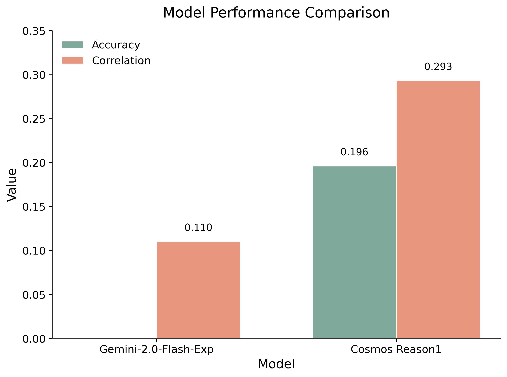
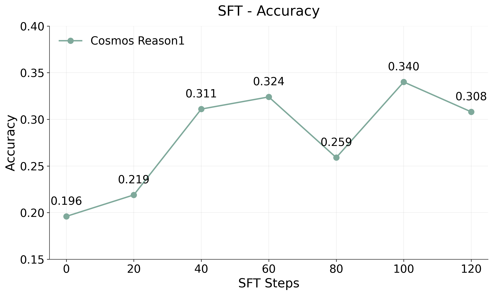
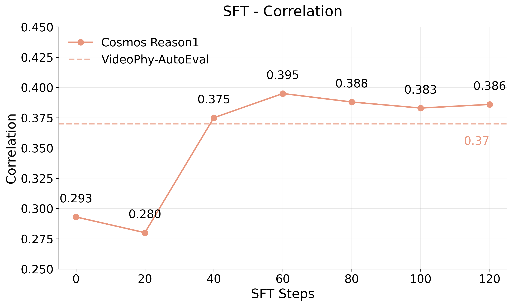
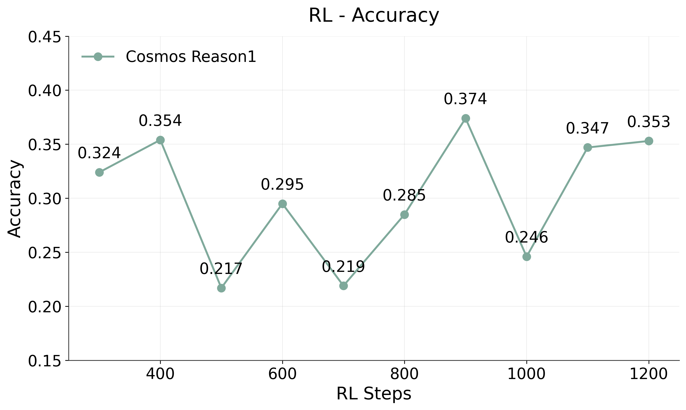

# Physical Plausibility Prediction with Cosmos Reason 1

> **Authors:** [Shun Zhang](https://www.linkedin.com/in/shun-zhang-1b154437/) • [Zekun Hao](https://www.linkedin.com/in/zekunhao/) • [Jingyi Jin](https://www.linkedin.com/in/jingyi-jin/)
> **Organization:** NVIDIA

## Overview

| **Model** | **Workload** | **Use Case** |
|-----------|--------------|--------------|
| Cosmos Reason 1 | Post-training | Physical plausibility prediction |

In synthetic video generation, it is crucial to determine the quality of the generated videos and filter out videos of bad quality.
In this case study, we demonstrate using the Cosmos Reason 1 model for physical plausibility prediction. Physics plausibility assessment involves evaluating whether the physical interactions and behaviors observed in videos are consistent with real-world physics laws and constraints.

- [Setup and System Requirement](setup.md)

We first evaluate the model's ability to predict physical plausibility on an open-source dataset. We then fine-tune the model and evaluate its performance.

## Dataset: VideoPhy-2

We use the [VideoPhy-2 dataset](https://github.com/Hritikbansal/videophy/tree/main/VIDEOPHY2) for this case study, which is designed as an action-centric benchmark for evaluating physical common sense in generated videos.

### Dataset Overview

VideoPhy-2 provides a comprehensive evaluation framework for testing how well models understand and predict physical plausibility in video content. The dataset features **human evaluations on physics adherence** using a **standardized 1-5 point scale**.

| **Dataset Split** | **Size** | **Access** |
|-------------------|----------|------------|
| **Training Set** | 3.4k videos | [videophysics/videophy2_train](https://huggingface.co/datasets/videophysics/videophy2_train/) |
| **Evaluation Set** | 3.3k videos | [videophysics/videophy2_test](https://huggingface.co/datasets/videophysics/videophy2_test) |

### Evaluation Criteria

Each video receives human evaluations based on **adherence to physical laws** using a standardized 5-point scale:

| **Score** | **Description** | **Physics Adherence** |
|-----------|-----------------|----------------------|
| **1** | No adherence to physical laws | Completely implausible |
| **2** | Poor adherence to physical laws | Mostly unrealistic |
| **3** | Moderate adherence to physical laws | Mixed realistic/unrealistic |
| **4** | Good adherence to physical laws | Mostly realistic |
| **5** | Perfect adherence to physical laws | Completely plausible |

### Key Physics Challenges

The dataset highlights critical challenges for generative models in understanding fundamental physical rules:

- **Conservation Laws**: Mass, energy, and momentum conservation
- **Gravitational Effects**: Realistic falling and weight behavior
- **Collision Dynamics**: Object interaction physics
- **Temporal Causality**: Cause-and-effect relationships
- **Spatial Constraints**: Object boundaries and spatial logic

### Example Videos from the Dataset

#### Low Physical Plausibility (Score: 2/5)

<video controls width="480">
  <source src="https://videophysics2trainvideos.s3.us-east-2.amazonaws.com/hunyuan_xedit_train/A_robotic_arm_gently_pokes_a_stack_of_plastic_cups,_making_the_bottom_cups_slide_out_and_the_whole_stack_fall.mp4" type="video/mp4">
</video>

- **Scene**: A robotic arm gently pokes a stack of plastic cups.

- **Physics Issue**: The stack of cups does not maintain its shape when the robotic arm interacts with it.

- **Key Problems**: Conservation of mass and elasticity.

#### High Physical Plausibility (Score: 4/5)

<video controls width="480">
  <source src="https://videophysics2trainvideos.s3.us-east-2.amazonaws.com/cosmos_videophy2_train_challenging/A_robotic_arm_pushes_a_metal_cube_off_a_steel_table;_the_cube_lands_precisely_on_a_marked_spot.mp4" type="video/mp4">
</video>

- **Scene**: A robotic arm pushes a metal cube off a steel table.

- **Physics Strengths**: The robotic arm moves the cube from one position to another. The cube maintains its shape and volume throughout the interaction.

- **Key Success**: Conservation of mass and gravity.

## Zero-Shot Inference

We first evaluate the model's ability to predict physical plausibility on the VideoPhy-2 evaluation set without any fine-tuning. We use the same prompt from the [VideoPhy-2 paper](https://arxiv.org/abs/2503.06800), which provides detailed instructions on what aspects of the video to evaluate and scoring criteria.

???+ code "Prompt for Scoring Physical Plausibility"

    ```yaml
    --8<-- "docs/recipes/post_training/reason1/physical-plausibility-check/assets/video_reward.yaml"
    ```

We use a script similar to [an existing video critic example](https://github.com/nvidia-cosmos/cosmos-reason1/blob/main/examples/video_critic/video_critic.py) in Cosmos Reason 1 to run zero-shot inference.

1. Copy `scripts/examples/reason1/physical-plausibility-check/video_reward.py` from this repo to `cosmos-reason1/examples/video_critic/video_reward.py`, and copy the "Prompt for Scoring Physical Plausibility" YAML file above to `cosmos-reason1/prompts/video_reward.yaml`.
2. Run the following command to run zero-shot inference on a video:

        # In the cosmos-reason1 root directory
        uv run examples/video_critic/video_reward.py \
            --video_path [video_path] \
            --prompt_path prompts/video_reward.yaml

The result is saved in an HTML file in the same directory as the video.

### Evaluation Metrics

We evaluate the model performance using two key metrics:

- **Accuracy**: The percentage of videos where predicted scores match ground truth scores
- **Correlation**: The correlation between predicted and ground truth scores

### Results

We compare Cosmos Reason 1 with Gemini-2.0-Flash-Exp (the baseline from the paper). Even without fine-tuning, Cosmos Reason 1 demonstrates superior performance.



### Example Predictions

The following examples demonstrate zero-shot predictions from the Cosmos Reason 1 model:

#### Car Crashes into Stack of Cardboard Boxes

<source src="https://videophysics2testvideos.s3.us-east-2.amazonaws.com/hunyuan_xdit/A_car_crashes_into_a_stack_of_cardboard_boxes,_sending_the_boxes_flying_in_all_directions.mp4" type="video/mp4">

- **Model prediction**: 1
- **Ground truth**: 2 (poor adherence to physical laws)

#### Robotic Arm Operates on Circuit Board

<video controls width="480">
  <source src="https://videophysics2testvideos.s3.us-east-2.amazonaws.com/wan_videophy2_test_hard_upsampled/A_robotic_arm_uses_a_slender_tool_to_carefully_reposition_a_circuit_board,_nudging_it_a_fraction_of_an_inch.mp4" type="video/mp4">
</video>

- **Model prediction**: 5
- **Ground truth**: 5 (perfect adherence to physical laws)

## Supervised Fine-Tuning (SFT)

Having demonstrated that Cosmos Reason 1 can predict physical plausibility and outperform baseline models in zero-shot evaluation, we now apply supervised fine-tuning (SFT) using the VideoPhy-2 training set to further improve the model's performance.

### Training Data Format

The fine-tuning process uses the following data structure:

- **Input**: Video + language instruction (from the evaluation prompt)
- **Output**: Physical plausibility score (1-5 scale)

### Setup

We use the [cosmos-rl](https://github.com/nvidia-cosmos/cosmos-rl) library for fine-tuning. First, download and prepare the VideoPhy-2 training data:

1. Copy `scripts/examples/reason1/physical-plausibility-check/download_videophy2.py` from this repo to `cosmos-reason1/examples/post_training_hf/scripts/download_videophy2.py`
2. Run the following command to download the VideoPhy-2 training data:

        # In the cosmos-reason1 root directory
        cd examples/post_training_hf/
        uv run scripts/download_videophy2.py \
            --output data/videophy2_train \
            --dataset videophysics/videophy2_train \
            --split train


### Training Configuration

We use the following configuration optimized for 8 GPUs:

???+ code "Training Configuration"

    ```toml
    --8<-- "docs/recipes/post_training/reason1/physical-plausibility-check/assets/sft_config.toml"
    ```

### Running Training

We run training with the following steps:

1. Save the "Training Configuration" above as `cosmos-reason1/examples/post_training_hf/configs/videophy2_sft.toml`
2. Execute the training script:

        # In the cosmos-reason1 root directory
        cd examples/post_training_hf/
        cosmos-rl --config configs/videophy2_sft.toml scripts/custom_sft.py

> **Note**: The training process uses the [custom SFT script](https://github.com/nvidia-cosmos/cosmos-reason1/blob/main/examples/post_training_hf/scripts/custom_sft.py), which includes a data loader that works with the **Hugging Face datasets format**.

### Results

After fine-tuning, we evaluate the model on the VideoPhy-2 evaluation set using the same metrics. The results demonstrate significant performance improvements:




**Key observations**

- Performance improves significantly after fine-tuning
- Best correlation achieved at 60 steps (0.395)
- Best accuracy achieved at 100 steps (0.340)
- Outperforms VideoPhy-AutoEval baseline after 40-60 training steps

### Comparison Examples

The following examples show prediction improvements from fine-tuning:

#### Robotic Arm Operates on Circuit Board

<video controls width="480">
    <source src="https://videophysics2testvideos.s3.us-east-2.amazonaws.com/cosmos_videophy2_test_challenging/A_robotic_arm_uses_a_slender_tool_to_carefully_reposition_a_circuit_board,_nudging_it_a_fraction_of_an_inch.mp4" type="video/mp4">
</video>

- **Before SFT**: 3
- **After SFT (60 steps)**: 5
- **Ground truth**: 5

#### Robot Shovels Snow

<video controls width="480">
    <source src="https://storage.cdn-luma.com/dream_machine/fb2b34ac-ed7a-4773-8382-9786890a6056/ed9bc667-9b64-4224-8860-8108a42c8823_result.mp4" type="video/mp4">
</video>

- **Before SFT**: 4
- **After SFT (60 steps)**: 5
- **Ground truth**: 5

For both examples, the fine-tuned model correctly predicts the physical plausibility scores.

## Reinforcement Learning

So far we have evaluated the zero-shot and supervised fine-tuning (SFT) performance of the model. In this section, we explore reinforcement learning (RL) to further enhance the model's ability to predict physical plausibility. RL allows the model to explore and learn from reward signals based on its alignment with ground truth scores, which leads to better calibration and improved performance.

### Training Data Format

The prompt and expected model output are as follows:

- **Input**: Video + language instruction to generate thinking trace and score
- **Model output**: **Thinking trace** and physical plausibility score (1-5 scale)

The **reward function** is defined based on prediction accuracy. We use a dense reward function so that the model gets a partial credit for being close to the ground truth score:

- `1` if `prediction == ground_truth`
- `0.5` if `|prediction - ground_truth| == 1`
- `0` otherwise

The language instruction prompts the model to generate a structured response with explicit thinking traces before providing a score:

???+ code "Prompt for RL Training"

    ```yaml
    --8<-- "docs/recipes/post_training/reason1/physical-plausibility-check/assets/video_reward_with_thinking.yaml"
    ```

### Training Configuration

We use the **Group Relative Policy Optimization (GRPO)** algorithm in [cosmos-rl](https://github.com/nvidia-cosmos/cosmos-rl) library for RL training.

**Key Considerations:**

- The scores in the original VideoPhy-2 training data are not balanced and can cause the RL training to converge to a suboptimal solution. We found that the model tends to predict the most frequent score in the training data (always predicting 4). So we need to up-sample / down-sample the training data to make sure all the scores appear the same number of times in the training data.
- It is crucial to set a positive `kl_beta` value to avoid the model from overfitting to the training data.

We use the following configuration optimized for 8 GPUs:

???+ code "RL Training Configuration"

    ```toml
    --8<-- "docs/recipes/post_training/reason1/physical-plausibility-check/assets/rl_config.toml"
    ```

We prepare the training data for reinforcement learning with a different prompt and label balancing discussed in the considerations above.

1. Save the "Prompt for RL Training" above as `cosmos-reason1/examples/post_training_hf/prompts/video_reward_with_thinking.yaml`
2. Run the following command to prepare the training data. The `balance_labels` option is used to make sure all the scores appear the same number of times in the training data.

        # In the cosmos-reason1 root directory
        cd examples/post_training_hf/
        uv run scripts/download_videophy2.py \
          --output data/videophy2_train_w_thinking_balanced \
          --dataset videophysics/videophy2_train \
          --split train \
          --prompt_path prompts/video_reward_with_thinking.yaml \
          --balance_labels

### Running Training

1. Save the "RL Training Configuration" above as `cosmos-reason1/examples/post_training_hf/configs/videophy2_rl.toml`
2. Copy `scripts/examples/reason1/physical-plausibility-check/custom_grpo.py` from this repo to `cosmos-reason1/examples/post_training_hf/scripts/custom_grpo.py`
3. Execute the RL training script:

        # In the cosmos-reason1 root directory
        cd examples/post_training_hf/
        cosmos-rl --config configs/videophy2_rl.toml scripts/custom_grpo.py

**Notes**: The RL training script uses the `custom_grpo.py`, which is modified from the [GRPO script](https://github.com/nvidia-cosmos/cosmos-reason1/blob/main/examples/post_training/tools/dataset/cosmos_grpo.py) in the Cosmos Reason 1 repository. We included the implementation of our reward function in `custom_grpo.py`.

### Results

After RL training, we evaluate the model on the VideoPhy-2 evaluation set using the same metrics. The results demonstrate further performance improvements over both zero-shot and SFT approaches:




**Key observations:**

- RL training shows significant improvements over both zero-shot and SFT, especially in correlation
- Best performance achieved at 900 steps: 0.374 accuracy and 0.425 correlation
- Performance shows some variability across checkpoints, which may be mitigated by further adjusting the learning rate schedule

### Example Model Outputs

#### Pizza Dough Tossed and Caught

<video controls width="480">
  <source src="https://videophysics2testvideos.s3.us-east-2.amazonaws.com/videocrafter_videophy2_hard/A_pizza_dough_is_tossed_up__its_edges_become_thinner_as_it_rotates_in_the_air__and_it_s_caught_by_a_second_person_.mp4" type="video/mp4">
</video>
* **Ground truth**: 2 (poor adherence to physical laws)

**Before RL Training:**

<details>
<summary><strong>Model Raw Output</strong></summary>

&lt;think&gt;<br>
Okay, let's see. The video shows a close-up of someone preparing pizza dough. The dough is already spread out on a pan, right? And the person is using a small piece of dough to add tomato sauce. They pick up that little piece, stretch it a bit, and drop it onto the larger dough circle. Then they repeat the process a few times to spread the sauce evenly.<br>
<br>
Hmm, so the main question here is whether this follows physical laws. Let me think. When you stretch the dough, it should deform realistically. If the dough is elastic, stretching it would require some force, and when released, it should return to its original shape slightly, creating tension. But in the video, when the person lets go of the dough after stretching it, does it spring back too much or not at all? From the video, it seems like the dough behaves normally-it stretches when pulled and stays in place once dropped. That makes sense because real dough has some elasticity.<br>
<br>
Also, the sauce is being added by dropping the dough ball. The way it falls and spreads might seem a bit idealized, but in reality, when you drop something onto a surface, it would spread out depending on its consistency. Since the sauce is thick, it probably doesn't spread too much, which aligns with what you'd expect. So the interaction between the sauce and the dough seems plausible.<br>
<br>
Another thing to consider is the hand movements. The person's hand moves smoothly, picking up the dough, stretching it, and dropping it. The motion is continuous and doesn't have any jerky or unrealistic movements. The hand's weight and the way it handles the dough match how a real person would do this task. No signs of the hand passing through the dough or anything like that.<br>
<br>
Wait, but the camera angle is static and close-up. Could there be any visual tricks? Like maybe the dough isn't actually moving as it should? But according to the video, the actions are smooth and natural. The dough deforms as expected when stretched and doesn't float or behave unnaturally. The sauce drops realistically and doesn't clip through the dough surface.<br>
<br>
So putting it all together: the dough's elasticity, the sauce's behavior, and the hand movements all seem consistent with real-life physics. The video doesn't show any sudden flips, teleportation, or other impossible events. Everything follows the laws of motion and material behavior as we'd expect in reality. Therefore, the video adheres to physical commonsense.<br>
&lt;/think&gt;<br>
<br>
&lt;answer&gt;<br>
5<br>
&lt;/answer&gt;<br>
</details>

- **Model prediction**: 5. (The prediction is different from the ground truth score 2.)
- **Summary of the model output**: The analysis falsely believes that the video shows natural deformation, consistent elasticity, plausible sauce behavior, smooth hand movements, and adherence to physical laws, indicating no signs of manipulation or unrealistic simulation.

**After RL Training (900 steps):**

<details>
<summary><strong>Model Raw Output</strong></summary>

&lt;think&gt;<br>
Okay, let's see. In the sequence of frames provided, one can observe several visual anomalies and artifacts that suggest the video may not adhere to physical commonsense.
The dough appears to move and change shape in a manner inconsistent with how it would naturally behave under normal circumstances.
For instance, when the hand presses down on the dough, it seems to flatten and spread out more than expected, almost as if it were being manipulated by an invisible force rather than just being pressed by a physical object like a hand.
This suggests a lack of realistic interaction between the hand and the dough.<br>
<br>
Moreover, the dough's texture and elasticity seem to vary unpredictably across the frames.
At times, it looks smooth and pliable, but at other moments, it appears more dense and less responsive to touch.
This inconsistency could indicate digital manipulation or poor quality footage where the dough's properties are not being captured accurately.<br>
<br>
Additionally, the way the dough moves after being lifted off the surface defies typical gravitational behavior.
Instead of falling naturally due to its weight, it clings to the hand and then unexpectedly returns to rest on the surface without a clear cause.
This kind of movement raises questions about the physics being represented in the video, possibly due to editing tricks or unrealistic simulation.<br>
<br>
Furthermore, the overall motion of the dough lacks fluidity and realism.
There are abrupt changes in direction and speed that don't align with how real dough would react when handled.
These abrupt shifts might be the result of fast-forwarding parts of the video or applying effects that disrupt the natural flow of the action.<br>
<br>
Lastly, considering the context of preparing a dish, the dough's behavior does not match what would typically occur during food preparation.
Realistically, dough should stretch and fold in certain ways when rolled or shaped, but here it seems to defy these expectations, suggesting either an error in filming or an intentional artistic choice that veers away from realism.<br>
&lt;/think&gt;<br>
<br>
&lt;answer&gt;<br>
2<br>
&lt;/answer&gt;<br>
</details>

- **Model prediction**: 2. (The prediction matches the ground truth.)
- **Summary of the model output**: The analysis has successfully identified the key issues in the video, including unnatural deformation, inconsistent texture, gravity-defying movement, abrupt motion changes, and unrealistic food preparation behavior.

## Conclusion

Fine-tuning Cosmos Reason 1 on VideoPhy-2 data significantly improves physical plausibility prediction, progressing from zero-shot (0.293 correlation) to SFT (0.395) and RL (0.425). Key insights:

- **Progressive improvement**: Each training stage (SFT, RL) delivers measurable gains in both accuracy and correlation, with RL achieving the best overall performance.
- **Thinking traces enhance intepretability**: RL training with structured prompts enables the model to generate detailed reasoning traces that explain its predictions.
- **Flexibility**: This methodology can be adapted to other video quality assessment tasks by substituting the datasets and defining appropriate metrics.

As a next step, we can investigate reasoning SFT as a warmup step using datasets that contain thinking traces. This can improve the model's reasoning ability before RL training.
