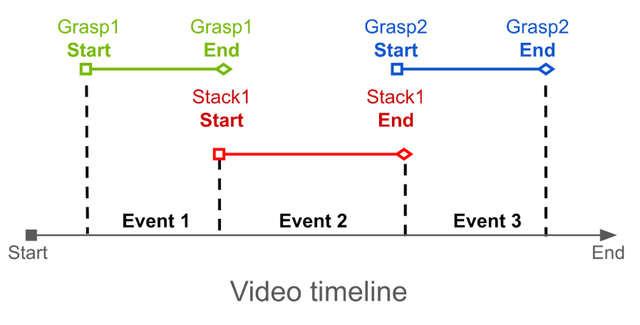

# Cosmos Reason for Mimic Gen temporal localization

> **Authors:** [Aigul Dzhumamuratova](https://www.linkedin.com/in/aigul-dzhumamuratova-78232b234/) • [Alexander Efitorov](https://www.linkedin.com/in/alex-efitorov/) • [Hesam Rabeti](https://www.linkedin.com/in/hesamrabeti/) • [Jingyi Jin](https://www.linkedin.com/in/jingyi-jin)
> **Organization:** NVIDIA

## Overview

| Model | Workload | Use case |
|------|----------|----------|
| Cosmos Reason 1 | Post-training | Temporal localization for MimicGen data generation |

[MimicGen](https://mimicgen.github.io/) is a system for automatically synthesizing large-scale, diverse robot-learning datasets from only a small number of human demonstrations.

It works by dividing each demonstration into **object-centric subtasks** annotated with **timestamp boundaries**.

Given a new scene with different object configurations, MimicGen:

- selects an existing demonstration
- spatially transforms each subtask to match the new context and stitches them together
- executes the resulting trajectory to collect a new demonstration

This allows a small set of manually recorded demonstrations to be expanded into **a large dataset with varied contexts and trajectories**.

By leveraging the **Cosmos Reason temporal localization** capability, timestamp annotations for subtasks can be automatically generated from short simulation videos, reducing manual effort and improving scalability.

- [Setup and System Requirement](setup.md)

## Benchmark Selection

For each specific task, we identify a set of subtasks that require timestamp boundary annotations. We overlay timestamps on the video and provide it as input to the model along with the following system and user prompts.

<p>
  
  
</p>

System prompt:

```
You are a specialized behavior analyst. Your task is to analyze the video and identify MULTIPLE discrete events with precise timestamps. At each frame, the timestamp is embedded at the bottom of the video. You need to extract the timestamp and answer the user question
CRITICAL REQUIREMENTS:
1. Extract timestamps from the bottom of each frame
2. Extract timestamps for USER-DEFINED events

Answer the question in the following format:
<think>
I will analyze the video systematically:
1. First, identify ALL visible timestamps throughout the video
2. Identify USER-DEFINED events
3. Extract timestamps for identified USER-DEFINED events. There will be different timestamps for each video.
4. Always answer in English

Event 1: <start time> - <end time> - Event | reasoning
Event 2: <start time> - <end time> - Event | reasoning
Event 3: <start time> - <end time> - Event | reasoning

[Continue for all events identified]
</think>

<answer>
Event 1: <start time> - <end time> Specific Event | detailed explanation.
Event 2: <start time> - <end time> Specific Event | detailed explanation.
Event 3: <start time> - <end time> Specific Event | detailed explanation.
[Continue for all events identified]
</answer>
```

User prompt:

```
You should find the following 3 events in the input video
Event 1: grasping the red cube.
Event 2: releasing the red cube.
Event 3: grasping the green cube.
Extract the exact timestamps for each event.
```

## Zero-shot Evaluation

### Run Baseline Evaluation

For Zero-shot Evaluation we used the test dataset consisting of 60 videos across 7 different tasks. The test dataset includes both simulation environments from [Isaac Lab Mimic](https://isaac-sim.github.io/IsaacLab/main/source/overview/imitation-learning/teleop_imitation.html) ([Cube Stacking, Humanoid Nut Pouring](https://isaac-sim.github.io/IsaacLab/main/source/overview/imitation-learning/teleop_imitation.html#pre-recorded-demonstrations)) and real-world datasets ([AgiBot](https://huggingface.co/datasets/agibot-world/AgiBotWorld-Alpha), [BridgeData V2](https://rail-berkeley.github.io/bridgedata/)), and covers both robot-arm and humanoid scenarios. Looking ahead, the fine-tuning dataset will contain only robot-arm demonstrations. As a result, the humanoid scenarios in the test dataset are fully out-of-distribution, making them particularly useful for evaluating how well the model generalizes during re-evaluation.

| Task | Frame number | Number of videos | Caption |
|------|--------------|------------------|---------|
| Isaac Lab: Cube stacking   | 179-247 | 10 | Event 1: grasping the red cube \| The robotic arm closes its grippers around the red cube, securing it firmly.<br><br>Event 2: releasing the red cube \| The robotic arm releases the red cube, allowing it to rest atop the blue cube.<br><br>Event 3: grasping the green cube \| The robotic arm closes its grippers around the green cube, picking it up from the surface. |
|  Isaac Lab: Humanoid nut pouring  | 288-313 | 5 | Event 1: Picking up the red cylinder from the table.<br><br>Event 2: Placing the red cylinder in the blue tray.<br><br>Event 3: Picking up the yellow bowl from the table. |
| BridgeData V2: Cube stacking  | 38-47 | 5 | Event 1: grasping the cube.<br><br>Event 2: releasing the cube. |
| AgiBot: task 358, Toaster | 451 | 10 | Event 1: grasping bread.<br><br>Event 2: releasing bread.<br><br>Event 3: pushing the toaster.<br><br>Event 4: releasing the toaster. |
| AgiBot: task 366, Chips  | 397-451 | 10 | Event 1: grasping a bag of chips.<br><br>Event 2: releasing a bag of chips. |
| AgiBot: task 378, Fork  | 451 | 10 | Event 1: grasping a fork.<br><br>Event 2: releasing a fork.<br><br>Event 3: grasping a bowl.<br><br>Event 4: releasing a bowl. |
| AgiBot: task 412, Cup  | 451 | 10 | Event 1: grasping a cup.<br><br>Event 2: grasping a rag.<br><br>Event 3: releasing a rag. |

Timestamps were added to the videos using a custom adaptive script (compatible with different FPS values) using `add_timestamps_to_all_videos_adaptive.py`:

```shell
python add_timestamps_to_all_videos_adaptive.py \
-i /path/to/videos \
-o /path/to/videos_with_ts
```

We used the public checkpoint of [Cosmos Reason 1](https://huggingface.co/nvidia/Cosmos-Reason1-7B) for evaluation with the following configuration:

- `max_tokens = 4096`
- `fps = 4, 8, 12`
- `temperature = 0.6`

We tested the model using `process_video_vllm_uni.py`:

```shell
python process_video_vllm_uni.py \
  --model_path nvidia/Cosmos-Reason1-7B \
  --prompt cube \
  --video_dir /path/to/videos_with_ts \
  --output_dir /path/to/results \
  --fps_list 8
```

Optimal setting: `fps = 8`.

The target accuracy for timestamp annotation was defined as **< 30% relative error** (relative to subtask duration). Beyond this threshold, MimicGen’s trajectory generation time increased significantly.

We also compared Cosmos Reason against the [Qwen3](https://huggingface.co/collections/Qwen/qwen3-vl) model family. Among them, [Qwen/Qwen3-VL-235B-A22B-Instruct](https://huggingface.co/Qwen/Qwen3-VL-235B-A22B-Instruct) achieved accuracy close to manual annotation.
We evaluated Qwen3 models using this script `process_video_vllm_qwen3_uni.py`:

```shell
python process_video_uni_qwen3_cr2.py \
--model qwen-2b \
--prompt cube \
--num_trials 10 \
--video_dir /path/to/videos_with_ts \
--output_dir /path/to/results
```

Models tested: [Qwen/Qwen3-VL-2B-Instruct](https://huggingface.co/Qwen/Qwen3-VL-2B-Instruct), [Qwen/Qwen3-VL-8B-Instruct](https://huggingface.co/Qwen/Qwen3-VL-8B-Instruct), [Qwen/Qwen3-VL-30B-A3B-Instruct](https://huggingface.co/Qwen/Qwen3-VL-30B-A3B-Instruct).

For Qwen/Qwen3-VL-235B-A22B-Instruct we used [this tutorial](https://docs.vllm.ai/projects/recipes/en/latest/Qwen/Qwen3-VL.html):

```shell
vllm serve Qwen/Qwen3-VL-235B-A22B-Instruct \
--tensor-parallel-size 8 \
--mm-encoder-tp-mode data \
--quantization fp8 \
--mm-processor-cache-type shm \
--async-scheduling \
--allowed-local-media-path /mnt/pvc/datasets
```

Processing with OpenAI API-compatible interface using `process_video_openai_api.py`:

```shell
python process_video_openai_api.py \
--model Qwen/Qwen3-VL-235B-A22B-Instruct \
--prompt cube \
--num_trials 10 \
--video_dir /path/to/videos_with_ts \
--output_dir /path/to/results
```

### Example Baseline Results

<table>
  <tr>
    <th style="text-align: center;">Task</th>
    <th style="text-align: center;">VLM (max_tokens = 4096, fps = 8)</th>
    <th style="text-align: center;">Mean absolute error ⇩ (s)</th>
    <th style="text-align: center;">Mean relative error ⇩ (%)</th>
    <th style="text-align: center;">Notes</th>
  </tr>
  <tr>
    <td rowspan="4"><b>#1 Isaac Lab Cube Stacking</b><br>10 demos</td>
    <td>Cosmos-Reason 1 7B</td>
    <td>0.769</td>
    <td>52.0</td>
    <td rowspan="4">Error 52% for CR1 reduces MimicGen success rate by 3x (from 41% → 14.8%) and increases generation time by 3x.</td>
  </tr>
  <tr>
    <td>Qwen3 VL 8B</td>
    <td>0.508</td>
    <td>32.4</td>
  </tr>
  <tr>
    <td>Qwen3 VL 30B A3B</td>
    <td>0.459</td>
    <td>30.4</td>
  </tr>
  <tr>
    <td>Qwen3 VL 235B A22B</td>
    <td><b>0.260</b></td>
    <td><b>17.3</b></td>
  </tr>
  <tr>
    <td rowspan="4"><b>#2 Isaac Lab Humanoid Nut Pouring</b><br>5 demos</td>
    <td>Cosmos-Reason 1 7B</td>
    <td>1.487</td>
    <td>61.3</td>
    <td rowspan="4">Error higher than Cube Stacking task.</td>
  </tr>
  <tr>
    <td>Qwen3 VL 8B</td>
    <td>1.001</td>
    <td>38.1</td>
  </tr>
  <tr>
    <td>Qwen3 VL 30B A3B</td>
    <td>1.407</td>
    <td>56.4</td>
  </tr>
  <tr>
    <td>Qwen3 VL 235B A22B</td>
    <td><b>0.310</b></td>
    <td><b>13.7</b></td>
  </tr>
  <tr>
    <td rowspan="4"><b>#3 Real world Bridge 1 Cube Stacking</b><br>10 demos</td>
    <td>Cosmos-Reason 1 7B</td>
    <td>0.560</td>
    <td>109.7</td>
    <td rowspan="4">Real-world dataset performance worse than simulated data.</td>
  </tr>
  <tr>
    <td>Qwen3 VL 8B</td>
    <td>0.489</td>
    <td>94.4</td>
  </tr>
  <tr>
    <td>Qwen3 VL 30B A3B</td>
    <td>0.560</td>
    <td>109.7</td>
  </tr>
  <tr>
    <td>Qwen3 VL 235B A22B</td>
    <td><b>0.158</b></td>
    <td><b>26.5</b></td>
  </tr>
  <tr>
    <td rowspan="5"><b>#4 Real world AgiBot dataset</b><br>40 demos</td>
    <td>Cosmos-Reason 1 7B</td>
    <td>2.381</td>
    <td>68.45</td>
    <td rowspan="5">Accuracy is lower compared to humanoid tasks; worse than simulated datasets.</td>
  </tr>
  <tr>
    <td>Qwen3 VL 2B</td>
    <td>2.965</td>
    <td>93.2</td>
  </tr>
  <tr>
    <td>Qwen3 VL 8B</td>
    <td>1.769</td>
    <td>50.33</td>
  </tr>
  <tr>
    <td>Qwen3 VL 30B A3B</td>
    <td>2.127</td>
    <td>58.98</td>
  </tr>
  <tr>
    <td>Qwen3 VL 235B A22B</td>
    <td><b>1.608</b></td>
    <td><b>45.45</b></td>
  </tr>
</table>

## Problem Analysis

The zero-shot evaluation demonstrated that the current accuracy level is insufficient to automate the MimicGen data preparation pipeline.

**Key Gaps Identified:**

- Gap 1: Inaccurate timestamps (mean relative error > 50%)
- Gap 2: Inconsistent output formatting - different structures between runs.
- Gap 3: Missed user-defined subtasks in some cases.

**Success Criteria:**

- Mean relative error < 30%
- All user-defined events are correctly identified and labeled.

## Data Curation

### Data Curation

For this project, we utilized the public [MimicGen dataset](https://huggingface.co/datasets/amandlek/mimicgen_datasets), focusing on 6 representative manipulation tasks.

To improve visual quality and ensure consistency across samples, all videos were rerendered using NVIDIA Omniverse. Rerendering with Omniverse is required, since the default visual outputs from the RoboMimic MuJoCo simulator produce poor-quality results that negatively affect downstream video-based reasoning. For users who wish to reproduce the rendering process or adapt it to their own tasks, please refer to [the robosuite documentation](https://robosuite.ai/docs/modules/renderers.html#basic-usage) for instructions on enabling Isaac rendering backends to re-render previously collected demonstrations using either ray tracing or path tracing.

The videos were generated at a resolution of 512x512 pixels and a frame rate of 30 FPS.
Ground-truth subtask timestamps were extracted semi-automatically based on:

- Object position trajectories
- Robot arm kinematics

The automatically extracted timestamps were then manually refined to ensure accurate alignment with task transitions and key manipulation events.

| Task | Frame number | Number of actions | Caption |
|------|--------------|-------------------|---------|
| coffee, d0-d2  | 70 | 1 | Event 1: <2.2> <5.6> grasping the pod |
| nut assembly, d0 | 308 | 3 | Event 1: <2.7> <5.5> grasping the square nut<br><br>Event 2: <5.5> <8.1> inserting the square nut<br><br>Event 3: <8.1> <10.6> grasping the round nut |
| square, d0 | 56 | 1 | Event 1: <2.1> <4.3> grasping the square nut |
| stack, d1 | 49 | 1 | Event 1: <1.9> <3.3> grasping the red cube |
| threading, d0-d2 | 56 | 1 | Event 1: <1.9> <6.5> grasping the mallet |
| three piece assembly, d0 d1 | 232 | 3 | Event 1: <2.2> <5.4> grasping the first piece<br><br>Event 2: <5.5> <7.7> inserting the first piece<br><br>Event 3: <7.7> <10.5> grasping the second piece |

### Preprocessing

- Add timestamps using `add_timestamps_to_all_videos_adaptive.py`:

  ```shell
  python add_timestamps_to_all_videos_adaptive.py \
    -i mimicgen_dataset/videos \
    -o mimicgen_dataset/videos_ts
  ```

- Convert to Hugging Face dataset format using `create_dataset_from_local.py`:

  ```shell
  python create_dataset_from_local.py \
    --output mimicgen_dataset_hf \
    --prompts_pickle mimicgen_dataset/formatted_prompts_and_responses.pkl \
    --video_dir mimicgen_dataset/videos_ts
  ```

Each training example is stored as a conversation consisting of a list of messages. A sample annotation is shown below:

```json
{
  "messages": [
    {
      "role": "system",
      "content": "You are a specialized behavior analyst. Your task is to analyze the video and identify MULTIPLE discrete events with precise timestamps. At each frame, the timestamp is embedded at the bottom of the video. You need to extract the timestamp and answer the user question\nCRITICAL REQUIREMENTS:\n1. Extract timestamps from the bottom of each frame\n 2. Extract timestamps for USER-DEFINED events\n\nAnswer the question in the following format:\n<think>\nI will analyze the video systematically:\n. First, identify ALL visible timestamps throughout the video\n2. Identify USER-DEFINED events\n3. Extract timestamps for identified USER-DEFINED events. There will be different timestamps for each video.\n4. Always answer in English\n\nEvent 1: <start time> - <end time> - Event | reasoning\nEvent 2: <start time> - <end time> - Event | reasoning \nEvent 3: <start time> - <end time> - Event | reasoning\n\n[Continue for all events identified]\n</think>\n\n<answer>\nEvent 1: <start time> - <end time> Specific Event | detailed explanation.\nEvent 2: <start time> - <end time> Specific Event | detailed explanation.\nEvent 3: <start time> - <end time> Specific Event | detailed explanation.\n[Continue for all events identified]\n</answer>"
    },
    {
      "role": "user",
      "content": [
        {
          "type": "video",
          "video": "mimicgen_dataset/videos_ts/coffee_d0_demo2_agentview.mp4"
        },
        {
          "type": "text",
          "text": "Event 1: grasping the pod"
        }
      ]
    },
    {
      "role": "assistant",
      "content": "<answer>\nEvent 1: <2.9> <5.5> grasping the pod\n\n</answer>"
    }
  ]
}
```

Dataset configuration:

- Input Type: Video
- Resolution: 512×512
- Encoding: H.264
- Training Set Size: 3644 videos (MimicGen dataset)
- Testing Set Size: 60 videos (Isaac Lab  + Bridge1 + AgiBot)
- Fps: 30
- Caption or annotation: see table above

### Dynamic Resolution and Pixel Budget Concept

Cosmos Reason 1 uses dynamic resolution: it automatically trades off frame rate and spatial resolution to fit a fixed per‑video total pixel budget:

- **budget = vision tokens × (2 × patch size)²**

With patch size = 14; vision tokens ≤ 8192:

- **8192 × (2 × 14)² = 6,422,528 pixels per video**

Because clip duration is fixed and you set fps, the system adjusts per‑frame resolution to stay within the budget:

**pixels per frame ≈ budget / frames**, where **frames = duration × fps**

with **side resolution** \( \approx \sqrt{\text{pixels per frame}} \) is then snapped to the patch grid of 14 pixels

**Example:** 7s input video (Cosmos Reason params: vision tokens = 8192, fps = 8):

1. **7 × 8 = 56 frames**
2. **6,422,528 / 56 ≈ 114,700 pixels per frame** with side resolution: \( \sqrt{114,700} \approx 338 \) **pixels**
3. snapped to patch grid: **24 × 14 = 336 pixels per side ⇒ 24² = 576 patches per frame**

**Guidance:**

- Ensure objects of interest cover multiple patches; otherwise they may be missed
- If detail is insufficient, shorten the clip (trim or speed up) or lower fps to increase per‑frame spatial resolution

## Supervised Fine-Tuning (SFT)

We apply supervised fine-tuning (SFT) to improve subtask boundary recognition, produce standardized timestamp formats, and enhance temporal reasoning accuracy for robotic manipulation sequences.

### Training Configuration

We use the following `mimicgen_sft.toml` configuration optimized for 8 GPUs:

???+ code "Training Configuration"

    ```toml
    --8<-- "docs/recipes/post_training/reason1/temporal_localization/assets/mimicgen_sft.toml"
    ```

We use the [cosmos-rl](https://github.com/nvidia-cosmos/cosmos-rl) library for fine-tuning.:

```bash
# In the cosmos-reason1 root directory
cd examples/post_training_hf/
cosmos-rl --config configs/mimicgen_sft.toml scripts/custom_sft.py
```

## Re-Evaluation

After fine-tuning, we evaluate the model on the test dataset from the Zero-shot Evaluation step. Re-evaluation was performed using `postprocess.py`:

```bash
python postprocess.py /path/to/results --gt-timestamps cube --use-start-time
```

`--gt-timestamps` options: `nut`, `cube`, `bridge`, `toaster`, `chips`, `fork`, `cup`

### Results Comparison

<table>
  <tr>
    <th style="text-align: center;">Task</th>
    <th style="text-align: center;">VLM (max_tokens = 4096, fps = 8)</th>
    <th style="text-align: center;">Mean absolute error ⇩ (s)</th>
    <th style="text-align: center;">Mean relative error ⇩ (%)</th>
    <th style="text-align: center;">Improvement</th>
  </tr>
  <tr>
    <td rowspan="5"><b>#1 Isaac Lab Cube Stacking</b><br>10 demos</td>
    <td>Cosmos-Reason 1 7B</td>
    <td>0.769</td>
    <td>52.0</td>
    <td>baseline</td>
  </tr>
  <tr>
    <td>Cosmos-Reason 1 7B SFT</td>
    <td><b>0.434</b></td>
    <td><b>28.6</b></td>
    <td><b>-23.4% MRE</b></td>
  </tr>
  <tr>
    <td>Qwen3 VL 8B</td>
    <td>0.508</td>
    <td>32.4</td>
    <td>-</td>
  </tr>
  <tr>
    <td>Qwen3 VL 30B A3B</td>
    <td>0.459</td>
    <td>30.4</td>
    <td>-</td>
  </tr>
  <tr>
    <td>Qwen3 VL 235B A22B</td>
    <td><b>0.260</b></td>
    <td><b>17.3</b></td>
    <td>-</td>
  </tr>
  <tr>
    <td rowspan="5"><b>#2 Isaac Lab Humanoid Nut Pouring</b><br>5 demos</td>
    <td>Cosmos-Reason 1 7B</td>
    <td>1.487</td>
    <td>61.3</td>
    <td>baseline</td>
  </tr>
  <tr>
    <td>Cosmos-Reason 1 7B SFT</td>
    <td><b>0.506</b></td>
    <td><b>17.5</b></td>
    <td><b>-43.8% MRE</b></td>
  </tr>
  <tr>
    <td>Qwen3 VL 8B</td>
    <td>1.001</td>
    <td>38.1</td>
    <td>-</td>
  </tr>
  <tr>
    <td>Qwen3 VL 30B A3B</td>
    <td>1.407</td>
    <td>56.4</td>
    <td>-</td>
  </tr>
  <tr>
    <td>Qwen3 VL 235B A22B</td>
    <td><b>0.310</b></td>
    <td><b>13.7</b></td>
    <td>-</td>
  </tr>
  <tr>
    <td rowspan="5"><b>#3 Real world Bridge 1 Cube Stacking</b><br>10 demos</td>
    <td>Cosmos-Reason 1 7B</td>
    <td>0.560</td>
    <td>109.7</td>
    <td>baseline</td>
  </tr>
  <tr>
    <td>Cosmos-Reason 1 7B SFT</td>
    <td>0.560</td>
    <td>109.7</td>
    <td>No change</td>
  </tr>
  <tr>
    <td>Qwen3 VL 8B</td>
    <td>0.489</td>
    <td>94.4</td>
    <td>-</td>
  </tr>
  <tr>
    <td>Qwen3 VL 30B A3B</td>
    <td>0.560</td>
    <td>109.7</td>
    <td>-</td>
  </tr>
  <tr>
    <td>Qwen3 VL 235B A22B</td>
    <td><b>0.158</b></td>
    <td><b>26.5</b></td>
    <td>-</td>
  </tr>
  <tr>
    <td rowspan="6"><b>#4 Real world AgiBot dataset</b><br>40 demos</td>
    <td>Qwen3 VL 2B</td>
    <td>2.965</td>
    <td>93.2</td>
    <td>-</td>
  </tr>
  <tr>
    <td>Cosmos-Reason 1 7B</td>
    <td>2.381</td>
    <td>68.45</td>
    <td>baseline</td>
  </tr>
  <tr>
    <td>Cosmos-Reason 1 7B SFT</td>
    <td><b>1.571</b></td>
    <td><b>43.03</b></td>
    <td><b>-24.75%</b></td>
  </tr>
  <tr>
    <td>Qwen3 VL 8B</td>
    <td>1.769</td>
    <td>50.33</td>
    <td>-</td>
  </tr>
  <tr>
    <td>Qwen3 VL 30B A3B</td>
    <td>2.127</td>
    <td>58.98</td>
    <td>-</td>
  </tr>
  <tr>
    <td>Qwen3 VL 235B A22B</td>
    <td>1.608</td>
    <td>45.45</td>
    <td>-</td>
  </tr>
</table>

### Analysis

- Mean relative error reduced 2x for simulation datasets and 1.5x for real-world datasets.
- Fine-tuning reduced error from 71% to 47%, improving timestamp accuracy and reliability.

### Comparison Examples

The following example shows temporal localization improvements from fine-tuning:

#### Isaac Lab Humanoid Nut Pouring


- **Before SFT**:

    ```
    Event 1: <0.0> <4.5> - Picking up the red cylindrical object with Robot Arm 1.
    Event 2: <3.5> <5.5> - Placing the red cylindrical object into the yellow bowl.
    Event 3: <7.2> <9.0> - Grasping the yellow bowl with Robot Arm 2 and lifting it onto the gray sheet.
    ```

- **After SFT (120 epochs)**:

    ```
    Event 1: <1.7> <5.8> Picking up the red cylinder from the table.
    Event 2: <5.8> <7.9> Placing the red cylinder in the blue tray.
    Event 3: <7.9> <10.6> Picking up the yellow bowl from the table.
    ```

- **Ground Truth**:

    ```
    Event 1: <1.7> <6.2> Picking up the red cylinder from the table.
    Event 2: <6.2> <8.3> Placing the red cylinder in the blue tray.
    Event 3: <8.3> <10.6> Picking up the yellow bowl from the table.
    ```

The fine-tuned model provides more accurate subtask timestamp boundaries compared to the baseline.

## Conclusion

### Key Achievements

- Reduced timestamp localization error by up to 2x after fine-tuning.
- Standardized output formatting, improving consistency and downstream parsing reliability.
- Demonstrated scalability for automated timestamp annotation in MimicGen pipelines.

### Lessons Learned

- Fine-tuning on task-specific datasets significantly improves timestamp consistency and reduces variance across model runs.
- Simulation data provides more reliable information for SFT model than real-world data.
