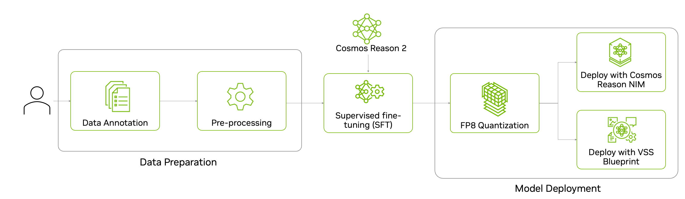
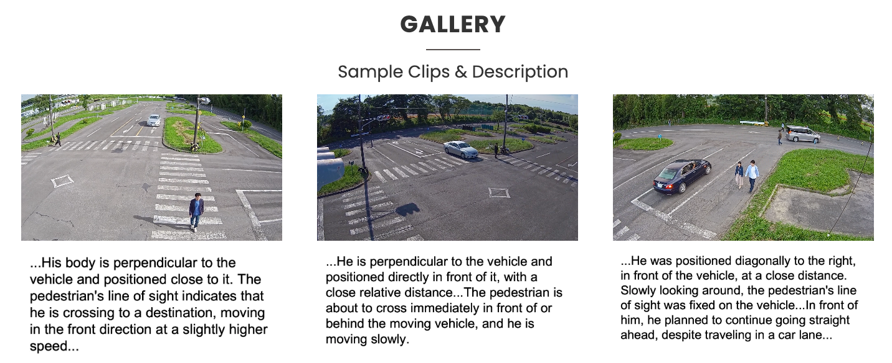
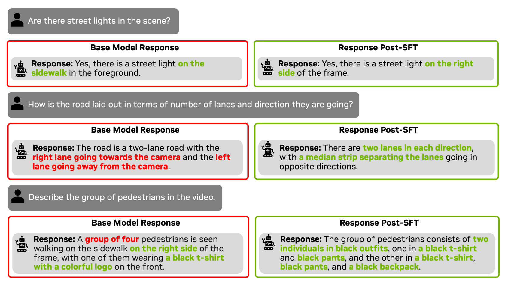

# Intelligent Transportation Post-Training with Cosmos Reason 2

> **Authors:** [Paris Zhang](https://www.linkedin.com/in/pariszhang11/)
> **Organization:** NVIDIA

| **Model** | **Workload** | **Use Case** |
|-----------|--------------|--------------|
| [Cosmos Reason 2](https://github.com/nvidia-cosmos/cosmos-reason2) | Post-training | Intelligent transportation scene understanding |

## Overview

Supervised Fine-Tuning (SFT) is used to improve the accuracy of a pre-trained model by teaching it to follow specific instructions or understand new tasks using labeled examples. While a base model learns general patterns from large, diverse data, SFT aligns the model to specific tasks with desired outputs by showing clear input–output pairs. Using domain-specific data is essential—it embeds the specialized vocabulary, visual patterns, and reasoning needed for real-world scenarios. In this recipe, we show how to fine-tune the [Cosmos Reason 2-8B](https://huggingface.co/nvidia/Cosmos-Reason2-8B) model to understand the world from a traffic point of view - scene understanding, road attributes, and pedestrian situation.

Before fine-tuning the model, let's review the zero-shot performance of the model. The model spots some of the content correctly while identifying one of the pedestrians crossing the road incorrectly.

<video controls width="960">
  <source src="assets/example_video.mp4" type="video/mp4">
</video>


<br>

Here’s the end-to-end workflow to fine-tune Cosmos Reason 2 - from data preparation, to training and evaluating the model, and finally quantizing and deploying the model for inference.


<br>

## Data Preparation

For this experiment, we use the [WovenTraffic Safety](https://woven-visionai.github.io/wts-dataset-homepage/) (WTS) Dataset from [Woven by Toyota, Inc.](https://woven.toyota/en/). This is a real-world pedestrian-centric traffic video dataset featuring 255 traffic scenarios, including staged pedestrian-related accidents across 1.2k video segments. It provides detailed textual descriptions of pedestrian and vehicle behavior, bounding box annotations, and traffic Visual Question Answering (VQA) with multiple-choice questions (MCQ).

> **Note**: The goal of this example is to demonstrate post-training on Cosmos Reason 2. The dataset used in this experiment is governed by the terms specified in the [WTS DATASET Terms of Use](https://woven-visionai.github.io/wts-dataset-homepage/#downloads).

Here are examples of the video clips and textual descriptions of the pedestrian from the dataset. The images and text are courtesy of Woven by Toyota, Inc.


<br>

For this experiment, we fine-tune the Cosmos Reason 2 model on the Environment VQA subset of the WTS dataset. The subset contains 341 videos with 5.6k MCQ question-answer pairs. The average video length is about 75 seconds.

### Data Pre-processing

We performed the following steps to pre-process the dataset:

1. Download the dataset from the WTS Dataset [homepage](https://woven-visionai.github.io/wts-dataset-homepage/). This dataset is owned and managed by “Woven by Toyota”. To use this dataset for your own applications, you must request access directly from the “Woven by Toyota” organization.

2. Pre-process the VQA annotations into [Llava dataset format](https://github.com/haotian-liu/LLaVA/blob/main/docs/Finetune_Custom_Data.md).
This format is a JSON-based structure commonly used for visual SFT on VLMs, including Llava and Qwen-VL families. Each entry contains an id, a reference to the media (video or image), and a conversation between query from a human and the expected answer from the VLM model. Here is an example:

  ```json
  {
      "id": "question_id",
      "video": "path/to/video.mp4",
      "conversations": [
          {
              "from": "human",
              "value": "<video>\n What is the weather in the video?"
          },
          {
              "from": "gpt",
              "value": "The weather in the video is sunny."
          }
      ]
  }
  ```

To pre-process the dataset, run the following command using the provided [script](https://github.com/nvidia-cosmos/cosmos-cookbook/tree/main/scripts/examples/reason2/intelligent-transportation/data_preprocess.py):

   ```shell
   # From scripts/examples/reason2/intelligent-transportation directory
   python data_preprocess.py --data_path /path/to/WTS/folder
   ```

<br>

## Post-Training with Supervised Fine-Tuning (SFT)

After preprocessing, the WTS dataset is in Llava dataset format and ready for training. To launch training, we follow the cosmos-rl training command in [Cosmos Reason 2 SFT Guide](https://github.com/nvidia-cosmos/cosmos-reason2/blob/main/examples/cosmos_rl/README.md#supervised-fine-tuning-sft). The specific code for this experiment can be found [here](https://github.com/nvidia-cosmos/cosmos-cookbook/tree/main/scripts/examples/reason2/intelligent-transportation).

```shell
# From scripts/examples/reason2/intelligent-transportation directory
cosmos-rl --config sft_config.toml custom_sft.py
```

### Hyperparameter optimization

For this SFT experiment, we updated some default configurations in `configs/llava_sft.toml`. Here are the key updates that optimize this experiment on 8 A100.

???+ code "Training Configuration"

   ```toml
   --8<-- "scripts/examples/reason2/intelligent-transportation/sft_config.toml"
   ```

### Ablation Study

We ablated the training with two configurations for different frame sampling rates and resolutions:

1. **nframes 8**: It uniformly samples 8 frames from the video and resizes the frames based on default limit. This translates to a total of **3k vision tokens**. The calculation is provided below.
2. **fps 1, total pixels 8,388,608**: It samples 1 frame per second from the video and resize the frames such that the total number of pixels is 8,388,608. This translates to a total of **8k vision tokens**. The calculation is provided below.

For Qwen3-VL (the backbone model of Cosmos Reason 2), the model compresses the input video in both space and time. Please refer to the `process_vision_info` function in [Qwen-VL-Utils](https://github.com/QwenLM/Qwen3-VL/blob/main/qwen-vl-utils/src/qwen_vl_utils/vision_process.py) for specific implementation details.

- Spatial Compression: The effective patch size is 32 (16 patch size $\times$ 2 spatial merge).
- Temporal Compression: The effective temporal step is 2 (2 frames merge into 1).

---

#### Calculation for "nframes 8" to 3k vision tokens

1. As specified, 8 frames are uniformly sampled from the video.
2. The default max frame pixel limit is defined as 768 vision tokens, corresponding to 768 $\times$ 32 $\times$ 32 = 786,432 pixels. The original frame resolution is 1920 $\times$ 1080, which exceeds the limit, so each frame is resized to approximately 1152 $\times$ 640.
3. The total number of vision tokens is 8 frames / 2 $\times$ 1152 $\times$ 640 / (32 $\times$ 32) = 2,880 tokens.

---

#### Calculation for "fps 1, total pixels 8,388,608" to 8k vision tokens

1. The video length is about 75 seconds. With 1 fps, the model samples 74 frames (rounded to the nearest even number).
2. As specified, the video's total pixel is 8,388,608. Considering the temporal step of 2, the frame pixel limit is 8,388,608 // (74 / 2) = 226,719 pixels. Each frame is resized to approximately 608 $\times$ 352.
3. The total number of vision tokens is 74 frames / 2 $\times$ 608 $\times$ 352 / (32 $\times$ 32) = 7,733 tokens.

### Model Evaluation

After training, we evaluate the model on the validation set of the Environment VQA subset of the WTS dataset. Similar to the training set, the validation set is also a collection of multiple choice questions (MCQ) on traffic and pedestrian videos. It contains 171 videos with 2.6k MCQ questions, which are unseen during training. The evaluation script below will save the model responses and accuracy score in the `results` directory.

The `eval_config.yaml` needs to be updated with the path to the post-trained model and the validation set.

```shell
# From scripts/examples/reason2/intelligent-transportation directory
python evaluate.py --config eval_config.yaml
```

<br>

## Results

### Quantitative Results

First, let's review the quantitative results on the environment VQA validation set for each experiment: one with "nframes 8" (3k vision tokens) and another with "fps 1, total pixels 8,388,608" (8k vision tokens). As calculated above, the 3k tokens setup samples fewer frames but uses a higher resolution per frame, while the 8k tokens setup samples more frames but at a lower resolution per frame.

For this task, it appears that having higher resolution per frame (even with fewer frames sampled) is more valuable for the model to accurately understand the traffic scene and pedestrian situations. This is reflected in the results: both experiments surpass 92% accuracy after just 1 epoch of training. With the 3k tokens setup, accuracy continues to improve over 3 epochs, reaching 93.65%, whereas the 8k tokens model tends to overfit with additional training. Thus, for this dataset, prioritizing higher resolution (3k vision tokens) leads to better overall performance, faster convergence, and faster inference times.


### Training Time

We ran all the experiments on 1 node (8 GPUs) of A100. The table below captures the training time for the two different settings with three training epoch. As expected, with 3k vision tokens, the model converged roughly 3 times as fast as 8k vision tokens. In summary, you can train a very accurate model using this amount of data in about an hour.

| Method | Vision Configuration                  | Training Time for 3 epochs (on 8 A100s) |
|--------|---------------------------------------|----------------------------|
| SFT    | "nframes 8" (3k vision tokens)       | 1h16m                        |
| SFT    | "fps 1, total pixels 8,388,608" (8k) | 4h                      |

### Qualitative Results

After SFT training with MCQs, the model achieves a significant accuracy improvement on the validation set on WTS videos. Additionally, the model is also able to answer open-ended questions more accurately than zero shot on videos outside of WTS dataset. Below is a qualitative comparison of open-ended questions on an unseen video.

<video controls width="960">
  <source src="assets/example_video.mp4" type="video/mp4">
</video>


<br>

## Model Deployment

The last step is to deploy the trained model for inference. You can deploy it using an NVIDIA optimized NIM, or you can deploy it in your own application. Before deployment, we can first quantize the LLM portion of the VLM to FP8 for faster inference.

### FP8 Quantization

The script to quantize the model to FP8 is provided in the NVIDIA [Cosmos Reason 2 repo](https://github.com/nvidia-cosmos/cosmos-reason2?tab=readme-ov-file#quantization).

1. Clone the Cosmos Reason 2 repo.

2. Run the quantization script.

   ```shell
   python ./scripts/quantize.py \
      --model_id '/path/to/post-trained/reason2' \
      --save_dir '/path/to/quantized/model' \
      --precision fp8
   ```

Before deploying the quantized model for inference, you should run an evaluation on the model for accuracy and ensure quantization doesn’t introduce significant accuracy regression. Please visit the [Cosmos Reason 2 NIM page](https://catalog.ngc.nvidia.com/orgs/nim/teams/nvidia/containers/cosmos-reason2-8b) for more details and to get the NIM image container.

### Deploy on NVIDIA NIM

NVIDIA NIM™ provides containers to self-host GPU-accelerated inferencing microservices for pre-trained and customized AI models across cloud instances, data centers, and RTX™ AI PCs and workstations, with industry-standard APIs for simple integration into AI applications.

To deploy a post-trained checkpoint, go to the [fine-tune-model](https://docs.nvidia.com/nim/vision-language-models/latest/fine-tune-model.html) section in NIM documentation. Go to "Cosmos Reason2" tab. NIM will automatically serve an optimized vLLM engine for this model. The model needs to be in the Huggingface checkpoint or quantized checkpoint.

```shell
export CUSTOM_WEIGHTS=/path/to/post-trained/model
export NIM_IMAGE=/path/to/nim/image/container
docker run -it --rm --name=cosmos-reason2-8b \
    --gpus all \
    --shm-size=32GB \
    -e NIM_MODEL_NAME=$CUSTOM_WEIGHTS \
    -e NIM_SERVED_MODEL_NAME="cosmos-reason2-8b" \
    -v $CUSTOM_WEIGHTS:$CUSTOM_WEIGHTS \
    -u $(id -u) \
    -p 8000:8000 \
    $NIM_IMAGE
```

## Conclusion

Supervised Fine-Tuning Cosmos Reason 2 on traffic-specific data boosts accuracy from zero-shot levels to over 90% on traffic VQA tasks. Key insights include the following:

- **The importance of domain-specific data**: Fine-tuning with targeted, specialized datasets delivers substantial performance improvements—even after just 1 hour of training.
- **Optimal training settings depend on the task**: More vision tokens in post-training do not always guarantee better results. In our case, using 3k vision tokens (with higher resolution per frame) yielded greater accuracy in about one-third the training time compared to using 8k vision tokens (with more frames sampled).
- **Enhanced generalization to new videos and questions**: Although the model was fine-tuned primarily with MCQ data from a specific dataset, it demonstrates improved accuracy on open-ended questions for traffic videos outside of the dataset, surpassing zero-shot performance.

This methodology can be applied to any physical AI domain by substituting relevant datasets.

## Related Work

This recipe builds upon our earlier work: [Intelligent Transportation Post-Training with Cosmos Reason 1](https://nvidia-cosmos.github.io/cosmos-cookbook/recipes/post_training/reason1/intelligent-transportation/post_training.html).
